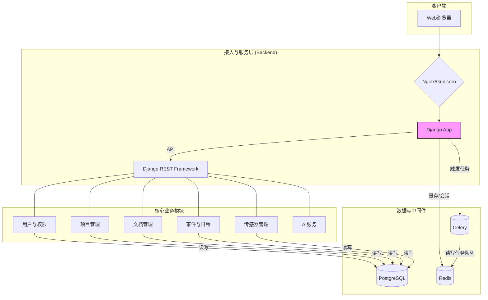

# OmniDesk 技术概览

## 项目概述

### 项目定位
- **项目名称**: OmniDesk
- **项目类型**: 全栈集成化业务管理平台
- **核心价值**: 简化组织运营，提供文档、项目、传感器和用户管理的统一解决方案。
- **目标用户**: 需要集中管理内部业务流程和数据的各类组织和企业。

### 技术特色
- **架构特点**: 采用前后端分离的单体仓库（Monorepo）架构，后端为 Django，前端为 React。
- **技术亮点**:
    - 使用 Django REST Framework 构建强大的 RESTful API。
    - 集成 Celery 进行异步任务处理。
    - 使用 React 和 Ant Design 构建现代化、响应式的用户界面。
    - 利用 Docker 和 Docker Compose 实现容器化部署，简化环境配置和交付。
    - 通过 GitHub Actions 实现 CI/CD，自动化构建和推送镜像。
- **创新点**: 集成了多种业务模块（如人事、事件、文档、项目等），并引入了AI服务（Ollama）以增强智能化功能。
- **竞争优势**: 提供了一套完整的、可扩展的业务管理解决方案，覆盖了从后端逻辑到前端交互再到部署运维的全过程。

## 技术栈分析

### 后端技术栈
| 技术类型 | 技术选型 | 版本 | 用途 |
|---|---|---|---|
| 编程语言 | Python | 3.8+ | 主要开发语言 |
| Web框架 | Django | 4.2.11 | 构建后端应用 |
| API框架 | Django REST Framework | 3.15.0 | 构建RESTful API |
| 数据库 | PostgreSQL / SQLite | - | 主数据存储 (推荐PostgreSQL) |
| 缓存 | Redis | 4.6.0+ | 缓存和Celery消息代理 |
| 异步任务 | Celery | 5.5.3 | 处理后台和定时任务 |
| 认证 | Simple JWT | 5.3.0 | 基于JWT的API认证 |
| ORM框架 | Django ORM | - | 数据库操作 |

### 前端技术栈
| 技术类型 | 技术选型 | 版本 | 用途 |
|---|---|---|---|
| JavaScript框架 | React | latest | 构建用户界面 |
| UI组件库 | Ant Design, MUI | 5.x, 5.x | 快速构建高质量UI |
| 状态管理 | React Query | 5.x | 服务端状态管理和缓存 |
| 路由 | React Router | 6.x | 客户端路由 |
| HTTP客户端 | Axios | 1.x | 发送API请求 |
| 日历组件 | FullCalendar | 6.x | 日程和事件管理 |
| 打包工具 | react-scripts | 5.0.1 | 项目构建和开发服务器 |

### 基础设施技术
| 技术领域 | 技术选型 | 作用 |
|---|---|---|
| 容器化 | Docker, Docker Compose | 应用容器化和本地编排 |
| CI/CD | GitHub Actions | 持续集成与部署 |
| 部署工具 | Gunicorn, Nginx | WSGI服务器和反向代理 |
| 代码托管 | Git | 版本控制 |

## 架构设计

### 系统架构图


### 分层架构
- **前端层 (Frontend)**: 基于 React 构建的单页面应用(SPA)，负责用户交互和视图展示。
- **后端层 (Backend)**: 基于 Django 的单体应用，通过 Django REST Framework 提供 API 接口。内部按功能模块划分（如 `personnel`, `events`, `projects` 等）。
- **数据层 (Data)**: 使用 PostgreSQL 作为主数据库，Redis 作为缓存和消息队列代理。
- **基础设施 (Infrastructure)**: 使用 Docker 进行容器化，通过 GitHub Actions 实现自动化构建和部署。

## 开发规范

### 代码规范
- **后端**: 遵循 PEP 8 编码规范。
- **前端**: 遵循 React 和 JSX 的最佳实践，使用 ESLint 进行代码风格检查。
- **命名约定**: 遵循各语言和框架的通用命名约定（例如，Python类使用驼峰，函数和变量使用下划线）。
- **错误处理**: API返回统一的错误格式，后端记录详细日志。

### 工程实践
- **测试策略**: 项目包含 `pytest` 和 `jest` 的配置，鼓励单元测试和集成测试。
- **版本管理**: 使用 Git 进行版本控制，主要开发在 `main` 分支进行。
- **依赖管理**: 后端使用 `requirements.txt`，前端使用 `package.json`。
- **文档维护**: 项目根目录有 `README.md`，`docs/` 目录存放更多详细文档。

## 快速开始

### 环境准备
- **开发环境**: Python 3.8+, Node.js 14+, Docker, PostgreSQL, Redis
- **开发工具**: VSCode 或其他现代IDE

### 构建运行
```bash
# 克隆项目
git clone <repository_url>
cd omni-desk-project

# 启动后端
cd omni_desk_backend
python -m venv venv
source venv/bin/activate
pip install -r requirements.txt
python manage.py migrate
python manage.py runserver

# 启动前端
cd ../omni_desk_frontend
npm install
npm start
```

## 贡献指南

### 开发流程
1.  Fork 项目仓库。
2.  从 `main` 分支创建新的功能分支。
3.  完成功能开发并提交代码。
4.  创建 Pull Request 到原始仓库的 `main` 分支。
5.  等待代码审查和合并。