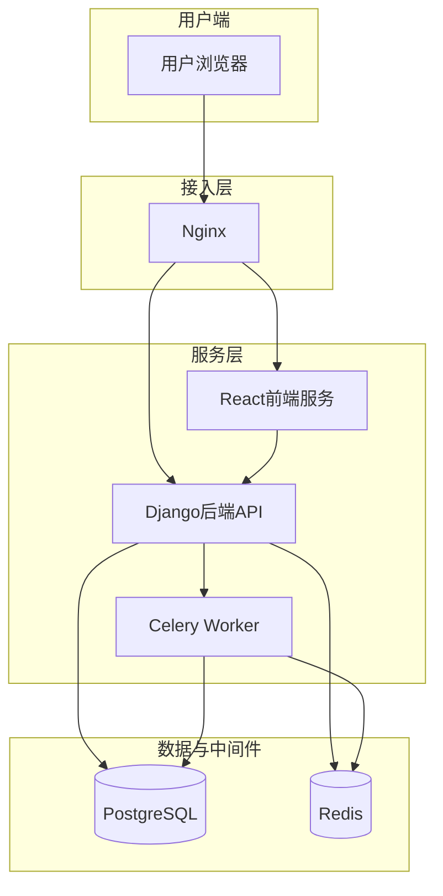

# OmniDesk 技术概览

## 项目概述

### 项目定位
- **项目名称**: OmniDesk
- **项目类型**: 集成化业务管理平台 (全栈)
- **核心价值**: 提供一个全面、可扩展的解决方案，用于简化文档、项目、传感器和用户管理等组织运营。
- **目标用户**: 需要集中管理内部业务流程的各类组织。

### 技术特色
- **架构特点**: 采用前后端分离的单体架构，后端为Django，前端为React。通过Docker实现容器化部署，并利用Celery处理异步任务。
- **技术亮点**: 
    - **全栈解决方案**: 提供从前端UI到后端逻辑再到数据库的完整业务支持。
    - **容器化部署**: 使用Docker和Docker Compose简化了开发、测试和生产环境的部署与管理。
    - **异步任务处理**: 集成Celery和Redis，用于处理耗时任务，提升系统响应速度和用户体验。
    - **完善的测试体系**: 通过GitHub Actions实现CI，自动运行后端Pytest和前端Jest测试，保证代码质量。
- **创新点**: 将多种业务管理功能（文档、项目、传感器等）集成于一个平台，提高了数据和流程的统一性。
- **竞争优势**: 相比于零散的工具，OmniDesk提供了更强的集成性和一致的用户体验，同时保持了良好的可扩展性。

## 技术栈分析

### 后端技术栈
| 技术类型 | 技术选型 | 版本 | 用途 |
|---------|---------|------|------|
| 编程语言 | Python | 3.8+ | 主要开发语言 |
| Web框架 | Django | 4.2.11 | 构建后端应用和API |
| API框架 | Django Rest Framework | 3.15.0 | 构建RESTful API |
| 异步任务 | Celery | 5.5.3 | 处理后台和定时任务 |
| ORM框架 | Django ORM | - | 数据库交互 |
| 数据库 | PostgreSQL | 14 | 主数据存储 |
| 缓存/消息代理 | Redis | 7 | Celery消息代理及应用缓存 |
| WSGI服务器 | Gunicorn | 20.1.0 | 生产环境下的Python应用服务器 |

### 前端技术栈
| 技术类型 | 技术选型 | 版本 | 用途 |
|---------|---------|------|------|
| JavaScript框架 | React | latest | 构建用户界面 |
| UI组件库 | Ant Design, MUI | ^5.24, ^5.15 | 提供丰富的UI组件 |
| 状态管理 | React Query | ^5.70.0 | 服务端状态管理、缓存、同步 |
| 路由管理 | React Router | ^6.28.2 | 客户端路由 |
| HTTP客户端 | Axios | ^1.8.4 | 发起网络请求 |
| 测试框架 | Jest, React Testing Library | - | 单元和组件测试 |

### 基础设施技术
| 技术领域 | 技术选型 | 作用 |
|---------|---------|------|
| 容器化 | Docker, Docker Compose | 应用容器化及本地环境编排 |
| Web服务器 | Nginx | 反向代理和静态文件服务 |
| CI/CD | GitHub Actions | 自动化测试和构建 |

## 架构设计

### 系统架构图


### 分层架构
- **接入层**: Nginx作为反向代理，负责请求分发到前端和后端服务，并处理静态资源。
- **服务层**: 
    - **前端服务**: 基于React的单页面应用，负责用户交互和视图展示。
    - **后端服务**: 基于Django的API服务，负责处理业务逻辑、数据持久化和API接口。
    - **异步任务服务**: Celery Worker独立于主应用运行，处理邮件发送、数据处理等耗时任务。
- **数据层**: 
    - **PostgreSQL**: 作为主数据库，存储所有业务数据。
    - **Redis**: 作为Celery的消息队列和Broker，同时可用于应用级别的数据缓存。

## 开发规范

### 代码规范
- **后端**: 遵循PEP 8规范。依赖通过`pip-tools`管理，确保环境一致性。
- **前端**: 使用ESLint进行代码风格检查和规范。

### 工程实践
- **测试策略**: 
    - 后端使用`pytest`进行单元测试和集成测试。
    - 前端使用`Jest`和`@testing-library/react`进行组件和逻辑测试。
- **代码审查**: 所有代码变更通过Pull Request进行，鼓励团队成员之间进行审查。
- **版本管理**: 使用Git进行版本控制，遵循功能分支开发流程。
- **CI/CD**: 在`test`分支上的推送会触发GitHub Actions，自动执行前后端的测试套件。

## 快速开始

### 环境准备
- **开发环境**: Python 3.8+, Node.js 14+, Docker, Docker Compose
- **依赖服务**: PostgreSQL, Redis
- **开发工具**: VSCode 或其他现代IDE

### 构建运行 (Docker)
```bash
# 克隆项目
git clone {repository_url}
cd {project_name}/deployment/docker

# 启动所有服务
docker-compose up --build
```
应用将在 `http://localhost:80` 上可用。

## 贡献指南

### 开发流程
1. Fork项目仓库。
2. 基于`main`或`develop`分支创建新的功能分支。
3. 提交代码变更，确保通过本地测试。
4. 创建Pull Request到上游仓库。
5. 等待代码审查和合并。