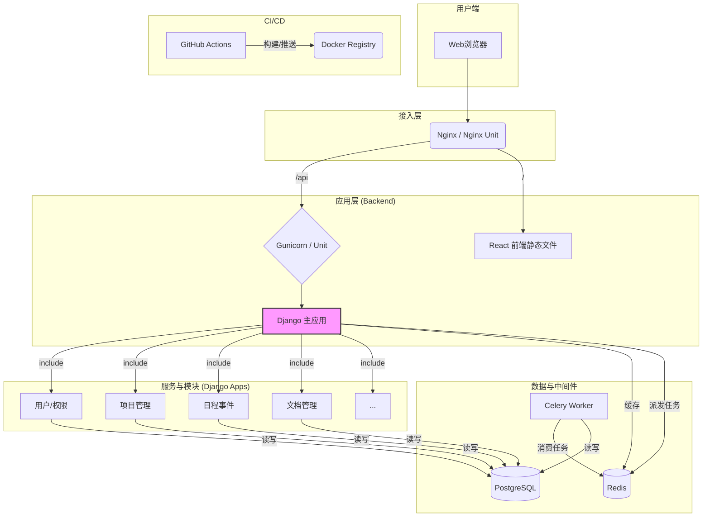
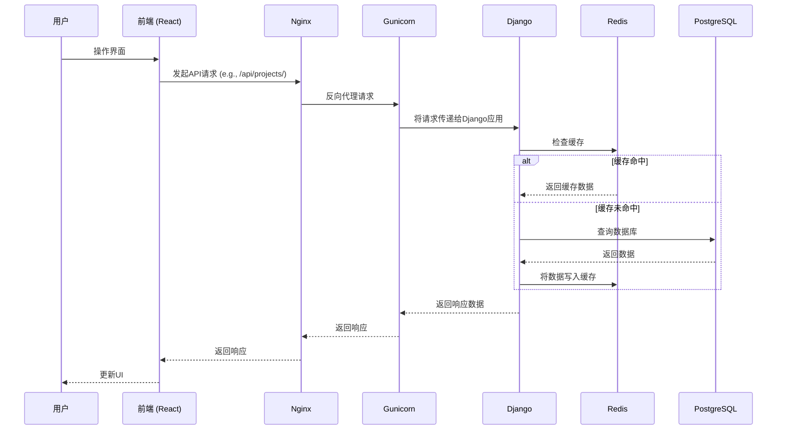
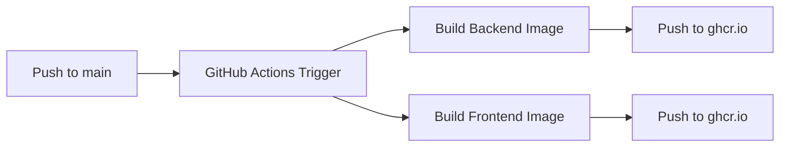

# OmniDesk 整体架构分析

## 架构概览

### 系统定位
- **项目类型**: 全栈集成化业务管理平台
- **业务领域**: 综合业务管理，包括人事、项目、文档、日程、传感器数据等。
- **技术复杂度**: 中高。项目采用前后端分离架构，涉及多种技术栈和基础设施组件，包括数据库、缓存、异步任务队列、容器化和CI/CD。

### 架构目标
- **高性能**: 通过引入Redis缓存和Celery异步任务处理，提升系统响应速度和处理能力。
- **高可用**: 部署方案支持使用Gunicorn或Nginx Unit，并可通过负载均衡实现多实例部署，保证服务的稳定性。
- **可扩展**: 后端采用模块化的Django App结构，便于独立开发和扩展新功能。容器化部署也为水平扩展提供了便利。
- **易维护**: 前后端分离，职责清晰；代码库中包含文档和部署脚本，降低了维护和交接成本。

## 系统架构设计

### 架构风格
#### 模块化单体架构 (Modular Monolith)
- **架构描述**: OmniDesk后端是一个单体应用程序，但内部按业务功能划分成多个独立的Django App（如`personnel`, `projects`, `events`等）。这种方式结合了单体应用的部署简便性和微服务的部分模块化优势。前端是一个独立的React单页面应用（SPA）。
- **选择原因**:
    - **开发效率**: 在项目初期和中小型团队中，单体架构能更快地进行开发和迭代。
    - **部署简单**: 相对于复杂的微服务架构，单体应用的部署和管理更为直接。
    - **数据一致性**: 所有模块共享同一个数据库，易于保证事务和数据的一致性。
- **适用场景**: 适合中小型企业应用或大型应用的初始阶段，业务边界相对清晰，但还未达到需要完全拆分为微服务的复杂程度。
- **优缺点分析**:
    - **优势**: 开发简单、部署方便、易于测试。
    - **劣势**: 随着功能增加，代码库会变得庞大；单个模块的性能问题可能影响整个应用；技术栈升级困难。

### 整体架构图

### 架构分层说明
#### 接入层
- **Web服务器/反向代理**: 使用 Nginx 或 Nginx Unit。负责处理静态文件请求、将API请求反向代理到后端应用服务器，并可配置SSL、负载均衡等。
- **认证授权**: API流量通过 `rest_framework_simplejwt` 实现JWT认证。

#### 业务服务层
- **应用服务器**: Gunicorn 或 Nginx Unit 负责运行Django WSGI应用。
- **服务拆分**: 后端在代码层面按Django App进行模块化拆分，如`users`, `projects`, `events`等，每个App负责一块独立的业务领域。所有App在同一个Django项目中运行。
- **业务逻辑**: 核心业务逻辑封装在各个Django App的 `views.py` 和 `serializers.py` 中。

#### 数据层
- **数据存储**: 主要使用PostgreSQL作为关系型数据库。开发环境默认为SQLite。
- **缓存策略**: 使用Redis进行数据缓存，以减少数据库查询，提高API响应速度。
- **消息队列**: 使用Redis作为Celery的消息代理（Broker），实现任务的异步处理。

## 数据架构

### 数据存储架构
| 数据库类型 | 技术选型 | 用途 | 特点 |
|---|---|---|---|
| 关系数据库 | PostgreSQL | 存储核心业务数据，如用户信息、项目、事件等。 | 强一致性，支持复杂查询和事务。 |
| 缓存数据库 | Redis | 缓存常用数据、JWT黑名单、Celery任务队列和结果后端。 | 内存存储，读写速度快。 |

### 数据流设计
#### API请求数据流

## 技术架构

### 架构模式应用
- **分层架构**:
    - **表现层**: 前端React应用。
    - **业务逻辑层**: Django应用中的Views和Serializers。
    - **数据访问层**: Django ORM。
- **事件驱动模式**: 通过Celery和Redis实现异步任务处理，例如合规性检查 (`compliance.tasks.check_compliance_due_dates`) 是一个定时任务，解耦了主流程和耗时操作。
- **云原生模式**: 项目采用Docker进行容器化，并通过GitHub Actions实现CI/CD，体现了云原生的一些基本实践。

## 部署架构

### 容器化架构
- **Docker镜像策略**:
    - 后端和前端分别构建独立的Docker镜像。
    - `Dockerfile`位于各自的目录中 (`omni_desk_backend/Dockerfile`, `omni_desk_frontend/Dockerfile`)。
    - CI/CD流水线 (`.github/workflows/build-and-push-images.yml`) 自动化构建镜像并推送到GitHub Container Registry。
- **本地部署**: `docker-compose.yml` (位于 `nginx_config/`) 用于本地开发环境，编排前端、后端和Nginx服务。

### 环境部署
- **多环境部署**:
    - **开发环境**: 使用 `manage.py runserver` 和 `npm start`，或通过Docker Compose。
    - **生产环境**: 推荐使用Gunicorn或Nginx Unit作为应用服务器，并用Nginx作为反向代理。`deployment/source/` 目录下提供了相应的 `systemd` 服务文件和配置文件。
- **部署流水线**:

## 安全架构

### 认证授权架构
- **身份认证**:
    - API使用JWT进行无状态认证，由 `djangorestframework-simplejwt` 提供支持。
    - 用户通过 `/api/auth/token/` 端点获取access和refresh token。
- **权限控制**:
    - Django REST Framework内置的权限系统 (`rest_framework.permissions.IsAuthenticated`) 作为默认权限，要求所有API访问都必须经过认证。
    - 项目中定义了自定义的用户模型 (`users.CustomUser`) 和权限缓存机制，为更复杂的RBAC（基于角色的访问控制）提供了基础。

### 安全防护架构
- **网络安全**: 部署时使用Nginx作为反向代理，可以方便地集成SSL/TLS加密，并配置防火墙规则。
- **应用安全**:
    - **CSRF防护**: Django默认开启CSRF中间件防护。
    - **SQL注入防护**: 使用Django ORM，可以有效防止大部分SQL注入攻击。
    - **CORS**: 通过 `django-cors-headers` 控制跨域资源共享，限制了可访问API的来源。