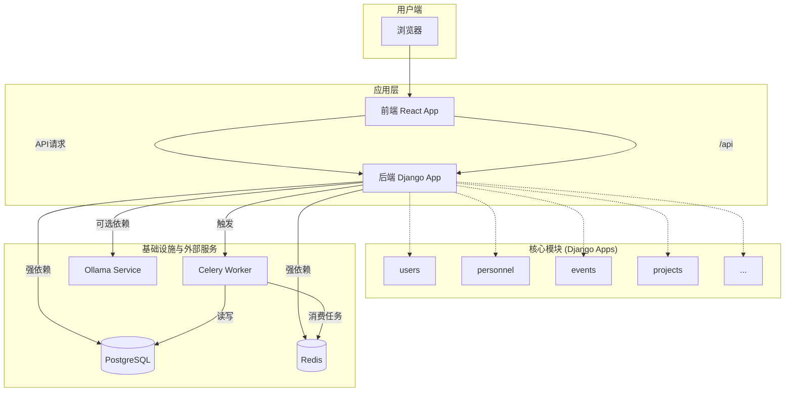

# OmniDesk 服务依赖分析

## 依赖概览

由于OmniDesk是模块化单体架构，其核心“服务”是以后端Django应用内的模块（Apps）和外部基础服务（如数据库、缓存）的形式存在的。

### 服务清单
| 服务/模块名称 | 类型 | 技术栈 | 责任 |
|---|---|---|---|
| `omni_desk_backend` | 后端应用 | Django, Python | 核心后端团队 |
| `omni_desk_frontend` | 前端应用 | React, JavaScript | 核心前端团队 |
| PostgreSQL | 数据库 | PostgreSQL | DBA/运维团队 |
| Redis | 缓存/消息代理 | Redis | 运维团队 |
| Celery | 异步任务 | Python, Celery | 核心后端团队 |
| Ollama | 第三方AI服务 | - | AI服务提供商/运维 |
| Nginx | Web服务器 | Nginx | 运维团队 |

### 依赖关系总览

## 内部模块依赖 (Django Apps)

在单体架构中，模块间的依赖主要通过Python的导入语句和Django的`INSTALLED_APPS`设置来体现。所有模块共享同一个数据库，因此存在紧密的数据耦合。

| 模块 (App) | 主要职责 | 依赖的其他模块 (示例) |
|---|---|---|
| `users` | 用户管理、认证、权限 | `permissions` |
| `personnel` | 人事信息管理 | `users` (外键关联) |
| `events` | 日程、事件、排班管理 | `personnel` (外键关联) |
| `projects` | 项目管理 | `users` |
| `documents` | 文档管理 | `users` |
| `compliance` | 合规性检查 (使用Celery) | - |
| `llm_service` | 与Ollama服务交互 | - |
| `permissions` | 自定义权限管理 | `users` |

**分析**:
- 模块之间通过Django ORM的外键（`ForeignKey`）关系形成了强数据依赖。
- `urls.py`将来自不同App的URL组织在一起，形成统一的API入口。
- 这种紧耦合的依赖关系是单体架构的典型特征，简化了开发但降低了模块独立性。

## 数据依赖分析

### 数据库依赖
- **主数据库**:
    - **服务**: `omni_desk_backend` (所有内部模块)
    - **技术**: PostgreSQL (生产推荐) / SQLite (开发默认)
    - **依赖级别**: **强依赖**。所有业务数据的持久化都依赖于此数据库。数据库不可用将导致整个后端服务瘫痪。
- **数据库连接配置**: 在 `settings/base.py` 中定义，但通常通过环境变量在生产环境中覆盖。

### 缓存依赖
- **服务**: `omni_desk_backend`
- **技术**: Redis
- **用途**:
    1.  **Celery消息代理**: 接收Django应用派发的异步任务。
    2.  **Celery结果后端**: 存储异步任务的执行结果。
    3.  **应用缓存**: 缓存API查询结果、权限数据等，以提高性能。
- **依赖级别**: **强依赖**。Redis的不可用将导致异步任务系统完全失效，并可能因缓存失效引起性能下降和数据库压力增大。

## 第三方服务依赖

### AI/LLM 服务
- **服务**: Ollama
- **调用方**: `omni_desk_backend` (通过 `llm_service/ollama_client.py`)
- **接口**: HTTP API (e.g., `http://localhost:11434/api/chat`)
- **依赖级别**: **可选/弱依赖**。该依赖主要用于提供AI增强功能。如果Ollama服务不可用，核心的业务管理功能（如CRUD操作）仍可正常运行，但AI问答、内容生成等功能会失败。
- **配置**: Ollama的URL和模型名称在 `settings/base.py` 中配置，并可通过环境变量覆盖。

## 基础设施依赖

### Web服务器 / 反向代理
- **技术**: Nginx
- **依赖关系**: `omni_desk_frontend` 和 `omni_desk_backend` 都依赖Nginx来处理外部请求。
    - Nginx为前端React应用提供静态文件服务。
    - Nginx将 `/api` 路径下的请求反向代理到后端Gunicorn/Unit服务器。
- **依赖级别**: **强依赖**。Nginx是整个服务的入口，其故障将导致前端和后端都无法从外部访问。

### 应用服务器
- **技术**: Gunicorn 或 Nginx Unit
- **依赖关系**: `omni_desk_backend` 依赖应用服务器来运行其WSGI应用。
- **依赖级别**: **强依赖**。应用服务器的故障将导致整个后端API不可用。

### 容器化与编排
- **技术**: Docker, Docker Compose
- **依赖关系**: 整个项目的开发和部署环境都依赖于Docker。`docker-compose.yml` 文件定义了服务（如Nginx）的编排。
- **依赖级别**: **强依赖** (对于部署和标准化的开发环境而言)。

### CI/CD
- **技术**: GitHub Actions
- **依赖关系**: 依赖 `.github/workflows/build-and-push-images.yml` 文件来自动化构建Docker镜像并推送到容器仓库。
- **依赖级别**: **开发/运维流程依赖**。CI/CD的失败不直接影响正在运行的服务，但会中断新版本的构建和部署流程。

## 依赖风险评估

### 关键依赖识别
| 依赖服务/组件 | 影响范围 | 故障影响 |
|---|---|---|
| **PostgreSQL** | 整个后端应用 | **致命**。数据无法读写，所有核心功能失效。 |
| **Redis** | 后端应用 (特别是异步任务和缓存) | **严重**。异步任务系统瘫痪，性能显著下降。 |
| **Nginx** | 整个应用 (前端和后端) | **致命**。外部用户无法访问任何服务。 |
| **Gunicorn/Unit** | 整个后端应用 | **致命**。所有API接口失效。 |
| **Ollama** | AI相关功能 | **中等**。核心业务功能不受影响，但AI功能失效。 |

### 单点故障风险
- **数据库**: PostgreSQL是典型的单点故障。**解决方案**: 在生产环境中应部署主从复制或高可用集群。
- **缓存/消息代理**: Redis同样是单点故障。**解决方案**: 部署Redis哨兵或集群模式以实现高可用。
- **后端应用实例**: 单个Gunicorn/Unit实例是单点故障。**解决方案**: 在负载均衡器后运行多个实例。
