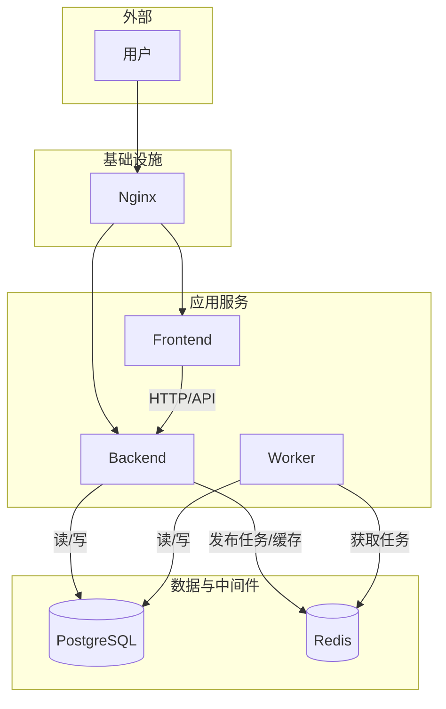

# OmniDesk 服务依赖分析

## 依赖概览

### 服务清单
| 服务名称 | 容器名 | 技术栈 | 职责 |
|---|---|---|---|
| 前端 | `omni_desk_frontend` | React, Node.js | 用户界面与交互 |
| 后端 | `omni_desk_backend` | Django, Python | 核心业务逻辑与API |
| 数据库 | `omni_desk_db` | PostgreSQL | 数据持久化 |
| 缓存/消息代理 | `omni_desk_redis` | Redis | 缓存与Celery Broker |
| 异步任务Worker | `omni_desk_worker` | Celery, Python | 执行后台任务 |
| Web服务器 | `omni_desk_nginx` | Nginx | 反向代理与静态文件服务 |

### 依赖关系总览

## 服务间调用依赖

### HTTP服务调用
- **前端 -> 后端**: 前端应用是后端API的主要消费者。所有的数据获取、状态变更都通过调用后端RESTful API完成。这是一个强依赖关系。
    - **接口路径**: `/api/*`
    - **调用方式**: HTTP (GET, POST, PUT, DELETE等)
    - **数据格式**: JSON

### 异步消息依赖 (Celery)
后端服务与异步任务Worker之间通过Redis消息队列进行解耦。
- **消息生产者**: 
    - **服务**: `omni_desk_backend`
    - **场景**: 在处理某些业务逻辑时（例如，在`sensor_management`和`compliance`模块中），后端服务会将需要异步执行的任务放入Redis队列。
- **消息消费者**:
    - **服务**: `omni_desk_worker`
    - **场景**: Worker进程持续监听Redis队列，获取并执行任务，如检查合规性到期日、创建校准提醒等。

## 数据依赖分析

### 数据库依赖 (PostgreSQL)
- **`omni_desk_backend`**: 后端主服务直接依赖PostgreSQL进行所有业务数据的CRUD（创建、读取、更新、删除）操作。这是一个强依赖。
- **`omni_desk_worker`**: 异步任务Worker在执行任务时，也需要连接PostgreSQL来读取或更新数据。这是一个强依赖。

### 缓存依赖 (Redis)
- **`omni_desk_backend`**: 
    - **作为Celery Broker**: 后端服务依赖Redis来存放Celery的任务消息。这是一个强依赖。
    - **作为应用缓存**: 后端服务可以利用Redis进行数据缓存，以提高API响应性能（可选依赖）。
- **`omni_desk_worker`**: Worker进程依赖Redis来获取待执行的任务。这是一个强依赖。

## 配置依赖分析

### 环境配置依赖
- **`.env` 文件**: 项目通过`.env`文件（如`.env.production`）管理环境变量。所有服务（尤其是`backend`和`db`）都依赖这些环境变量来获取数据库凭证、`SECRET_KEY`等关键配置。
- **共享配置**: 
    - `POSTGRES_DB`, `POSTGRES_USER`, `POSTGRES_PASSWORD`: 由`db`服务使用，并由`backend`服务依赖以连接数据库。
    - `REDIS_HOST`: 由`backend`和`worker`服务共享，用于连接Redis。
    - `DJANGO_SETTINGS_MODULE`: 由`backend`和`worker`服务共享，用于指定Django的配置文件。

## 基础设施依赖

### 容器编排依赖 (Docker Compose)
- 整个应用栈（包括所有服务和数据库）都依赖`docker-compose.yml`文件进行定义和编排。服务间的网络连接、卷挂载、启动顺序（通过`depends_on`）都在此文件中定义。

### 网络依赖 (Nginx)
- **`omni_desk_frontend`** 和 **`omni_desk_backend`**: 这两个核心服务都依赖Nginx作为入口。Nginx负责将来自用户的请求正确地路由到前端或后端服务，实现了服务的统一访问入口。

## 依赖风险评估

### 关键依赖识别
- **PostgreSQL**: 是整个系统的核心数据存储。如果数据库服务不可用，整个平台的核心功能将完全瘫痪。
- **Redis**: 对于异步任务处理至关重要。如果Redis服务不可用，所有后台任务将无法被创建和执行。如果用作缓存，其不可用会导致性能下降。
- **`omni_desk_backend`**: 作为核心API服务，如果它不可用，前端将无法获取或提交任何数据，应用将变为空壳。

### 单点故障风险
- **数据库 (`omni_desk_db`)**: 在当前的`docker-compose.yml`配置中，数据库是单实例的，存在单点故障风险。**解决方案**: 在生产环境中，应使用云服务商提供的RDS或自建高可用数据库集群（如主从复制）。
- **Redis (`omni_desk_redis`)**: 同样是单实例的，存在单点故障风险。**解决方案**: 在生产环境中，应使用高可用的Redis集群或哨兵模式。
- **后端/Worker服务**: 虽然可以通过Docker快速重启，但如果应用本身存在导致持续崩溃的bug，也会导致服务不可用。**解决方案**: 部署多个实例并使用负载均衡。
