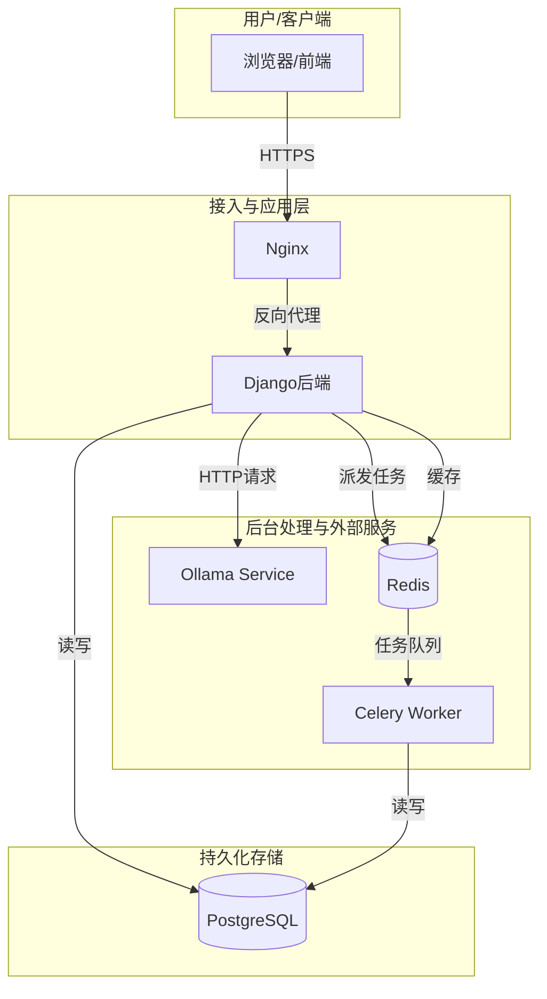
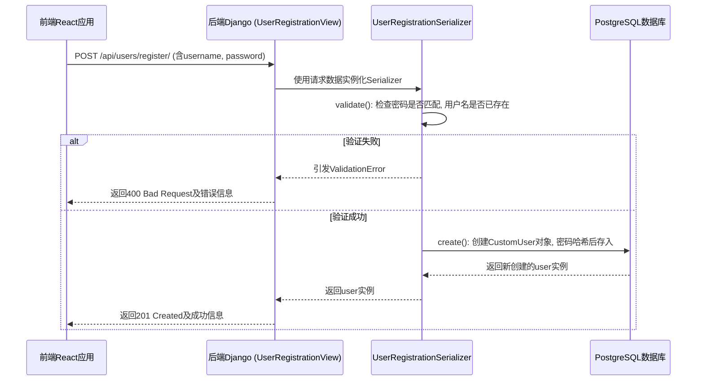
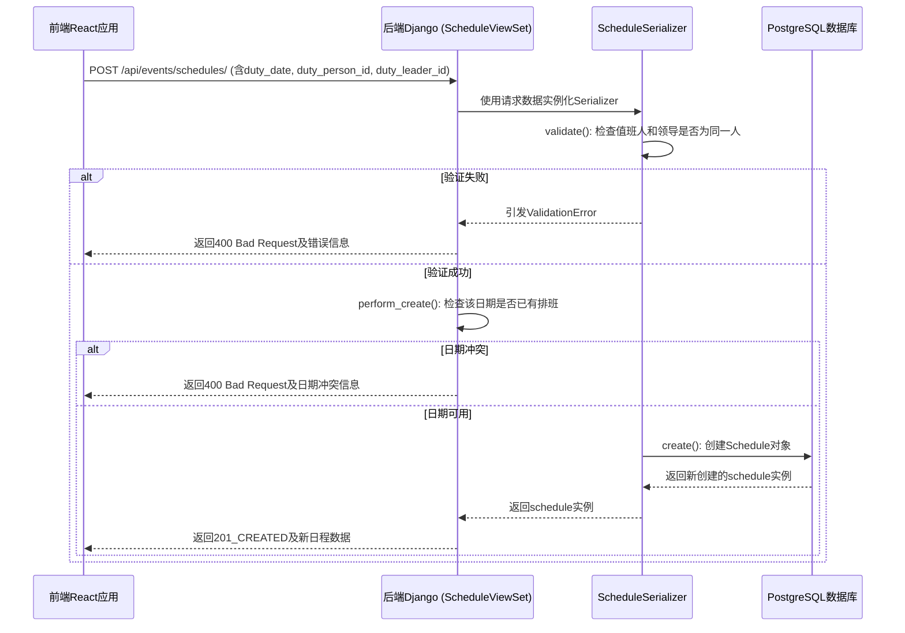

# OmniDesk 数据流和集成分析

## 数据流概览

### 数据流分类
| 数据流类型 | 描述 | 涉及服务/模块 | 传输方式 |
|---|---|---|---|
| **同步业务流** | 用户通过UI操作触发的实时数据交互，如创建、读取、更新、删除 (CRUD) 操作。 | 前端, 后端 (所有模块) | HTTP/REST (JSON) |
| **异步任务流** | 由系统触发或需要较长处理时间的任务，如定时检查、批量生成等。 | 后端 (Celery), Redis | 消息队列 |
| **AI服务流** | 与外部AI模型进行交互，用于内容生成或分析。 | 后端 (`llm_service`), Ollama | HTTP/REST (JSON) |

### 数据流架构图


## 核心业务数据流分析

### 1. 用户注册数据流

此流程展示了一个新用户如何通过前端界面注册账户，以及后端如何处理和存储这些信息。

#### 数据流转路径


#### 数据格式与处理
- **输入数据 (Request Body)**:
  ```json
  {
    "username": "newuser",
    "password": "complex_password_123",
    "password_confirmation": "complex_password_123",
    "email": "newuser@example.com"
  }
  ```
- **数据验证 (`UserRegistrationSerializer`)**:
    - `username`: 检查格式和唯一性。
    - `password` & `password_confirmation`: 必须匹配。
- **数据转换**:
    - `password`: 在`CustomUser.objects.create_user()`方法中被自动哈希处理。
- **数据存储**:
    - 经过验证和转换的数据通过Django ORM持久化到`PostgreSQL`的`users_customuser`表中。

### 2. 创建日程事件数据流

此流程展示了用户如何创建一个新的日程事件，并关联相关人员。

#### 数据流转路径


#### 数据格式与处理
- **输入数据 (Request Body)**:
  ```json
  {
    "duty_date": "2025-12-25",
    "duty_person_id": 10,
    "duty_leader_id": 2
  }
  ```
- **数据验证 (`ScheduleSerializer`)**:
    - `duty_person_id`和`duty_leader_id`不能相同。
    - `duty_date`必须是有效日期。
- **业务逻辑 (`ScheduleViewSet.perform_create`)**:
    - 在创建前检查`duty_date`的唯一性，防止重复排班。
- **数据存储**:
    - 关联`CustomUser`模型，将`duty_person_id`和`duty_leader_id`作为外键存储到`PostgreSQL`的`events_schedule`表中。

## 集成模式分析

### API 集成 (前端-后端)
- **模式**: **REST API**
- **协议**: HTTP/HTTPS
- **数据格式**: **JSON**
- **描述**: 前端React应用通过HTTP客户端（如Axios）调用后端Django REST Framework提供的API端点。这是系统的主要数据交互方式。前端负责发送JSON格式的请求体，后端处理后返回JSON格式的响应。
- **示例**: `omni_desk_frontend/src/api/personnelApi.js`中的`getPersonnel`函数向`/api/personnel/personnel/`端点发起GET请求以获取人员列表。

### 异步任务集成 (后端内部)
- **模式**: **消息队列**
- **技术**: Celery, Redis
- **描述**: 对于耗时或需要后台执行的任务，Django应用不直接执行，而是创建一个任务并将其发送到Redis消息队列中。一个或多个独立的Celery Worker进程会监听这个队列，获取并执行任务。
- **示例**: `settings/base.py`中定义的`CELERY_BEAT_SCHEDULE`展示了一个定时任务`compliance.tasks.check_compliance_due_dates`，该任务每天由Celery Beat调度器触发，并由Celery Worker执行。

### 数据库集成 (后端内部)
- **模式**: **共享数据库**
- **技术**: Django ORM, PostgreSQL
- **描述**: 所有后端的Django App（模块）都通过Django ORM访问同一个PostgreSQL数据库。模块间的数据关系通过模型中的外键（`ForeignKey`）和多对多（`ManyToManyField`）字段来定义。这是一种紧耦合的集成方式，保证了强数据一致性（ACID事务）。

### 第三方服务集成 (后端-外部)
- **模式**: **HTTP API 调用**
- **技术**: Python `requests`库, Ollama API
- **描述**: 当需要AI功能时，后端通过`llm_service/ollama_client.py`中的`OllamaClient`类，向配置的Ollama服务地址发送HTTP POST请求。
- **数据流**: Django视图 -> `OllamaClient.chat()` -> `requests.post()` -> Ollama服务 -> `requests`响应 -> Django视图返回给前端。

## 数据一致性与安全

### 数据一致性
- **事务一致性**: 对于涉及多个数据库写操作的业务逻辑（如创建试验及其时间段），代码中明确使用了`django.db.transaction.atomic()`上下文管理器。这确保了在一个原子块内的所有数据库操作要么全部成功提交，要么在出现错误时全部回滚，从而保证了ACID特性。
- **最终一致性**: 对于异步任务，系统采用最终一致性模型。例如，当一个任务被发送到Celery但Worker处理失败时，任务可能会被重试。在此期间，主业务数据和异步任务产生的数据可能暂时不一致，但最终会通过重试或失败处理达到一致状态。

### 数据安全
- **传输加密**: 生产环境部署时，应在Nginx层配置SSL/TLS证书，强制使用HTTPS，以加密前端和服务器之间的所有通信数据。
- **存储加密**:
    - **密码**: 用户密码通过Django内置的密码哈希系统（默认为PBKDF2）进行哈希和加盐处理后存储，是不可逆的。
    - **敏感数据**: 项目目前未显式对数据库中其他敏感字段（如个人信息）进行加密，这是一个潜在的安全改进点。
- **访问控制**:
    - API端点通过`rest_framework.permissions`进行保护，默认要求用户必须登录 (`IsAuthenticated`)。
    - 更精细的权限控制通过自定义权限类实现，如`IsAdminOrManager`，限制了只有特定角色的用户才能访问某些管理接口。