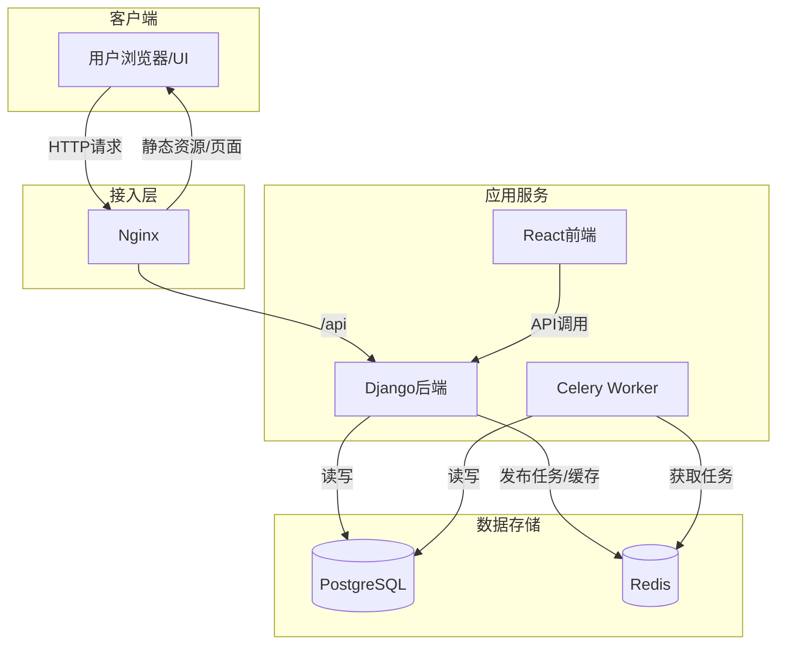
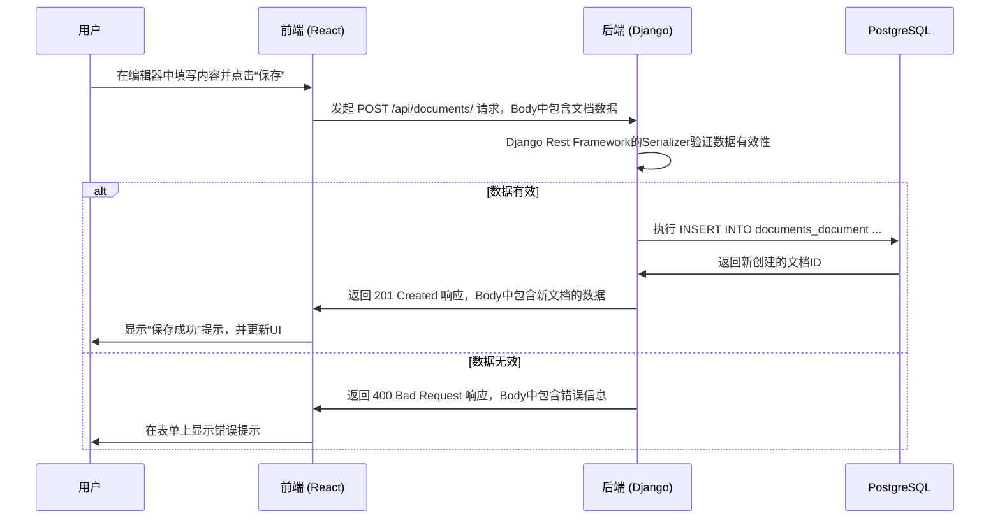
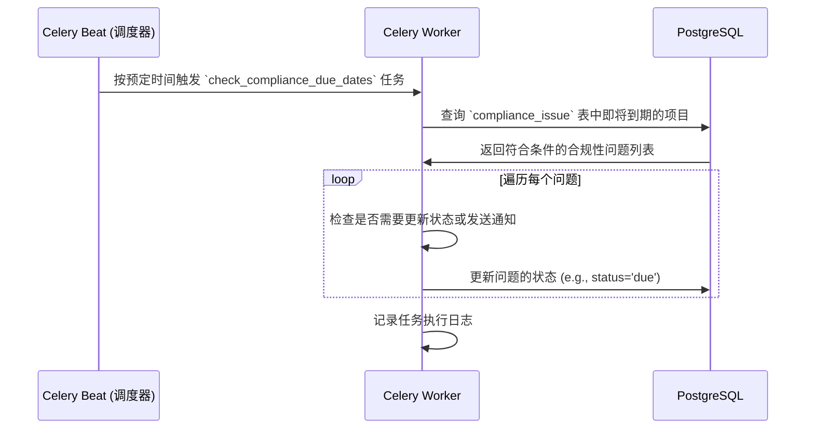

# OmniDesk 数据流和集成分析

## 数据流概览

### 数据流分类
| 数据流类型 | 描述 | 涉及服务 | 传输方式 |
|---|---|---|---|
| **用户交互流** | 用户通过UI进行操作，如查看、创建、更新数据。 | Frontend, Backend | HTTP/REST |
| **异步任务流** | 后端触发的后台任务，如定时检查、报告生成。 | Backend, Worker, Redis | 消息队列 |
| **数据持久化流** | 应用数据写入或读取数据库。 | Backend, Worker, PostgreSQL | DB Connection |
| **缓存流** | 热点数据或任务队列的读写。 | Backend, Worker, Redis | Redis Protocol |

### 数据流架构图


## 核心业务数据流分析

### 场景：用户创建一篇新文档

这是一个典型的同步数据流，涉及用户输入、API调用和数据持久化。

#### 数据流转路径


#### 数据格式与协议
- **传输协议**: `HTTP/1.1` 或 `HTTP/2` (取决于Nginx和浏览器)
- **数据格式**: `application/json`

**请求体 (Request Body) 示例:**
```json
{
  "title": "季度项目复盘",
  "content": "<p>这是文档的HTML内容...</p>",
  "project_id": 123,
  "tags": ["review", "q3"]
}
```

### 场景：定时检查合规性问题

这是一个典型的异步数据流，涉及定时任务触发和后台处理。

#### 数据流转路径


#### 数据格式与协议
- **传输协议**: AMQP (Redis作为Broker)
- **数据格式**: Celery内部序列化格式 (通常是pickle或json)

## 集成模式分析

### API 集成模式
- **模式**: 请求/响应 (Request/Response)
- **描述**: 系统中的主要集成方式。前端作为客户端，通过发送HTTP请求到后端API来获取或修改数据。后端处理请求后同步返回一个HTTP响应。这是一种紧耦合的同步集成模式。

### 消息集成模式
- **模式**: 发布/订阅 (Publish/Subscribe)
- **描述**: 用于后端服务与异步Worker之间的解耦。后端服务（生产者）将任务消息发布到Redis的特定队列中，而不关心哪个Worker会处理它。一个或多个Worker（消费者）订阅这些队列，获取并执行任务。这是一种松耦合的异步集成模式。

### 数据库集成模式
- **模式**: 共享数据库 (Shared Database)
- **描述**: 后端的不同业务模块（Django Apps）以及Celery Worker都直接访问同一个PostgreSQL数据库。这是单体架构的典型特征，简化了数据访问，并能轻易地通过数据库事务保证数据强一致性。

## 数据一致性分析

### 事务一致性
- **机制**: 项目依赖于Django的默认事务行为。在默认的`autocommit`模式下，每个数据库查询都会被立即提交。
- **分析**: 
    - 对于只涉及单次数据库写操作的API视图，自动提交模式是安全的。
    - 对于需要执行多次写操作（例如，创建一个订单并更新库存）的视图，由于没有显式使用`@transaction.atomic`，如果中途发生失败，可能会导致数据部分更新，存在数据不一致的风险。
- **建议**: 对于所有涉及多个数据库写操作的视图函数或方法，都应使用`@transaction.atomic`装饰器，以确保所有操作要么全部成功，要么全部回滚。

### 最终一致性
- **机制**: 在涉及异步任务的场景中，系统达到的是最终一致性。
- **示例**: 当后端发布一个任务（如发送通知邮件）到队列后，它会立即向上游（前端）返回成功响应。此时邮件并未真正发送。Worker进程在稍后的某个时间点消费该任务，完成邮件发送，系统状态才最终与预期一致。如果任务失败，Celery的重试机制会尝试再次执行，以尽力达成最终一致性。

## 数据安全分析

### 数据传输安全
- **HTTPS**: 部署时应配置Nginx使用SSL/TLS证书，对所有客户端与服务器之间的HTTP通信进行加密，防止数据在传输过程中被窃听或篡改。

### 数据存储安全
- **密码处理**: Django内置的认证系统默认使用强大的哈希算法（如PBKDF2或Argon2）来存储用户密码，确保原始密码不会以明文形式存储。
- **敏感信息**: 对于其他敏感信息（如API密钥、个人身份信息等），代码中并未发现有应用级别的加密措施。**建议**: 对存储在数据库中的高度敏感字段，应在应用层进行加密后再存入数据库。
