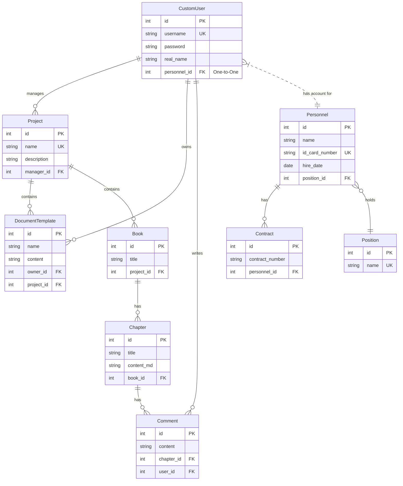

# OmniDesk 数据库架构分析

## 数据库架构概览
- **数据库类型**: PostgreSQL
- **版本**: 14 (根据 `docker-compose.yml` 文件)
- **用途**: 作为项目唯一的主数据存储，负责所有业务数据的持久化。
- **交互方式**: 应用通过 Django ORM 与数据库进行交互，不直接编写原生SQL。
- **部署方式**: 在开发环境中，通过 Docker Compose 启动一个单实例的PostgreSQL容器。生产环境建议使用高可用方案（如云RDS或主从复制集群）。

## 实体关系图 (ERD)

## 核心表结构分析

### `users_customuser`
- **描述**: 核心用户表，存储账户登录信息。
- **重要字段**:
    - `id` (PK): 主键。
    - `username` (Unique): 用户登录名。
    - `password`: 哈希后的密码。
    - `personnel_id` (FK, One-to-One): 关联到`personnel_personnel`表，将系统账户与现实世界的人员信息绑定。

### `personnel_personnel`
- **描述**: 核心人员信息表，存储员工的详细档案。
- **重要字段**:
    - `id` (PK): 主键。
    - `name`: 员工真实姓名。
    - `id_card_number` (Unique): 身份证号，作为人员的唯一标识。
    - `position_id` (FK): 关联到`personnel_position`表，表示员工的职位。
- **关联表**: 通过外键关联了`Contract`(合同)、`Education`(教育背景)、`WorkExperience`(工作经历)等多个卫星表，形成完整的人事档案。

### `projects_project`
- **描述**: 项目信息表。
- **重要字段**:
    - `id` (PK): 主键。
    - `name` (Unique): 项目名称。
    - `manager_id` (FK): 关联到`users_customuser`表，表示项目的负责人。

### `documents_book` / `documents_chapter`
- **描述**: 文档/书籍内容的核心表。
- **重要字段**:
    - `book.id` (PK): 书籍ID。
    - `chapter.book_id` (FK): 章节所属的书籍。
    - `chapter.content_md`: 存储Markdown格式的章节内容。

## 关系模型分析
- **用户与人员 (One-to-One)**: `users_customuser` 与 `personnel_personnel` 通过 `OneToOneField` 建立了一对一的关系。这是一种经典的设计，将易变的系统账户信息（如密码）与相对稳定的人员档案信息分离。
- **项目与负责人 (Many-to-One)**: `projects_project` 与 `users_customuser` 通过 `ForeignKey` 建立了多对一关系，一个用户可以管理多个项目。
- **人员与附属信息 (One-to-Many)**: `personnel_personnel` 与 `personnel_contract`, `personnel_education` 等表通过 `ForeignKey` 建立了一对多关系，一个员工可以有多份合同、多条教育背景记录。
- **书籍与章节 (One-to-Many)**: `documents_book` 与 `documents_chapter` 是一对多关系，一本书包含多个章节。

## 索引设计分析
- **主键索引**: Django ORM自动为所有模型的主键字段（通常是`id`）创建主键索引。
- **唯一索引 (Unique Constraint)**: 在模型字段上设置 `unique=True` (如 `CustomUser.username`, `Project.name`) 会自动创建唯一索引，保证了业务逻辑上的唯一性，并能极大地提升基于这些字段的查询性能。
- **外键索引**: Django ORM自动为所有`ForeignKey`和`OneToOneField`字段创建B-tree索引。这对于JOIN操作和基于外键的过滤查询至关重要，例如，查询"某项目负责人下的所有项目"时，`projects_project`表上的`manager_id`索引会被高效利用。
- **潜在优化**:
    - 对于经常用于过滤的非外键字段，如`projects_project.status`，如果查询频繁，可以考虑手动添加索引 (`db_index=True`)。
    - 对于经常一起查询的字段，可以考虑创建复合索引。例如，如果经常查询"某个用户在某个状态下的文档"，可以在`documents`表上为`(owner_id, status)`创建复合索引。

## 数据完整性分析
- **实体完整性**: 通过自动创建的主键实现。
- **参照完整性**: 通过`ForeignKey`和`OneToOneField`以及它们的`on_delete`策略来保证。例如，`on_delete=models.CASCADE`意味着当一个`Book`被删除时，其下所有的`Chapter`也会被自动删除。`on_delete=models.SET_NULL`则表示当关联的对象被删除时，外键字段会被置为NULL。
- **域完整性**: 通过模型字段的类型（如`CharField`, `DateField`）和选项（如`choices`, `max_length`）来保证。
- **事务完整性**: 如“数据流分析”中所述，项目主要依赖数据库的自动提交模式。对于涉及多表更新的复杂操作，存在数据不一致的风险，建议在相关视图或服务方法中引入`@transaction.atomic`来保证原子性。
