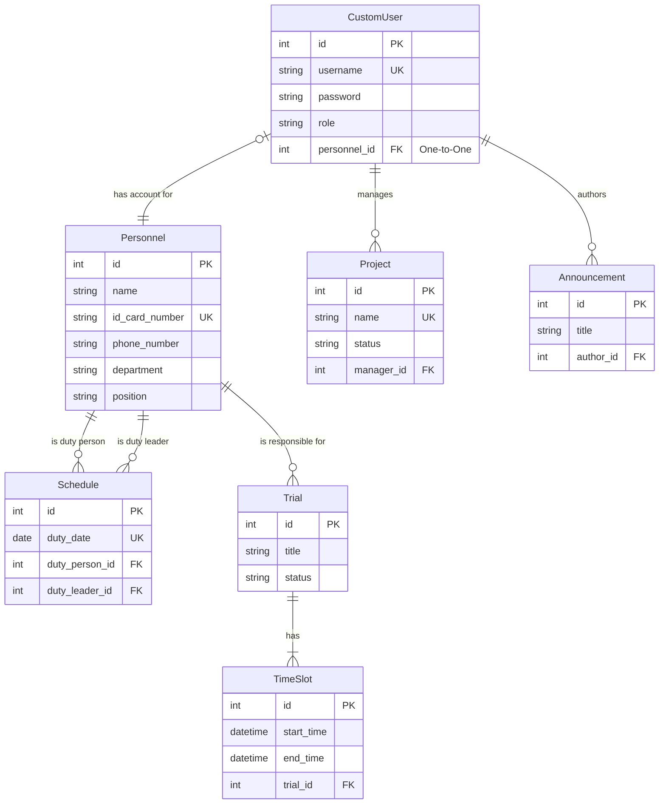

# OmniDesk 数据库架构分析

## 1. 数据库架构概览

- **数据库类型**: 主要使用 **PostgreSQL** 作为关系型数据库，用于持久化存储核心业务数据。开发环境默认为 **SQLite**。
- **架构风格**: 采用 **共享数据库** 模式。所有后端的Django模块（`users`, `personnel`, `events`, `projects` 等）共享同一个数据库实例和Schema。
- **数据访问**: 数据访问完全通过 **Django ORM** (对象关系映射) 进行，不直接编写SQL查询。这保证了代码的数据库无关性，并利用ORM提供了基本的SQL注入防护。

## 2. 实体关系图 (ERD)

下图展示了核心业务模块（`users`, `personnel`, `events`, `projects`）中主要模型之间的关系。

### 关系说明:
- **`CustomUser` 和 `Personnel` (一对一)**: 一个用户账户 (`CustomUser`) 对应一个具体的人事档案 (`Personnel`)。这是系统的核心关联，将登录账户与实体个人连接起来。
- **`Personnel` 和 `Schedule` (一对多)**: 一个人可以作为值班人员或值班领导出现在多个排班记录中。
- **`Personnel` 和 `Trial` (多对多)**: 一个试验可以有多个责任人，一个人也可以负责多个试验。
- **`Trial` 和 `TimeSlot` (一对多)**: 一个试验可以包含多个具体的时间段。
- **`CustomUser` 和 `Project` (一对多)**: 一个用户可以作为项目经理管理多个项目。
- **`CustomUser` 和 `Announcement` (一对多)**: 一个用户可以发布多个公告。

## 3. 核心表结构分析

以下是根据Django模型推断出的核心表的简化SQL风格描述。

### `users_customuser` (用户表)
- **职责**: 存储用户的登录凭证、角色和基本信息。
- **字段分析**:
    - `id`: 主键。
    - `username`: 用户名，唯一且有索引，用于登录。
    - `password`: 存储哈希后的密码。
    - `role`: 角色字段（如 'admin', 'manager', 'user'），用于权限控制。
    - `personnel_id`: 到 `personnel_personnel` 表的一对一外键，是连接账户和物理人员的关键。

### `personnel_personnel` (人员表)
- **职责**: 存储员工的详细个人信息和在职信息。
- **字段分析**:
    - `id`: 主键。
    - `name`: 姓名。
    - `id_card_number`: 身份证号，唯一。
    - `phone_number`, `department`, `position`: 职位和联系信息。

### `events_schedule` (排班表)
- **职责**: 存储每日的值班安排。
- **字段分析**:
    - `id`: 主键。
    - `duty_date`: 值班日期，设置了唯一约束（`unique=True`），确保一天只有一个排班记录。
    - `duty_person_id`: 外键，关联到 `personnel_personnel` 表，表示值班人员。
    - `duty_leader_id`: 外键，关联到 `personnel_personnel` 表，表示值班领导。

### `events_trial` (试验表)
- **职责**: 存储试验的元数据。
- **字段分析**:
    - `id`: 主键。
    - `title`, `status`, `description`: 试验的基本信息。
    - `start_date`, `end_date`: 试验的整体时间范围，这些字段由其关联的 `TimeSlot` 自动计算和更新，是一种数据冗余，用于提高查询效率。

## 4. 索引和约束设计

- **主键索引**: Django ORM自动为每个模型的 `id` 字段创建主键索引。
- **唯一约束 (Unique Constraints)**:
    - `users_customuser.username`: 保证用户名不重复。
    - `personnel_personnel.id_card_number`: 保证身份证号不重复。
    - `events_schedule.duty_date`: 保证每天只有一条排班记录。
- **外键约束 (Foreign Key Constraints)**:
    - 模型间的 `ForeignKey`, `OneToOneField`, `ManyToManyField` 关系在数据库层面创建了外键约束，保证了引用完整性。例如，不能删除一个还关联着排班记录的人员（除非设置了 `on_delete=models.SET_NULL` 等策略）。
- **检查约束 (Check Constraints)**:
    - `events_timeslot`: `start_time` 必须小于 `end_time`，确保时间段的有效性。

## 5. 性能和优化

- **查询优化**: 在 `events.views.ScheduleViewSet` 中，查询集使用了 `select_related('duty_person', 'duty_leader')`。这是一个重要的性能优化，它通过SQL JOIN一次性获取排班记录及其关联的人员和领导信息，有效避免了N+1查询问题。
- **数据冗余**: `Trial` 模型的 `start_date` 和 `end_date` 是根据其下的 `TimeSlot` 动态计算的。这是一种受控的数据冗余，虽然增加了写的复杂性（需要在`TimeSlot`增删改时更新`Trial`），但极大地简化和加速了按时间范围查询`Trial`的性能。
- **事务管理**: 在需要执行多个写操作的复杂业务逻辑中（如 `ScheduleViewSet.generate_schedules`），代码使用了 `transaction.atomic()` 来确保操作的原子性，维护了数据的一致性。

## 6. 总结

OmniDesk的数据库设计遵循了Django的最佳实践。通过ORM定义模型，清晰地表达了业务实体及其关系。数据库层面的约束（唯一、外键）保证了数据的完整性，而在应用层面通过查询优化和事务管理来保证性能和数据一致性。共享数据库的模式简化了开发，但也意味着所有模块在数据层面是紧密耦合的。