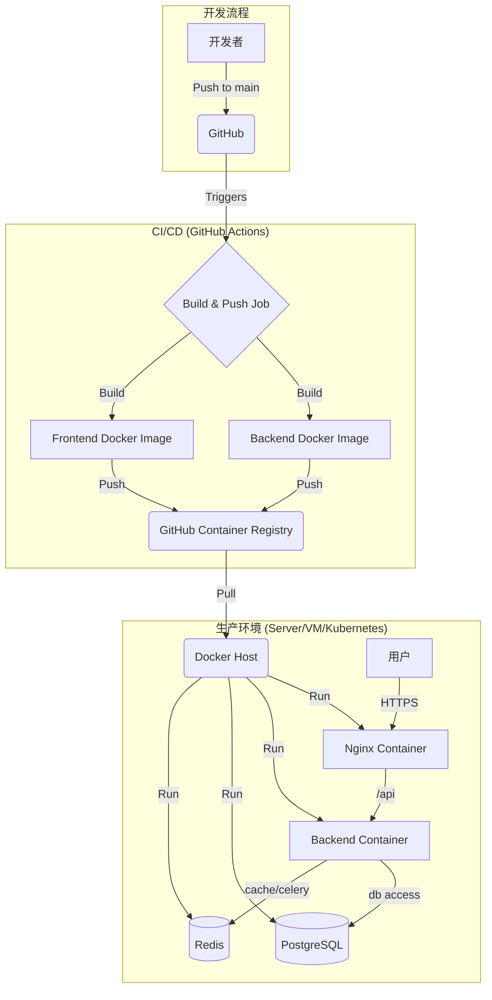

# OmniDesk 部署分析

## 1. 部署架构概览

OmniDesk 采用容器化的部署策略，将前后端应用分离到不同的Docker容器中。CI/CD流程通过GitHub Actions实现自动化，整体部署架构清晰且现代化。

### 部署架构图

### 部署架构特点
- **容器化部署**: 前后端应用均被打包成独立的Docker镜像，实现了环境的隔离和一致性。
- **自动化CI/CD**: 使用GitHub Actions，在代码推送到`main`分支时自动构建和推送Docker镜像，简化了发布流程。
- **前后端分离**: 前端（React）和后端（Django）是独立的服务，通过Nginx作为反向代理进行整合。
- **多环境支持**:
    - **开发环境**: 可以通过 `docker-compose` (在 `nginx_config/` 目录下) 快速启动一套完整的本地开发环境。
    - **生产环境**: 提供了多种部署选项，包括使用Gunicorn或Nginx Unit作为应用服务器，并提供了相应的 `systemd` 服务文件。

## 2. 容器化分析

### 后端 Dockerfile (`deployment/docker/omni_desk_backend/Dockerfile`)
- **多阶段构建**:
    1.  **`builder` 阶段**: 使用 `python:3.10-slim-bullseye` 基础镜像。首先安装编译 `psycopg2` 所需的系统依赖，然后使用 `pip wheel` 将Python依赖预编译成wheel包。这个阶段的产物是 `/app/wheels` 目录，包含了所有依赖的二进制包。
    2.  **生产阶段**: 同样使用 `python:3.10-slim-bullseye` 基础镜像。创建一个非root用户 `app` 来运行应用，增强了安全性。从 `builder` 阶段复制预编译好的wheel包并使用 `pip install` 安装，这大大加快了最终镜像的构建速度。
- **静态文件处理**: 在构建镜像的过程中，以root用户身份运行 `manage.py collectstatic`，将所有Django静态文件收集到 `staticfiles` 目录。
- **安全性**:
    - 创建并切换到非root用户 `app` 来运行应用。
    - `COPY --chown=app:app` 确保应用代码的所有权属于非root用户。
- **启动命令**: 默认启动命令是 `gunicorn`，但在实际部署中，通常会被 `docker-compose` 或Kubernetes的配置覆盖。

### 前端 Dockerfile (`omni_desk_frontend/Dockerfile`)
- **多阶段构建**:
    1.  **`builder` 阶段**: 使用 `node:18-alpine` 基础镜像。安装npm依赖，然后运行 `npm run build` 来构建生产环境的React应用。产物是 `/app/build` 目录下的静态文件。
    2.  **生产阶段**: 使用轻量的 `nginx:alpine` 基础镜像。从 `builder` 阶段复制构建好的静态文件到Nginx的Web根目录 (`/usr/share/nginx/html`)。
- **Web服务器**: 使用 **Nginx** 来提供前端静态文件服务。`nginx.conf` 文件被复制到容器中，用于配置Nginx。
- **安全性**: 同样创建并切换到非root用户 `appuser` 来运行Nginx进程。
- **健康检查**: 定义了一个 `HEALTHCHECK`，定期使用 `curl` 检查Nginx服务是否正常响应。

### Docker Compose (`nginx_config/docker-compose.yml`)
- **用途**: 主要用于本地开发和测试，快速启动一个Nginx代理。
- **服务**: 只定义了一个 `nginx` 服务。
- **配置**:
    - 将本地的 `nginx.conf` 和 `sites-enabled` 目录挂载到容器中，方便在本地修改Nginx配置而无需重建镜像。
    - 将容器的80端口映射到主机的80端口。
    - 使用 `extra_hosts` 将 `host.docker.internal` 指向宿主机的网关，这通常用于在容器内访问宿主机上运行的服务（例如，当你在本地运行后端开发服务器时）。

## 3. CI/CD 分析 (`.github/workflows/build-and-push-images.yml`)

- **触发条件**: 当代码被推送到 `main` 分支时，或者手动触发 (`workflow_dispatch`)。
- **核心步骤**:
    1.  **检出代码**: 使用 `actions/checkout@v4`。
    2.  **登录容器仓库**: 使用 `docker/login-action@v3` 登录到 **GitHub Container Registry (ghcr.io)**。认证信息使用 `secrets.GITHUB_TOKEN`，安全且方便。
    3.  **构建并推送后端镜像**:
        - 使用 `docker/build-push-action@v5`。
        - `context` 设置为 `.` (项目根目录)。
        - `file` 指向 `deployment/docker/omni_desk_backend/Dockerfile`。
        - `push: true` 表示构建成功后推送到仓库。
        - `tags` 定义了镜像的标签，例如 `ghcr.io/onemuggle/omni-desk-backend:latest`。
    4.  **构建并推送前端镜像**:
        - 流程与后端类似，但 `context` 和 `file` 指向 `omni_desk_frontend` 目录及其 `Dockerfile`。
- **总结**: 这是一个标准的、高效的CI/CD流程，实现了从代码提交到镜像发布的完全自动化。

## 4. 部署流程与配置

### 推荐的生产部署流程
1.  **代码合并**: 将功能分支合并到 `main` 分支。
2.  **自动构建**: GitHub Actions自动触发，构建新的前后端Docker镜像并推送到 `ghcr.io`。
3.  **服务器部署**:
    - 在生产服务器上，使用 `docker pull` 拉取最新的镜像。
    - 启动一套完整的服务栈，至少包括：
        - **Nginx容器**: 负责反向代理和提供前端静态文件。
        - **后端应用容器**: 运行Gunicorn和Django应用。
        - **PostgreSQL数据库**: 可以是容器化运行，也可以是外部数据库服务。
        - **Redis**: 用于缓存和Celery。
    - 推荐使用 `docker-compose` 或 Kubernetes 来编排这些服务，以管理它们之间的网络和依赖关系。

### 关键配置
- **环境变量**: 后端应用严重依赖环境变量来配置数据库连接、密钥、Celery Broker等。在生产环境中，必须通过 `.env` 文件或容器编排工具的环境变量注入功能来提供这些配置。
- **Nginx配置**: Nginx是流量入口，其配置至关重要。需要正确配置反向代理，将 `/api/` 的请求转发到后端容器，其他请求则由前端静态文件处理。同时，生产环境必须配置HTTPS。
- **Gunicorn/Unit**: `deployment/source/` 目录下的文件提供了非容器化部署的示例，展示了如何使用 `systemd` 来管理Gunicorn或Unit进程，确保服务开机自启和稳定运行。