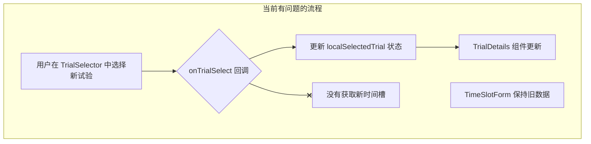

# 试验排班模态框时间槽更新 Bug 修复计划

## 1. 问题描述

在日历界面的“编辑排班”模态框中，当用户在“试验项目”下拉菜单中切换到一个新的试验时，下方的“时间段”表单没有随之更新，依然显示的是上一个试验的时间槽数据。

## 2. 根本原因分析

通过分析 `calendar_with_react/src/components/Calendar/EventModal/EventModalContainer.jsx` 组件，确定了问题的根本原因：

- **数据获取逻辑不完整**: 当用户在 `TrialSelector` 组件中选择一个新试验时，`onTrialSelect` 回调函数只更新了组件的本地状态 (`localSelectedTrial`) 以显示新的试验详情，但**没有触发 API 调用**来获取新选定试验的时间槽数据。
- **`useEffect` 依赖不足**: 负责获取时间槽的 `useEffect` 钩子只依赖于 `currentEvent` 和 `trials`，不依赖于用户选择的试验。因此，在切换试验时，该钩子不会重新执行。

## 3. 修复计划

为了解决此问题，需要修改 `EventModalContainer.jsx` 以确保在切换试验时能重新获取并更新时间槽数据。

### 3.1. 详细步骤

1.  **提取可重用函数**: 将 `useEffect` 中用于获取和设置时间槽的逻辑提取到一个新的异步函数中，例如 `fetchAndSetTimeSlots(trial)`。此函数接收一个 `trial` 对象作为参数。

2.  **修改 `useEffect`**: 更新现有的 `useEffect` 钩子，使其在 `currentEvent` 发生变化时，调用 `fetchAndSetTimeSlots` 函数。

3.  **修改 `onTrialSelect` 回调**: 在 `TrialSelector` 组件的 `onTrialSelect` 回调函数中，除了现有的状态更新逻辑外，增加对 `fetchAndSetTimeSlots` 函数的调用，并传入新选择的 `trial` 对象。

### 3.2. 流程图

使用 Mermaid 流程图来说明修复前后的数据流差异。

#### 当前有问题的流程



#### 计划修复后的流程

```mermaid
graph TD
    subgraph "计划修复后的流程"
        A_new[用户在 TrialSelector 中选择新试验] --> B_new{onTrialSelect 回diao};
        B_new --> C_new[更新 localSelectedTrial 状态];
        C_new --> D_new[TrialDetails 组件更新];
        B_new --> G_new[调用 fetchAndSetTimeSlots(newTrial)];
        G_new --> H_new[API: 获取新时间槽];
        H_new --> I_new[更新表单中的 time_slots 数据];
        I_new --> J_new[TimeSlotForm 组件更新];
    end
```

## 4. 预期结果

完成修复后，当用户在“编辑排班”模态框中选择一个新试验时，下方的“时间段”表单将立即异步加载并正确显示新试验的时间槽信息。