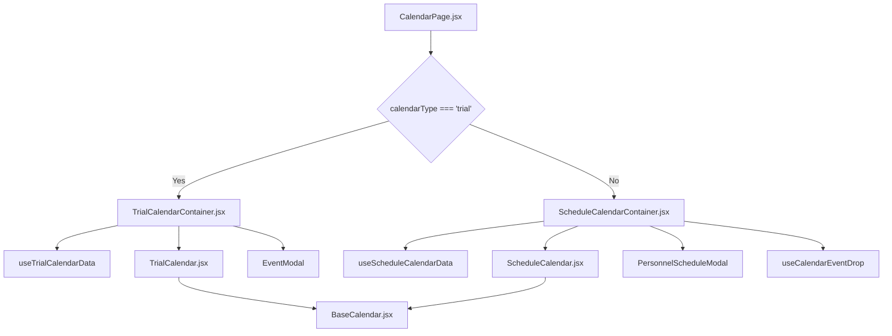

# 日历模块解耦设计

## 1. 背景与问题

当前日历界面（`CalendarPage.jsx`）集成了“试验排班日历”和“人员排班日历”两种功能。这导致了以下耦合问题：

*   `CalendarPage.jsx` 中存在大量基于 `calendarType` 的条件渲染和逻辑分支，使得代码复杂且难以维护和扩展。
*   事件处理函数（如日期点击、事件点击、事件拖放等）集中管理，并需要根据 `calendarType` 进行区分。
*   模态框（`EventModal` 和 `PersonnelScheduleModal`）的状态和逻辑也集中在 `CalendarPage.jsx` 中。
*   `useCalendarEventDrop` 等 Hook 内部也存在对 `calendarType` 的依赖。

这种紧密耦合使得：
*   新增或修改任一类型日历的功能都可能影响到另一类型。
*   代码可读性差，难以快速理解和定位问题。
*   组件复用性低。

## 2. 解耦目标

*   **分离日历视图和逻辑：** 将不同类型日历的特定逻辑（数据转换、事件处理、模态框管理）从 `CalendarPage.jsx` 中完全分离。
*   **抽象通用事件处理：** 寻找两种日历事件处理的共同模式，提取通用逻辑或通过参数化实现复用。
*   **模块化模态框管理：** 将模态框的显示、隐藏、数据填充等逻辑封装到各自的组件或 Hook 中。
*   **独立的日历页面或组件：** 为“试验排班日历”和“人员排班日历”创建独立的容器组件，每个组件负责自己的数据、状态和逻辑。

## 3. 解耦计划

我们将通过引入独立的日历容器组件来解耦 `CalendarPage.jsx`。

### 3.1. 核心组件职责划分

*   **`BaseCalendar.jsx`**: 通用日历组件，基于 FullCalendar，负责渲染和基础交互。它将继续作为两种特定日历的底层通用组件。
*   **`ScheduleCalendar.jsx`**: 包装了 `BaseCalendar`，负责排班数据的转换和排班特有事件的处理。
*   **`TrialCalendar.jsx`**: 包装了 `BaseCalendar`，负责试验数据的传递和试验特有事件的处理。

### 3.2. 新增容器组件

我们将创建两个新的容器组件，分别封装各自日历类型的所有特定逻辑和状态：

#### 3.2.1. `TrialCalendarContainer.jsx`

*   **职责：**
    *   管理试验日历的数据获取 (`useTrialCalendarData`)。
    *   管理试验日历相关的状态（如 `currentEvent`, `selectedTrial`, `modalType`, `isEditing`, `modifiedSlots`）。
    *   处理试验日历的所有事件（`handleTrialSelect`, `handleTrialDateClick`, `onTrialEventClick` 等）。
    *   渲染 `TrialCalendar` 组件。
    *   渲染和管理 `EventModal` 的显示逻辑和数据传递。
    *   处理 `EventModal` 中的事件提交逻辑 (`handleEventSubmit`)。

*   **位置：** `calendar_with_react/src/components/Calendar/TrialCalendarContainer.jsx`

#### 3.2.2. `ScheduleCalendarContainer.jsx`

*   **职责：**
    *   管理人员排班日历的数据获取 (`useScheduleCalendarData`)。
    *   管理人员排班日历相关的状态（如 `scheduleModalOpen`, `currentSchedule`, `scheduleModalMode`）。
    *   处理人员排班日历的所有事件（`handleScheduleDateClick`, `onScheduleEventClick`）。
    *   渲染 `ScheduleCalendar` 组件。
    *   渲染和管理 `PersonnelScheduleModal` 的显示逻辑和数据传递。
    *   处理事件拖放逻辑（`useCalendarEventDrop` 的集成或修改）。

*   **位置：** `calendar_with_react/src/components/Calendar/ScheduleCalendarContainer.jsx`

### 3.3. 修改 `CalendarPage.jsx`

`CalendarPage.jsx` 将被大幅简化，其主要职责变为：

*   管理 `calendarType` 状态，用于切换显示哪种日历。
*   渲染 `CalendarControls` 组件。
*   根据 `calendarType` 条件渲染 `TrialCalendarContainer` 或 `ScheduleCalendarContainer`。
*   **移除**所有与 `trial` 和 `schedule` 日历相关的状态（如 `currentEvent`, `scheduleModalOpen`, `currentSchedule` 等）。
*   **移除**所有与 `trial` 和 `schedule` 日历相关的事件处理函数。
*   **移除** `EventModal` 和 `PersonnelScheduleModal` 的直接渲染。

### 3.4. 调整 `useCalendarEventDrop.js`

*   将 `useCalendarEventDrop` 的逻辑直接集成到 `ScheduleCalendarContainer.jsx` 中，或者修改它使其不再依赖 `calendarType` 参数，而是由调用方（即 `ScheduleCalendarContainer`）传入具体的 API 和查询客户端，使其更通用。

### 3.5. 优化数据转换逻辑

*   确保 `ScheduleCalendar` 内部的 `schedules` 到 `events` 转换逻辑清晰且独立。
*   确保 `TrialCalendar` 接收到的 `trialEvents` 已经是 FullCalendar 兼容的格式。如果不是，则在 `TrialCalendarContainer` 中进行转换，保持 `TrialCalendar` 自身的简洁。

## 4. 解耦后的组件关系图

## 5. 预期收益

*   **提高可维护性：** 各日历类型的逻辑独立，修改或调试某一部分不会影响其他部分。
*   **增强可读性：** `CalendarPage.jsx` 代码量减少，逻辑清晰，易于理解。
*   **提升组件复用性：** `TrialCalendarContainer` 和 `ScheduleCalendarContainer` 可以作为独立的模块在其他需要的地方复用。
*   **降低耦合度：** `CalendarPage.jsx` 不再包含大量业务逻辑，只负责协调不同日历的显示。
*   **便于扩展：** 未来新增其他类型的日历时，只需创建新的容器组件，对现有代码的影响最小。
