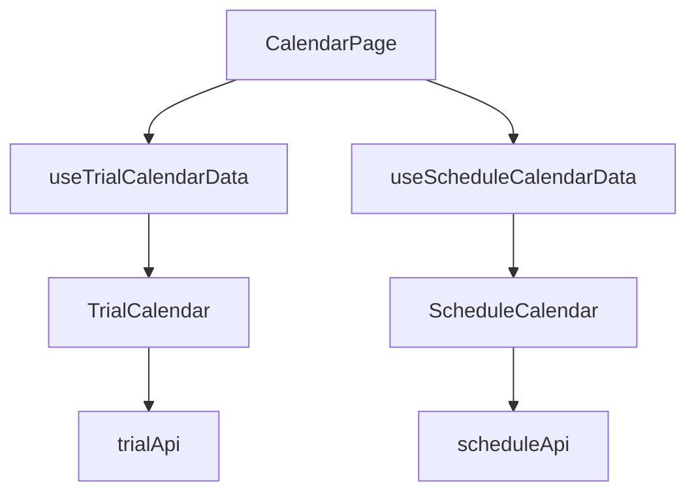

# 日历系统分离设计文档

## 架构概述

本系统将试验日历和排班日历完全分离，各自管理独立的数据流和状态。主要特点包括：

- 独立的数据hooks：`useTrialCalendarData`和`useScheduleCalendarData`
- 独立的状态管理
- 按需加载数据
- 清晰的API边界

## 数据流



## 文件结构

```
src/
  hooks/
    useTrialCalendarData.js
    useScheduleCalendarData.js
  components/
    Calendar/
      TrialCalendar.jsx
      ScheduleCalendar.jsx
      BaseCalendar.jsx
  api/
    trialApi.js
    scheduleApi.js
```

## 主要变更

1. 移除共享的`useCalendarData` hook
2. 创建独立的hooks：
   - `useTrialCalendarData`: 管理试验日历数据
   - `useScheduleCalendarData`: 管理排班日历数据
3. 更新组件props：
   - `TrialCalendar`接收`trialEvents`而非`defaultEvents`
   - `ScheduleCalendar`不再接收`defaultEvents`
4. 优化数据获取逻辑

## API规范

### 试验日历API (`trialApi.js`)
- `fetchTrialEvents()`: 获取试验事件列表
- `getTrialDetails(trialId)`: 获取试验详情
- `createTrial(trialData)`: 创建新试验
- `updateTrial(trialId, trialData)`: 更新试验

### 排班日历API (`scheduleApi.js`)
- `getSchedules()`: 获取排班列表
- `createSchedule(scheduleData)`: 创建新排班
- `updateSchedule(scheduleId, scheduleData)`: 更新排班
- `swapScheduleDates(scheduleId1, scheduleId2)`: 交换排班日期

## 状态管理

- 试验日历状态：
  - `trials`: 试验列表
  - `trialEvents`: 试验事件
  - `currentEvent`: 当前选中事件
  - `selectedTrial`: 选中试验详情

- 排班日历状态：
  - `schedules`: 排班列表
  - `personnel`: 人员列表
  - `currentSchedule`: 当前选中排班
  - `darkMode`: 暗黑模式状态

## 使用指南

1. 在`CalendarPage`中导入两个hooks：
```jsx
import { useTrialCalendarData } from '../hooks/useTrialCalendarData';
import { useScheduleCalendarData } from '../hooks/useScheduleCalendarData';
```

2. 使用hooks获取数据：
```jsx
const { trials, trialEvents } = useTrialCalendarData();
const { schedules, personnel } = useScheduleCalendarData();
```

3. 传递数据到对应日历组件：
```jsx
{calendarType === 'trial' ? (
  <TrialCalendar
    trials={trials}
    trialEvents={trialEvents}
    {...其他props}
  />
) : (
  <ScheduleCalendar
    schedules={schedules}
    personnel={personnel}
    {...其他props}
  />
)}
```

## 验证要点

1. 确保两种日历数据完全独立
2. 验证所有功能正常：
   - 试验日历的CRUD操作
   - 排班日历的CRUD操作
   - 日历切换功能
3. 检查性能优化效果
