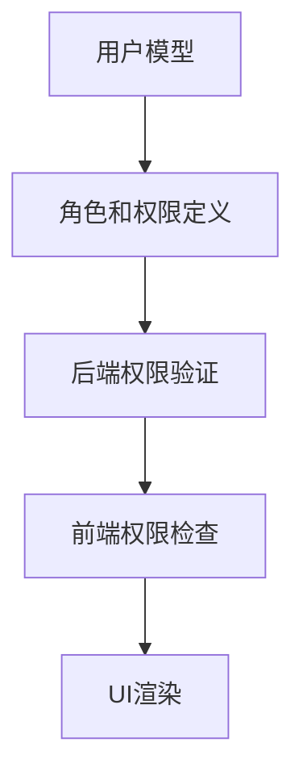

# 权限系统技术文档

## 1. 系统架构


## 2. 后端权限类

### 2.1 基于角色的权限
- `IsAdmin`: 检查用户是否为管理员
- `IsManager`: 检查用户是否为经理
- `IsAdminOrManager`: 检查用户是否为管理员或经理

### 2.2 基于具体权限
- `HasSpecificPermission`: 检查特定权限
- `has_module_permission`: 工厂函数创建模块权限检查器

### 2.3 对象级权限
- `IsOwnerOrReadOnly`: 只允许对象所有者编辑

## 3. 前端权限实现

### 3.1 AuthContext
- `hasPermission`: 检查用户是否具有指定权限
- 权限错误处理:
  - 401: 未认证
  - 403: 无权限

### 3.2 ProtectedRoute
保护路由组件，检查权限后渲染

## 4. API权限配置示例

```python
# 视图权限配置示例
class UserListView(APIView):
    permission_classes = [IsAdmin]
    
class UserDetailView(APIView):
    permission_classes = [IsOwnerOrReadOnly]
```

## 5. 常见问题排查

1. 权限不生效:
   - 检查用户角色和权限分配
   - 验证后端权限类是否正确应用
   - 检查前端权限检查逻辑

2. 403错误:
   - 检查请求是否包含有效token
   - 验证用户是否具有所需权限
