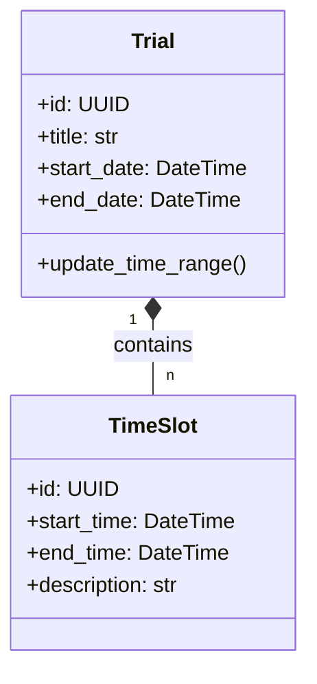
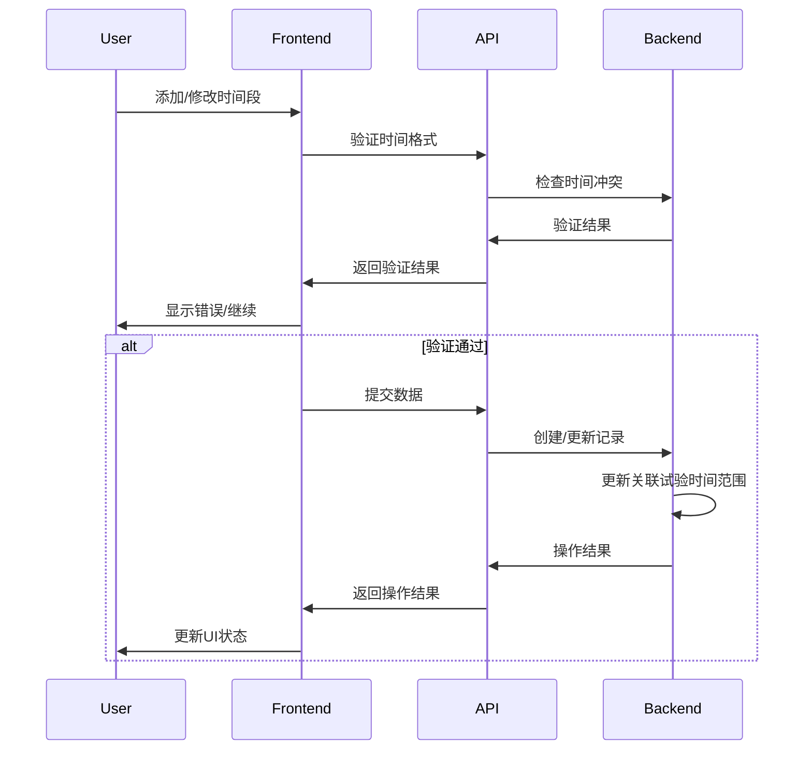

# 时间段(TimeSlot)增删改查逻辑文档

## 1. 数据模型设计

### 后端模型 (DRFForVue/events/models.py)
```python
class TimeSlot(models.Model):
    trial = models.ForeignKey(
        'Trial',
        on_delete=models.CASCADE,
        related_name='time_slots'
    )
    start_time = models.DateTimeField()
    end_time = models.DateTimeField()
    description = models.TextField(blank=True)
    
    class Meta:
        ordering = ['start_time']
        constraints = [
            models.CheckConstraint(
                check=models.Q(end_time__gt=models.F('start_time')),
            models.CheckConstraint(
                check=models.Q(end_time__gt=models.F('start_time') + timedelta(minutes=30)))
        ]
```

### 关联关系


## 2. API接口规范

### 端点列表
| 方法 | 路径 | 描述 |
|------|------|------|
| POST | `/timeslots/` | 创建单个时间段 |
| POST | `/timeslots/bulk/` | 批量创建时间段 |
| GET | `/timeslots/{trial_id}/` | 获取试验的时间段列表 |
| PUT | `/timeslots/{id}/` | 更新单个时间段 |
| DELETE | `/timeslots/{id}/` | 删除单个时间段 |

### 请求/响应示例
```json
// 创建请求
{
  "trial": "3fa85f64-5717-4562-b3fc-2c963f66afa6",
  "start_time": "2025-04-10T09:00:00Z",
  "end_time": "2025-04-10T12:00:00Z",
  "description": "设备校准"
}

// 成功响应
{
  "id": "3fa85f64-5717-4562-b3fc-2c963f66afa6",
  "trial": "3fa85f64-5717-4562-b3fc-2c963f66afa6",
  "start_time": "2025-04-10T09:00:00Z",
  "end_time": "2025-04-10T12:00:00Z",
  "description": "设备校准"
}
```

## 3. 前端交互流程

### 核心流程


### 批量操作流程
1. 前端收集多个时间段数据
2. 执行预验证(时间格式、最小间隔)
3. 提交批量创建请求
4. 后端使用事务处理
5. 返回成功/失败结果
6. 前端更新日历显示

## 4. 特殊处理逻辑

### 时间验证规则
1. 最小时间段: 30分钟
2. 不允许时间重叠(同一试验内)
3. 结束时间必须晚于开始时间
4. 批量操作时自动跳过无效时间段

### 关联试验更新
- 创建/更新/删除时间段时自动调用`trial.update_time_range()`
- 重新计算试验的总体时间范围
- 更新`trial.start_date`和`trial.end_date`

## 5. 错误处理

### 常见错误码
| 代码 | 描述 | 解决方案 |
|------|------|----------|
| 400 | 时间格式无效 | 检查时间格式 |
| 400 | 时间段太短 | 确保≥30分钟 |
| 409 | 时间冲突 | 调整时间段 |
| 404 | 试验不存在 | 检查试验ID |
