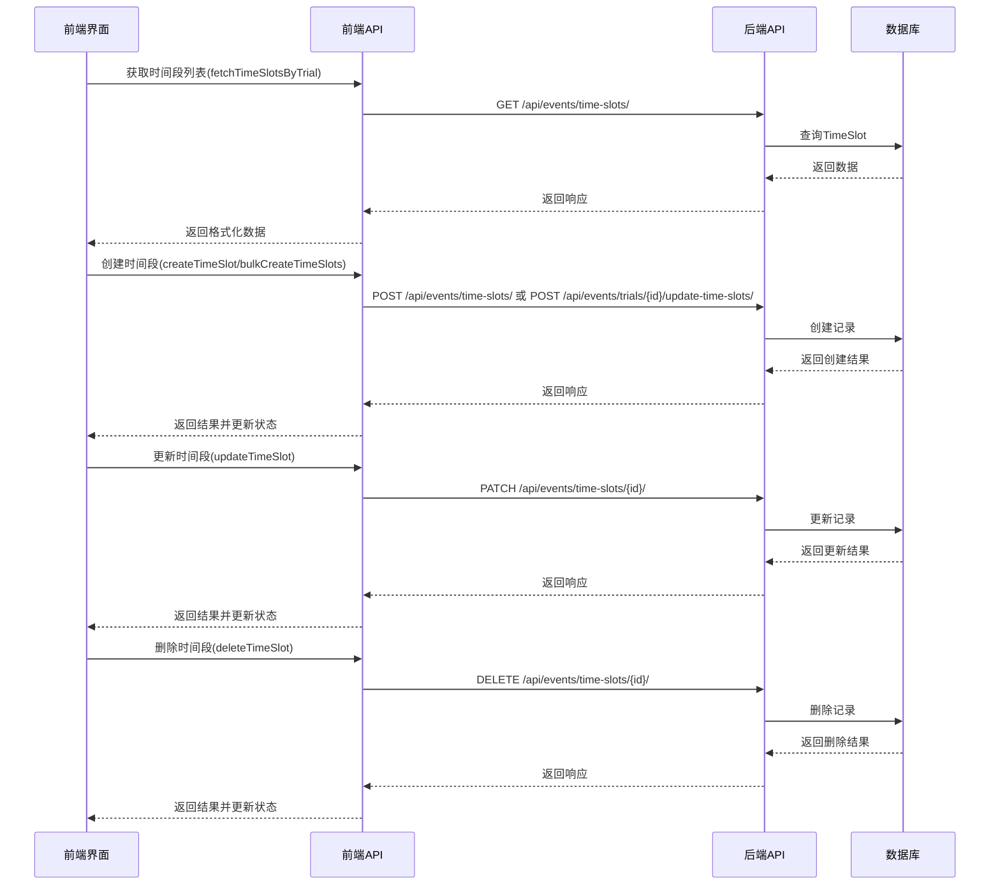

# 时间段(TimeSlot)增删改查逻辑分析

## 后端模型 (DRFForVue/events/models.py)
```python
class TimeSlot(models.Model):
    trial = models.ForeignKey(
        Trial, 
        on_delete=models.CASCADE,
        related_name='time_slots'
    )
    start_time = models.DateTimeField()
    end_time = models.DateTimeField()
    description = models.TextField(blank=True)
    
    class Meta:
        ordering = ['start_time']
        constraints = [
            models.CheckConstraint(
                check=models.Q(end_time__gt=models.F('start_time')),
                name='end_after_start'
            )
        ]
```

## 后端API (DRFForVue/events/views.py)
- 提供以下端点：
  - `GET /api/events/time-slots/` - 获取时间段列表
  - `POST /api/events/time-slots/` - 创建单个时间段
  - `PATCH /api/events/time-slots/{id}/` - 更新单个时间段
  - `DELETE /api/events/time-slots/{id}/` - 删除单个时间段
  - `POST /api/events/trials/{trial_id}/update-time-slots/` - 批量创建/更新时间段

## 前端API调用 (calendar_with_react/src/api/calendar.js)
```javascript
export const calendarApi = {
  // 获取试验的时间段
  fetchTimeSlotsByTrial: async (trialId, params = {}) => {
    const response = await apiClient.get('/api/events/time-slots/', {
      params: { trial: trialId, ...params }
    });
    return response.data;
  },

  // 创建单个时间段
  createTimeSlot: async (slotData) => {
    const response = await apiClient.post('/api/events/time-slots/', {
      trial_id: slotData.trial,
      start_time: slotData.start_time,
      end_time: slotData.end_time,
      description: slotData.description || ''
    });
    return response.data;
  },

  // 更新单个时间段
  updateTimeSlot: async (slotId, slotData) => {
    const response = await apiClient.patch(`/api/events/time-slots/${slotId}/`, {
      start_time: slotData.start_time,
      end_time: slotData.end_time,
      description: slotData.description || '',
      trial_id: slotData.trial
    });
    return response.data;
  },

  // 删除时间段
  deleteTimeSlot: async (slotId) => {
    await apiClient.delete(`/api/events/time-slots/${slotId}/`);
    return { success: true, id: slotId };
  },

  // 批量创建时间段
  bulkCreateTimeSlots: async (trialId, slotsData) => {
    const response = await apiClient.post(
      `/api/events/trials/${trialId}/update-time-slots/`,
      slotsData
    );
    return response.data;
  }
};
```

## 前端组件交互 (calendar_with_react/src/components/CalendarPage.jsx)

### 1. 创建时间段流程
1. 用户在日历上点击选择日期
2. 弹出模态框，选择试验项目
3. 添加时间段表单：
   - 开始时间 (DateTimePicker)
   - 结束时间 (DateTimePicker)
   - 描述 (TextArea)
4. 提交时验证：
   - 结束时间 > 开始时间
   - 每个时间段至少30分钟
5. 根据时间段数量调用：
   - 单个时间段：`createTimeSlot`
   - 多个时间段：`bulkCreateTimeSlots`

### 2. 查看/编辑时间段流程
1. 点击日历上的时间段事件
2. 获取时间段详情并显示在模态框中
3. 编辑模式下可修改：
   - 开始/结束时间
   - 描述
4. 提交时调用 `updateTimeSlot`

### 3. 删除时间段流程
1. 在查看模态框中点击删除按钮
2. 确认后调用 `deleteTimeSlot`
3. 更新本地事件列表

## 数据流图


## 关键验证逻辑
1. 后端模型约束：
   - `end_time` 必须大于 `start_time`
2. 前端验证：
   - 时间段至少30分钟
   - 必须选择试验项目
   - 开始/结束时间格式正确
3. 批量操作：
   - 自动处理多个时间段的创建/更新
   - 保持事务一致性
