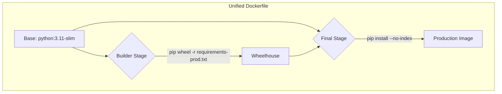

# 后端构建与依赖优化方案

## 1. 问题分析

经过对项目 `Dockerfile`、`requirements` 文件及 CI/CD 工作流的全面审查，我们发现当前后端构建流程存在严重的不一致性，这是导致 "module not found" 等环境问题的核心原因。

主要问题总结如下：

- **Python 版本混乱**:
  - 本地开发 (`Dockerfile.dev`): **3.11**
  - `test` 分支 CI (`ci-test.yml`): **3.11**
  - `main` 分支 CI 测试 (`build-and-push-images.yml`): **3.9**
  - 生产镜像构建 (`Dockerfile`): **3.10**
  - 版本碎片化导致不同环境下的行为不可预测。

- **依赖管理脱节**:
  - 开发和测试环境使用 `requirements.txt`，生产环境使用 `requirements-prod.txt`。
  - 两个文件存在版本冲突（如 `djangorestframework-simplejwt` 的 `5.3.1` vs `5.3.0`），且部分依赖（如 `pypdf`, `drf-nested-routers`）未锁定版本。
  - 这导致测试环境无法真实反映生产环境的依赖状况，测试的有效性大打折扣。

- **构建流程冗余与不一致**:
  - 项目中存在三个 Dockerfile (`Dockerfile`, `Dockerfile.dev`, `Dockerfile.prod`)，目标混淆，实现方式各异。
  - 生产构建采用的多阶段 `wheelhouse` 优化未在所有生产相关的 Dockerfile 中统一，且开发环境完全未使用，增加了环境差异。

- **CI/CD 与生产环境不匹配**:
  - CI 测试流程使用的 Python 版本和依赖文件与最终构建生产镜像的配置不一致，削弱了 CI 的保障作用。

## 2. 优化方案

为解决上述问题，我们提出一个旨在统一所有环境（本地、CI、生产）配置的标准化方案。

### 2.1. 统一 Python 版本

所有环境，包括本地开发、CI 测试和生产部署，将统一使用 **`python:3.11-slim-bullseye`** 作为基础镜像。这确保了从开发到生产的完全一致性。

### 2.2. 引入 `pip-tools` 实现稳健的依赖管理

我们将放弃手动维护 `requirements.txt` 文件，转而使用 `pip-tools` 进行自动化和确定性的依赖管理。

- **创建 `.in` 文件**:
  - `omni_desk_backend/requirements.in`: 定义项目核心依赖，供所有环境使用。
  - `omni_desk_backend/requirements-dev.in`: 包含开发和测试专用工具（如 `pytest`, `coverage`, `pip-tools` 本身），并通过 `-r requirements.in` 继承核心依赖。

- **生成锁定的 `.txt` 文件**:
  - 通过 `pip-compile` 命令，从 `.in` 文件自动生成完全锁定的 `requirements.txt` 和 `requirements-prod.txt` 文件。
  - `requirements-prod.txt` 将包含所有生产所需的包及其精确版本。
  - `requirements.txt` 将包含所有生产和开发依赖的精确版本。

这个流程确保了每一层依赖都被精确锁定，从而实现可复现的构建。

### 2.3. 统一 Docker 构建流程

我们将废弃 `Dockerfile.dev` 和 `Dockerfile.prod`，只保留一个统一的、多阶段的 `Dockerfile` (`deployment/docker/omni_desk_backend/Dockerfile`)。

- **一个 Dockerfile，多个目标**: 利用 Docker 的多阶段构建特性，在同一个文件中定义开发、构建和生产环境。
  - **`base` 阶段**: 定义统一的 Python 基础镜像。
  - **`builder` 阶段**: 专门用于创建生产依赖的 `wheelhouse`，加速生产镜像构建。
  - **`development` 阶段**: 用于本地开发，直接从 `requirements.txt` 安装所有依赖。
  - **`production` 阶段 (默认)**: 最终的生产镜像，从 `builder` 阶段拷贝 `wheelhouse` 并进行安装，确保镜像最小化且安全。

### 2.4. 对齐 CI/CD 工作流

- **统一 Python 版本**: 将所有 GitHub Actions 工作流中的 `setup-python` 版本统一为 `3.11`。
- **统一依赖安装**: 所有 CI 测试任务都将使用新生成的、完全锁定的 `requirements.txt` 文件进行依赖安装。这确保了 CI 环境与本地开发环境的依赖完全一致。
- **统一构建命令**: `build-and-push` 任务将继续使用那个唯一的、经过优化的 `Dockerfile` 来构建生产镜像。

## 3. 实施步骤

1.  **引入 `pip-tools`**: 在 `omni_desk_backend` 目录下创建 `requirements-dev.in` 并添加 `pip-tools`。
2.  **创建 `.in` 文件**: 根据现有的 `requirements.txt` 和 `requirements-prod.txt`，创建 `requirements.in` 和 `requirements-dev.in`。
3.  **生成依赖锁文件**: 运行 `pip-compile` 生成 `requirements.txt` 和 `requirements-prod.txt`。
4.  **重构 Dockerfile**: 将 `deployment/docker/omni_desk_backend/Dockerfile` 重构为支持多阶段目标的统一文件。
5.  **更新 `docker-compose.yml`**: 修改 `docker-compose.yml` 和 `docker-compose.dev.yml` (如果存在)，使其指向新的 Dockerfile 并使用正确的构建目标（如 `development`）。
6.  **更新 CI/CD 工作流**: 修改 `.github/workflows/*.yml` 文件，对齐 Python 版本和依赖安装步骤。
7.  **清理**: 验证新流程工作正常后，删除已废弃的 `Dockerfile.dev` 和 `Dockerfile.prod`。
8.  **更新文档**: 在项目 `README.md` 或贡献指南中，添加关于如何使用 `pip-tools` 更新依赖的说明。

## 4. 预期收益

- **一致性与可复现性**: 从根本上解决因环境差异导致的问题。
- **可靠性**: 测试环境能够真实反映生产环境，显著减少 "在我机器上可以运行" 的情况。
- **简化维护**: 单一的构建入口点和自动化的依赖管理流程降低了维护成本和出错风险。
- **安全性与审计**: 精确锁定的依赖使得安全审计和依赖更新变得简单可控。