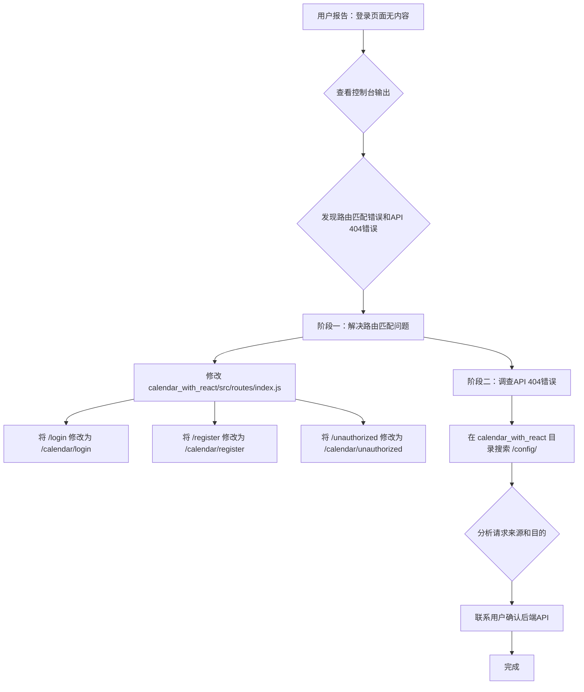

# 登录页面无内容问题修复计划

## 问题描述
用户访问登录页面时，页面没有显示任何内容。

## 控制台错误分析
根据提供的控制台输出，主要问题在于React Router的 `basename` 配置。应用配置了所有路由都应以 `/calendar` 为基础路径，但 `/login` 路径没有遵循这个约定，导致路由器无法匹配并渲染登录页面。

此外，还发现一个 `GET http://localhost:3000/config/ 404 (Not Found)` 错误，表明前端尝试访问一个不存在的API端点。

## 修复计划

### 阶段一：解决路由匹配问题
*   **目标：** 确保所有顶层路由（如登录、注册、未授权页面）都符合React Router `basename` 的 `/calendar` 配置。
*   **操作：** 修改 `calendar_with_react/src/routes/index.js` 文件，将 `/login`、`/register` 和 `/unauthorized` 这三个路径前加上 `/calendar` 前缀。

### 阶段二：调查API 404错误
*   **目标：** 找出 `http://localhost:3000/config/` 请求的来源，并确定如何解决404错误。
*   **操作：** 使用 `search_files` 工具在 `calendar_with_react` 目录下搜索 `/config/` 或 `http://localhost:3000/config/`，以定位发起该请求的代码。分析其逻辑，并可能需要进一步确认后端配置。