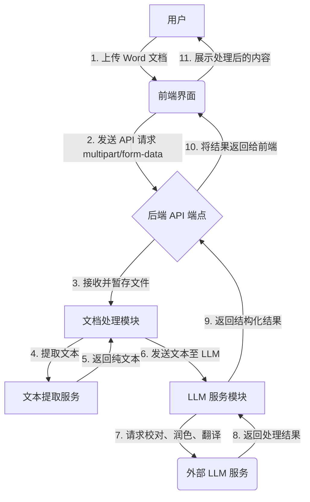

# Office 助手：文档智能处理功能架构设计方案

## 1. 概述

本文档旨在为 Office 助手设计一个全新的文档智能处理功能。该功能允许用户上传 Word 文档（`.docx`），并利用大语言模型（LLM）服务对文档内容进行校对、润色和翻译。此方案将详细阐述前端、后端以及相关服务之间的交互设计。

## 2. 系统架构

我们将采用前后端分离的架构。前端负责用户交互和文件上传，后端负责处理业务逻辑，包括文件解析、与 LLM 服务集成等。

### 2.1. 架构图 (Mermaid)



## 3. 前端设计

前端将实现一个独立的 React 组件，用于处理文档上传和结果展示。

-   **组件名**: `DocumentProcessor.jsx`
-   **核心功能**:
    1.  **文件上传**: 提供一个文件选择输入框和拖拽上传区域，限制文件类型为 `.docx`。
    2.  **上传交互**: 文件选中后，点击“处理”按钮，向后端 API 发送上传请求。在请求期间，按钮应置为禁用状态并显示加载指示器。
    3.  **结果展示**: 收到后端返回的数据后，在一个清晰的界面中分栏或分页展示“原文”、“校对建议”、“润色版本”和“翻译版本”。
    4.  **错误处理**: 如果上传失败或后端处理出错，向用户显示友好的错误提示。
-   **技术栈**:
    -   React
    -   Ant Design / Material-UI (用于 UI 组件)
    -   Axios (用于 API 请求)

## 4. 后端设计

后端将负责处理所有核心逻辑。

### 4.1. API 端点设计

-   **URL**: `/api/office-assistant/process-document`
-   **方法**: `POST`
-   **请求格式**: `multipart/form-data`
    -   `file`: 用户上传的 Word 文档文件。
-   **成功响应 (200 OK)**:
    ```json
    {
      "status": "success",
      "data": {
        "original_text": "The original extracted text...",
        "proofread_text": "The proofread version of the text...",
        "polished_text": "The polished version of the text...",
        "translated_text": "The translated version of the text..."
      }
    }
    ```
-   **失败响应 (400/500)**:
    ```json
    {
      "status": "error",
      "message": "Error description, e.g., 'Invalid file type' or 'Failed to process document.'"
    }
    ```

### 4.2. 文档处理逻辑

1.  **文件接收**: API 端点接收到 `multipart/form-data` 请求后，验证文件类型和大小。
2.  **文本提取**:
    -   使用一个可靠的库（例如 Python 的 `python-docx`）从 `.docx` 文件中提取纯文本内容。
    -   需要处理提取过程中的潜在异常，例如文件损坏或格式不受支持。

### 4.3. LLM 服务交互

1.  **服务封装**: 创建一个 `LLMService` 模块，用于封装与外部 LLM 服务的 API 调用。这有助于未来更换 LLM 提供商。
2.  **功能实现**: `LLMService` 将提供以下方法：
    -   `proofread(text: str) -> str`: 发送文本进行语法和拼写检查。
    -   `polish(text: str) -> str`: 发送文本进行风格和措辞优化。
    -   `translate(text: str, target_language: str = 'en') -> str`: 将文本翻译成指定语言。
3.  **并发处理**: 为了提高效率，后端可以并发地向 LLM 服务发送校对、润色和翻译的请求。
4.  **API 密钥管理**: LLM 服务的 API 密钥将通过环境变量进行管理，确保安全性。

### 4.4. 结果返回机制

-   **同步处理**: 对于较小的文档，可以采用同步处理方式。即在单次 API 请求-响应周期内完成所有处理并返回结果。
-   **异步处理 (未来考虑)**: 对于大型文档，为避免请求超时，可以引入异步任务队列（如 Celery + Redis）。
    1.  初始 API 请求立即返回一个 `task_id`。
    2.  前端通过另一个端点 `/api/office-assistant/task-status/<task_id>` 轮询任务状态。
    3.  任务完成后，前端从状态端点获取最终结果。

## 5. 部署与依赖

-   **后端**: 需要在后端环境中安装 `python-docx` 和 `requests` (或等效的 HTTP 客户端) 库。
-   **前端**: 无特殊依赖，集成到现有前端项目中即可。
