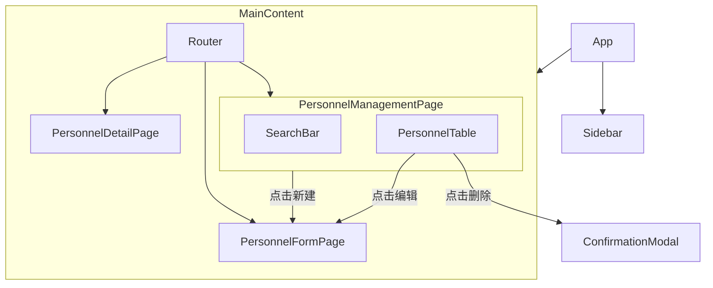

# 人员信息模块设计报告

本文档旨在详细阐述人员信息管理模块的后端和前端设计方案，以满足对人员信息进行增删改查（CRUD）的需求。

## 1. 后端设计 (Django)

后端将使用 Django 和 Django REST Framework (DRF) 来实现。

### 1.1. Django 应用

我们将创建一个新的 Django 应用，命名为 `personnel`。

```bash
python manage.py startapp personnel
```

然后，需要将此应用添加到 `settings.py` 的 `INSTALLED_APPS` 列表中。

### 1.2. 数据模型 (Personnel Model)

在 `personnel/models.py` 文件中，我们将定义 `Personnel` 模型。该模型包含了从需求图片中识别出的所有关键字段。

```python
from django.db import models

class Personnel(models.Model):
    """
    人员信息模型
    """
    STATUS_CHOICES = [
        ('active', '在职'),
        ('inactive', '离职'),
    ]

    name = models.CharField(max_length=100, verbose_name="姓名")
    id_card_number = models.CharField(max_length=18, unique=True, verbose_name="身份证号")
    date_of_birth = models.DateField(verbose_name="出生年月")
    # 假设部门和职位是字符串。如果它们是独立模型，应使用 ForeignKey。
    department = models.CharField(max_length=100, verbose_name="部门")
    position = models.CharField(max_length=100, verbose_name="职位")
    phone_number = models.CharField(max_length=20, verbose_name="联系电话")
    address = models.TextField(blank=True, null=True, verbose_name="家庭住址")
    hire_date = models.DateField(verbose_name="入职日期")
    status = models.CharField(max_length=10, choices=STATUS_CHOICES, default='active', verbose_name="员工状态")
    created_at = models.DateTimeField(auto_now_add=True, verbose_name="创建时间")
    updated_at = models.DateTimeField(auto_now=True, verbose_name="更新时间")

    def __str__(self):
        return self.name

    class Meta:
        verbose_name = "人员信息"
        verbose_name_plural = verbose_name
        ordering = ['-hire_date']
```

### 1.2.1. 与 `CustomUser` 模型的关联

为了将人员信息与系统中的用户账户（`users.CustomUser`）关联起来，我们需要对现有的 `CustomUser` 模型进行修改。该模型中已存在一个名为 `personnel` 的字段，但它指向了一个过时的模型 (`events.Personnel`)。

**步骤：**

1.  **修改 `users/models.py`**:
    更新 `CustomUser` 模型中的 `personnel` 字段，使其 `OneToOneField` 指向我们新创建的 `personnel.Personnel` 模型。

    ```python
    # omni_desk_backend/users/models.py - 需要修改的部分

    class CustomUser(AbstractUser):
        # ...
        personnel = models.OneToOneField(
            'personnel.Personnel',  # <-- 从 'events.Personnel' 修改为此
            on_delete=models.SET_NULL,
            null=True,
            blank=True,
            related_name='user_account',
            verbose_name='关联人员'
        )
        # ...
    ```

2.  **创建并应用数据库迁移**:
    在模型修改后，必须生成数据库迁移文件来记录这些变更，并将其应用到数据库中。

    ```bash
    # 为 users 应用创建迁移文件
    python manage.py makemigrations users

    # 为新的 personnel 应用创建初始迁移文件
    python manage.py makemigrations personnel

    # 应用迁移
    python manage.py migrate
    ```

### 1.3. RESTful API 设计

我们将使用 DRF 创建一个 `ModelViewSet` 来快速生成标准的 CRUD API 端点。

#### 1.3.1. Serializer

在 `personnel/serializers.py` 中定义序列化器：

```python
from rest_framework import serializers
from .models import Personnel

class PersonnelSerializer(serializers.ModelSerializer):
    # 通过 source 参数，可以在读取人员信息时直接获取关联用户的用户名
    user_username = serializers.CharField(source='user_account.username', read_only=True, allow_null=True)

    class Meta:
        model = Personnel
        fields = [
            'id', 'name', 'id_card_number', 'date_of_birth', 'department',
            'position', 'phone_number', 'address', 'hire_date', 'status',
            'created_at', 'updated_at', 'user_username'
        ]
```

#### 1.3.2. View

在 `personnel/views.py` 中定义视图集：

```python
from rest_framework import viewsets
from .models import Personnel
from .serializers import PersonnelSerializer

class PersonnelViewSet(viewsets.ModelViewSet):
    queryset = Personnel.objects.all()
    serializer_class = PersonnelSerializer
```

#### 1.3.3. API Endpoints

在 `personnel/urls.py` 和项目的主 `urls.py` 中配置路由后，将生成以下 API 端点：

| 方法   | URL                  | 描述                 |
| :----- | :------------------- | :------------------- |
| `GET`  | `/api/personnel/`    | 获取所有人员信息列表 |
| `POST` | `/api/personnel/`    | 创建一条新的人员信息 |
| `GET`  | `/api/personnel/{id}/` | 获取单个人员的详细信息 |
| `PUT`  | `/api/personnel/{id}/` | 更新单个人员的全部信息 |
| `PATCH`| `/api/personnel/{id}/` | 部分更新单个人员的信息 |
| `DELETE`| `/api/personnel/{id}/` | 删除一条人员信息     |

---

## 2. 前端设计 (React)

前端将使用 React 框架来构建用户界面，通过调用后端 API 来实现数据交互。

### 2.1. 组件规划

我们将创建一系列可复用的 React 组件来构建人员管理页面。

*   **`PersonnelManagementPage.jsx`**: 主页面，整合列表、搜索和新建按钮。
*   **`PersonnelTable.jsx`**: 表格组件，用于以列表形式展示人员信息，并包含编辑和删除操作的入口。
*   **`PersonnelDetailPage.jsx`**: 详情页面，展示单个员工的完整信息。
*   **`PersonnelForm.jsx`**: 表单组件，用于创建新员工或编辑现有员工信息。此表单可包含一个下拉选择框，用于从现有未关联的 `CustomUser` 列表中选择一个账户进行关联。
*   **`SearchBar.jsx`**: 搜索栏组件，用于根据姓名、部门等字段筛选人员。
*   **`ConfirmationModal.jsx`**: 确认对话框，用于删除操作前的二次确认。

### 2.2. 页面布局与组件层次结构

页面将采用经典的后台管理布局，包含侧边导航栏和主内容区。



### 2.3. 数据流

前端的数据流遵循单向数据流的原则。

1.  **获取数据 (Fetch)**:
    *   `PersonnelManagementPage` 组件在加载时（`useEffect` hook）调用 API 服务 (`/api/personnel/`) 获取人员列表。
    *   获取到的数据存储在组件的 state 中，并作为 props 传递给 `PersonnelTable`。

2.  **展示数据 (Display)**:
    *   `PersonnelTable` 接收人员列表数据并渲染成表格。
    *   `PersonnelDetailPage` 根据 URL 中的 ID 调用 API (`/api/personnel/{id}/`) 获取单个员工数据并展示。

3.  **创建/更新数据 (Create/Update)**:
    *   `PersonnelForm` 组件管理表单输入状态。
    *   用户提交表单时，根据是新建还是编辑，分别调用 `POST /api/personnel/` 或 `PUT /api/personnel/{id}/`。
    *   操作成功后，刷新列表或跳转回列表页。

4.  **删除数据 (Delete)**:
    *   用户在 `PersonnelTable` 中点击删除按钮，触发 `ConfirmationModal`。
    *   确认后，调用 `DELETE /api/personnel/{id}/` API。
    *   删除成功后，从 state 中移除对应数据或重新获取列表。