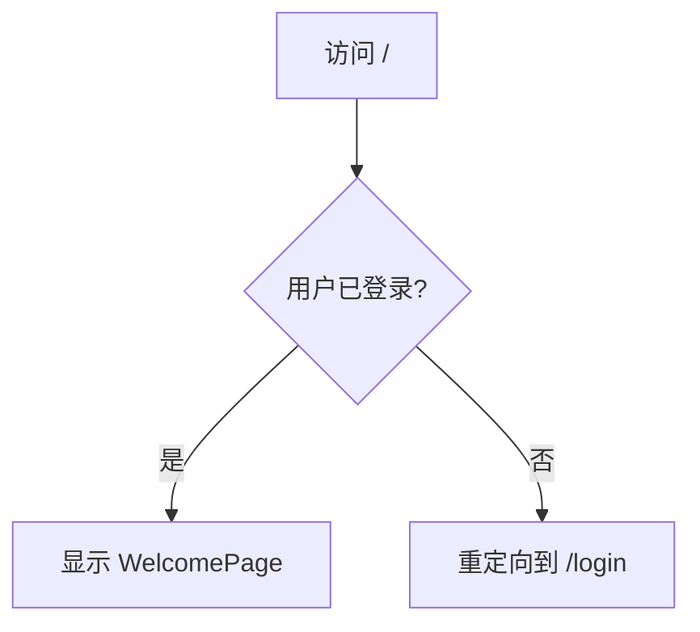

# 根路径路由调整计划

## 问题描述
目前，访问应用程序的根路径 `/` 时，会自动跳转到 `/calendar/trial-calendar`。这是由于 `calendar_with_react/src/routes/index.js` 中的路由配置导致的。

## 目标
实现访问根路径时，根据用户登录状态进行条件跳转：
- 若用户未登录，则重定向到登录页面 (`/login`)。
- 若用户已登录，则显示一个全新的欢迎页面。

## 详细步骤

### 1. 创建新的欢迎页面组件
- **文件路径：** `calendar_with_react/src/pages/WelcomePage.js`
- **内容：** 一个简单的 React 组件，用于显示欢迎信息。

### 2. 修改路由配置 (`calendar_with_react/src/routes/index.js`)

#### a. 移除现有重定向
删除或注释掉以下行：
```javascript
{ index: true, element: <Navigate to="calendar" replace /> },
{ path: "calendar", element: <Navigate to="trial-calendar" replace /> }, // 默认重定向到试验日历
```

#### b. 添加新的根路径逻辑
在根路径 `/` 下，根据用户登录状态渲染 `WelcomePage` 或重定向到 `Login` 页面。

修改后的路由逻辑示意图：


## 实施说明
本计划将在 `code` 模式下实施。