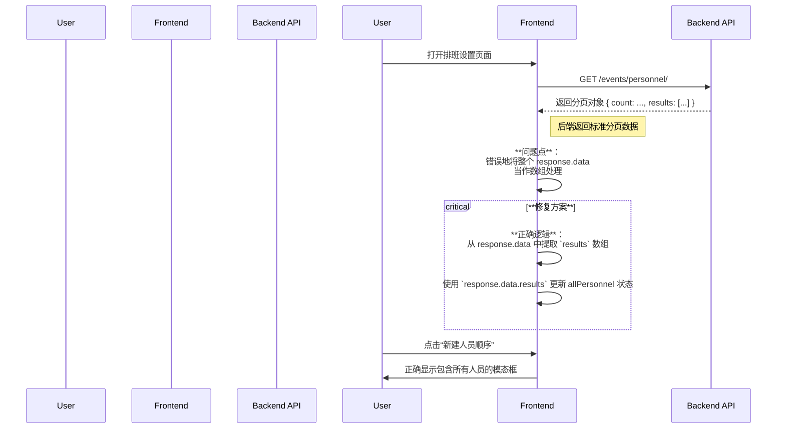

# 排班设置页面人员顺序模态框 Bug 修复计划

## 1. 问题描述

在排班设置页面（`schedule-settings`），当用户尝试新建人员顺序时，弹出的模态框中无法获取并显示现有的所有人员信息，导致用户无法选择人员来创建顺序。

## 2. 问题根源分析

经过对前后端代码的联合分析，确定问题根源在于前端对后端 API 返回数据格式的处理不当。

-   **后端 API**: `/events/personnel/` 端点返回的是一个标准的分页对象（Paginated Response），而不是一个纯粹的人员列表数组。其结构为：
    ```json
    {
      "count": 10,
      "next": "...",
      "previous": null,
      "results": [
        { "id": 1, "name": "张三", ... },
        { "id": 2, "name": "李四", ... }
      ]
    }
    ```
-   **前端组件**: 位于 `omni_desk_frontend/src/components/SequenceManager.jsx` 的 `fetchData` 函数在接收到 API 响应后，错误地将整个 `response.data` 对象当作人员数组处理，而没有提取其中的 `results` 字段。这导致存储人员列表的 `allPersonnel` 状态被设置为空数组，最终使得模态框中的下拉列表为空。

## 3. 修复计划

修复的核心是调整前端组件，使其能够正确解析后端返回的分页数据结构。

### 3.1. 目标文件

-   **文件路径**: `omni_desk_frontend/src/components/SequenceManager.jsx`

### 3.2. 修改点

-   **函数**: `fetchData`
-   **具体操作**: 修改 `setAllPersonnel` 的调用逻辑。

    **原代码**:
    ```javascript
    setAllPersonnel(Array.isArray(personnelListRes.data) ? personnelListRes.data : []);
    ```

    **修改后代码**:
    ```javascript
    setAllPersonnel(Array.isArray(personnelListRes.data.results) ? personnelListRes.data.results : []);
    ```
    此修改确保我们从响应中提取 `results` 数组来更新状态。

### 3.3. 开发流程图



## 4. 实施步骤

1.  切换到 `code` 模式。
2.  使用 `apply_diff` 工具对 `omni_desk_frontend/src/components/SequenceManager.jsx` 文件应用上述代码修改。
3.  提交代码变更。