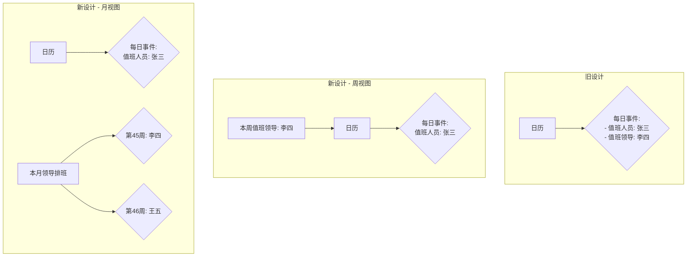

# 排班页面简化方案

## 1. 背景

当前，排班管理页面 (`/admin/schedules`) 和排班日程页面 (`/shift-schedule`) 都在日历的每一天显示值班人员和值班领导。由于值班领导是按周轮换的，这种设计导致了信息冗余和视觉混乱，使得关键信息不够突出。

## 2. 目标

*   简化日历视图，使其更加清晰易读。
*   突出显示每周轮换的值班领导。
*   优化用户体验，让排班信息一目了然。

## 3. 设计方案

核心思想是将不同更新频率的信息（每日的值班人员 vs. 每周的值班领导）分层展示。

### 3.1. 创建独立的“本周值班领导”组件

我们将创建一个新的 React 组件 `WeeklyLeaderDisplay.jsx`。

*   **位置**: 该组件将被放置在日历视图的正上方。
*   **功能**:
    *   它会根据日历当前显示的日期范围，自动计算出是哪一周。
    *   获取并清晰地展示该周的值班领导姓名。
    *   当用户在日历上切换周时，该组件显示的内容会同步更新。

### 3.2. 简化日历事件的显示内容

我们将修改日历中每日事件的渲染逻辑。

*   在日历的每一天，只显示核心信息——“值班人员”的姓名。
*   移除之前重复显示的“值班领导”姓名，从而为日历减负，使其不再拥挤。

### 3.3. 月视图的优化方案

考虑到月视图信息密度更高，我们采用一个更清晰的方案，将周级别的领导信息从日历网格中完全分离。

*   **创建“本月领导排班”侧边栏**：
    *   在月视图日历的旁边（例如右侧），增加一个**只用于显示值班领导**的独立侧边栏。
    *   该侧边栏将以列表形式，清晰展示当前月份**每一周的日期范围**及其对应的**值班领导**。
    *   当用户切换月份时，该信息板内容同步更新。
    *   **视觉对齐**：我们将通过 JavaScript 动态获取日历中**每一周的实际渲染高度**，并将此高度应用到侧边栏对应的领导信息条目上，确保领导信息与周次在视觉上**完美对齐**。
    *   **组件样式**：侧边栏中的每个领导信息条目将设计为具有辨识度的**“卡片”样式**。它将拥有独立的背景色、标签（如“第45周”）和领导姓名，使其在视觉上比简单的文本栏更突出，类似于一个独立的、有样式的“迷你日历格”。
    *   **样式对齐**：侧边栏中“值班领导”信息条目的视觉样式，应与日历中“值班人员”条目的效果在风格上（如颜色、字体）保持一致，以确保整体视觉和谐。
    *   **交互功能**：侧边栏中的“值班领导”信息条目应支持**拖拽功能**，允许用户通过拖拽操作来方便地交换每周的值班领导。

*   **保持日历网格的简洁**：
    *   日历的每一天只显示“值班人员”的姓名。

这个设计将宏观的周信息与微观的日信息彻底分开，让两个维度的信息都清晰易读。

### 3.4. 设计示意图

## 4. 待办事项及文件变更

为了实现以上方案，需要进行以下操作：

1.  **创建新文件**:
    *   `omni_desk_frontend/src/components/Schedule/WeeklyLeaderDisplay.jsx`: 用于显示每周值班领导的新组件。

2.  **修改现有文件**:
    *   `omni_desk_frontend/src/pages/ScheduleManagementPage.jsx`:
        *   引入并使用 `WeeklyLeaderDisplay` 组件。
        *   修改 `FullCalendar` 的事件渲染逻辑，只显示值班人员。
    *   `omni_desk_frontend/src/components/ShiftScheduleContainer.jsx`:
        *   引入并使用 `WeeklyLeaderDisplay` 组件。
        *   修改传递给 `ShiftSchedule` 组件的属性，或直接修改 `ShiftSchedule` 组件以调整事件的渲染。
    *   `omni_desk_frontend/src/components/ShiftSchedule.jsx`:
        *   (可能需要修改) 如果渲染逻辑封装在此组件内，需要修改其 `FullCalendar` 的配置。
