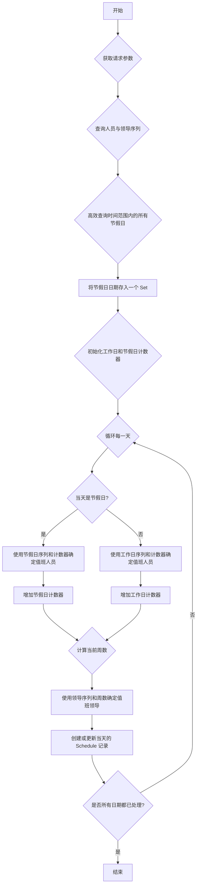

# 排班逻辑修改计划：工作日与节假日分离

## 1. 需求背景

当前排班系统的值班人员和值班领导均采用单一序列进行轮换。为了更灵活地管理人力资源，现提出以下需求：

1.  **值班人员排班**：需区分 **工作日** 和 **节假日**，建立两套独立的轮换序列。
2.  **值班领导排班**：逻辑保持不变，继续沿用单一的、按周轮换的序列。
3.  **节假日数据源**：系统从 `Holiday` 模型中动态获取节假日信息，该模型支持跨越多天的节假日。

## 2. 现有逻辑分析

-   **核心逻辑位置**：[`omni_desk_backend/events/views.py`](omni_desk_backend/events/views.py:303) 中的 `generate_schedules` 方法。
-   **人员轮换**：每日轮换，使用 `PersonnelSequence` 模型中的 `sequence` 列表。
-   **领导轮换**：每周轮换，使用 `LeaderSequence` 模型中的 `sequence` 列表。
-   **数据模型**：
    -   `Schedule`: 存储最终的排班结果。
    -   `PersonnelSequence`: 定义值班人员的轮换顺序。
    -   `LeaderSequence`: 定义值班领导的轮换顺序。
    -   `Holiday`: 存储节假日的起止日期。

当前的实现未对日期类型（工作日/节假日）进行区分，无法满足新需求。

## 3. 详细修改计划

为了以最小的侵入性实现需求，计划对现有模型进行扩展，并重构排班生成的核心逻辑。

### 步骤 1：扩展 `PersonnelSequence` 模型

不引入新模型，直接在现有的 [`PersonnelSequence`](omni_desk_backend/events/models.py:247) 模型中增加用于节假日排班的字段。

**文件**: [`omni_desk_backend/events/models.py`](omni_desk_backend/events/models.py:0)

```python
# omni_desk_backend/events/models.py

class PersonnelSequence(models.Model):
    name = models.CharField(max_length=100, unique=True, verbose_name="人员顺序名称")
    
    # 工作日序列
    personnel = models.ManyToManyField(Personnel, related_name='personnel_sequences', verbose_name="工作日人员")
    sequence = models.JSONField(default=list, verbose_name="工作日人员ID顺序列表")

    # 新增：节假日序列
    holiday_personnel = models.ManyToManyField(Personnel, related_name='holiday_personnel_sequences', verbose_name="节假日人员", blank=True)
    holiday_sequence = models.JSONField(default=list, verbose_name="节假日人员ID顺序列表", blank=True)

    class Meta:
        verbose_name = "人员顺序"
        verbose_name_plural = "人员顺序管理"

    def __str__(self):
        return self.name
```

**变更说明**:
-   `personnel` 和 `sequence` 字段将专门用于 **工作日** 排班。
-   新增 `holiday_personnel` 和 `holiday_sequence` 字段，用于 **节假日** 排班。`blank=True` 允许节假日序列为空，以兼容旧数据和简单场景。

### 步骤 2：更新 `PersonnelSequenceSerializer`

同步更新序列化器，使其能在 API 中展示和接收节假日序列数据。

**文件**: [`omni_desk_backend/events/serializers.py`](omni_desk_backend/events/serializers.py:0)

```python
# omni_desk_backend/events/serializers.py

class PersonnelSequenceSerializer(serializers.ModelSerializer):
    personnel_details = serializers.SerializerMethodField()
    holiday_personnel_details = serializers.SerializerMethodField() # 新增

    class Meta:
        model = PersonnelSequence
        fields = [
            'id', 'name', 
            'sequence', 'personnel_details',
            'holiday_sequence', 'holiday_personnel_details' # 新增字段
        ]

    def get_personnel_details(self, obj):
        # ... (现有逻辑不变)
        personnel_ids = obj.sequence
        personnel_queryset = Personnel.objects.filter(id__in=personnel_ids)
        personnel_map = {p.id: p for p in personnel_queryset}
        sorted_personnel = [personnel_map[pid] for pid in personnel_ids if pid in personnel_map]
        return PersonnelSerializer(sorted_personnel, many=True).data

    # 新增方法
    def get_holiday_personnel_details(self, obj):
        personnel_ids = obj.holiday_sequence
        if not personnel_ids:
            return []
        personnel_queryset = Personnel.objects.filter(id__in=personnel_ids)
        personnel_map = {p.id: p for p in personnel_queryset}
        sorted_personnel = [personnel_map[pid] for pid in personnel_ids if pid in personnel_map]
        return PersonnelSerializer(sorted_personnel, many=True).data
```

### 步骤 3：重构 `generate_schedules` 核心逻辑

这是本次修改的核心。需要重写 [`ScheduleViewSet.generate_schedules`](omni_desk_backend/events/views.py:303) 方法。

**文件**: [`omni_desk_backend/events/views.py`](omni_desk_backend/events/views.py:303)

#### 3.1 逻辑流程图



#### 3.2 伪代码实现

```python
# in ScheduleViewSet.generate_schedules

# 1. 获取请求参数 (start_date, duration_days, sequence_ids, etc.)
# ...

# 2. 获取序列模型
personnel_sequence = PersonnelSequence.objects.get(id=personnel_sequence_id)
leader_sequence = LeaderSequence.objects.get(id=leader_sequence_id)

workday_personnel_order = personnel_sequence.sequence
holiday_personnel_order = personnel_sequence.holiday_sequence
leader_order = leader_sequence.sequence

# 检查节假日序列是否为空，如果为空但需要使用，则报错或使用工作日序列作为后备
if not holiday_personnel_order:
    # 可以选择报错或默认使用工作日序列
    # return Response({'error': 'Holiday sequence is not configured.'}, status=400)
    holiday_personnel_order = workday_personnel_order # Fallback

# 3. 高效查询节假日
end_date = start_date + timedelta(days=duration_days - 1)
holidays = Holiday.objects.filter(
    start_date__lte=end_date,
    end_date__gte=start_date
)
holiday_dates = set()
for holiday in holidays:
    current_day = holiday.start_date
    while current_day <= holiday.end_date:
        holiday_dates.add(current_day)
        current_day += timedelta(days=1)

# 4. 初始化起始索引和计数器
# ... (获取 start_personnel_id, start_leader_id 并计算 start_index)
workday_personnel_start_index = ...
holiday_personnel_start_index = ... # 可能需要一个新的API参数来指定节假日起始人员
leader_start_index = ...

workday_days_passed = 0
holiday_days_passed = 0

# 5. 循环生成排班
with transaction.atomic():
    for i in range(duration_days):
        current_date = start_date + timedelta(days=i)

        # 5.1 判断日期类型并分配值班人员
        if current_date in holiday_dates:
            # 是节假日
            personnel_idx = (holiday_personnel_start_index + holiday_days_passed) % len(holiday_personnel_order)
            duty_person_id = holiday_personnel_order[personnel_idx]
            holiday_days_passed += 1
        else:
            # 是工作日
            personnel_idx = (workday_personnel_start_index + workday_days_passed) % len(workday_personnel_order)
            duty_person_id = workday_personnel_order[personnel_idx]
            workday_days_passed += 1

        # 5.2 分配值班领导 (逻辑不变)
        weeks_passed = (current_date - start_date).days // 7
        leader_idx = (leader_start_index + weeks_passed) % len(leader_order)
        duty_leader_id = leader_order[leader_idx]

        # 5.3 创建或更新排班记录
        Schedule.objects.update_or_create(
            duty_date=current_date,
            defaults={
                'duty_person_id': duty_person_id,
                'duty_leader_id': duty_leader_id
            }
        )

# 6. 返回结果
# ...
```

## 4. 总结

本次修改涉及以下文件和模型的变更：

-   **Models**:
    -   [`omni_desk_backend/events/models.py`](omni_desk_backend/events/models.py:0): 对 `PersonnelSequence` 模型进行扩展。
-   **Serializers**:
    -   [`omni_desk_backend/events/serializers.py`](omni_desk_backend/events/serializers.py:0): 修改 `PersonnelSequenceSerializer` 以反映模型变化。
-   **Views**:
    -   [`omni_desk_backend/events/views.py`](omni_desk_backend/events/views.py:0): 大幅重构 `ScheduleViewSet` 中的 `generate_schedules` 方法。

该计划通过扩展现有模型而非创建新模型的方式，保持了数据结构的简洁性，同时通过重构核心业务逻辑，清晰地实现了工作日与节假日排班序列的分离，且确保了值班领导的排班逻辑不受影响。
