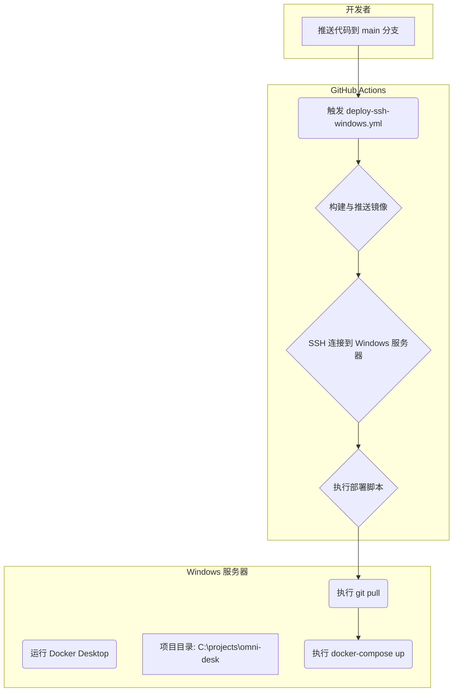

# 部署手册 - Ubuntu / Linux

> **注意**: 本部分描述的是在 Ubuntu/Linux 环境下的手动部署流程。对于 Windows 服务器，我们强烈推荐使用新的自动化部署流程。
>
> **[跳转到自动化部署手册 - Windows 服务器](#自动化部署手册---windows-服务器)**

# 项目部署手册 - 基于 Docker Compose (Ubuntu 22.04 LTS)

## 1. 概述

本手册旨在指导用户在 Ubuntu 22.04 LTS 服务器上部署基于 Docker Compose 的全栈应用。该应用包含前端 React 应用和后端 Django REST Framework 应用，前端容器内置 Nginx 作为统一 HTTP 入口（同时承担反向代理和静态文件服务），PostgreSQL 作为数据库。

## 2. 部署架构

本项目采用**单 Nginx 入口**架构（前端容器内置 Nginx）：

```mermaid
graph TD
    subgraph 用户端
        A[浏览器]
    end

    subgraph 部署服务器 (Ubuntu 22.04 LTS)
        direction LR
        D[Frontend Container<br/>内置 Nginx :80<br/>反向代理 + 静态服务] -- /api 反代 --> C(Backend Container :8000)
        C -- DB 连接 --> E(PostgreSQL Container)
        F[Docker Daemon] -- 管理 --> C & D & E
        G[Docker Compose] -- 编排 --> C & D & E
    end

    A -- HTTP/HTTPS :80 --> D
```

*   **前端 (Frontend):** React 应用构建产物 + 内置 Nginx（基于 `nginx:stable-alpine`），作为**唯一 HTTP 入口**，处理静态文件服务、反向代理到后端 API、Admin 路由、媒体文件访问等所有路由。Nginx 配置文件位于 `omni_desk_frontend/nginx.conf`。
*   **后端 (Backend):** Django REST Framework 应用，运行在 Waitress WSGI 服务器上，监听容器内 `:8000` 端口（**不直接对外暴露**）。
*   **数据库 (Database):** PostgreSQL 容器，用于存储应用数据。
*   **Docker & Docker Compose:** 提供容器化环境和多容器应用编排。

> **架构说明**：早期版本曾使用两层 Nginx（外层 Nginx + 前端 Nginx），现已简化为单 Nginx 入口。修改 `omni_desk_frontend/nginx.conf` 即可调整所有路由规则，无需同时维护两份 Nginx 配置。

## 3. 部署环境准备

### 3.1. 操作系统要求

*   Ubuntu Server 22.04 LTS

### 3.2. 安装 Docker

在 Ubuntu 22.04 上安装 Docker Engine：

```bash
# 更新 apt 包索引
sudo apt update

# 安装必要的包以允许 apt 通过 HTTPS 使用存储库
sudo apt install ca-certificates curl gnupg lsb-release

# 添加 Docker 的官方 GPG 密钥
sudo mkdir -p /etc/apt/keyrings
curl -fsSL https://download.docker.com/linux/ubuntu/gpg | sudo gpg --dearmor -o /etc/apt/keyrings/docker.gpg

# 设置 Docker 仓库
echo \
  "deb [arch=$(dpkg --print-architecture) signed-by=/etc/apt/keyrings/docker.gpg] https://download.docker.com/linux/ubuntu \
  $(lsb_release -cs) stable" | sudo tee /etc/apt/sources.list.d/docker.list > /dev/null

# 再次更新 apt 包索引
sudo apt update

# 安装 Docker Engine、Containerd 和 Docker Compose (CLI)
sudo apt install docker-ce docker-ce-cli containerd.io docker-buildx-plugin docker-compose-plugin

# 验证 Docker 是否安装成功
sudo docker run hello-world

# 将当前用户添加到 docker 用户组，以便无需 sudo 即可运行 Docker 命令
sudo usermod -aG docker $USER

# 重新登录以使组更改生效，或者运行 newgrp docker
newgrp docker
```

### 3.3. 防火墙配置 (UFW)

如果服务器启用了防火墙 (UFW)，需要开放必要的端口：

```bash
# 允许 SSH (如果通过 SSH 连接)
sudo ufw allow ssh

# 允许 HTTP (80 端口)
sudo ufw allow http

# 允许 HTTPS (443 端口，如果后续配置 HTTPS)
sudo ufw allow https

# 启用防火墙 (如果尚未启用)
sudo ufw enable

# 查看防火墙状态
sudo ufw status
```

## 4. 项目代码准备与配置

### 4.1. 克隆项目仓库

在部署服务器上，选择一个合适的目录来克隆项目代码：

```bash
# 例如，在用户主目录下创建 projects 目录
mkdir ~/projects
cd ~/projects

# 克隆您的项目仓库 (请替换为实际的仓库地址)
git clone your_project_repository_url.git
cd your_project_directory
```

### 4.2. 配置 `.env` 文件

项目根目录下有一个 `.env` 文件（或您需要手动创建）。这个文件包含 Docker Compose 部署所需的关键环境变量。

**示例 `.env` 文件内容：**

```ini
# Docker镜像配置
DOCKER_USER=your_docker_hub_username # 替换为您的 Docker Hub 用户名
FRONTEND_VERSION=1.0.0              # 前端镜像版本，与您构建的镜像版本一致
BACKEND_VERSION=1.0.0               # 后端镜像版本，与您构建的镜像版本一致

# 数据库配置 (与 docker-compose.yml 中的 db 服务配置保持一致)
POSTGRES_DB=postgres
POSTGRES_USER=postgres
POSTGRES_PASSWORD=postgres
DB_HOST=db # Docker Compose 网络中数据库服务的主机名

# Django SECRET_KEY (请务必替换为生产环境的强密钥)
SECRET_KEY=!@#django-insecure-9g_8=0q^fz$3k&9m6v%_wx@7t6r4b5y_u*8h7=+!k

# Django 超级用户配置 (首次部署或需要时创建)
SUPERUSER_NAME=admin
SUPERUSER_EMAIL=admin@example.com
SUPERUSER_PASSWORD=ChangeMe123!
```

**重要提示：**
*   务必将 `your_docker_hub_username` 替换为实际的 Docker Hub 用户名。
*   `FRONTEND_VERSION` 和 `BACKEND_VERSION` 应与您构建和推送的 Docker 镜像版本标签一致。
*   `SECRET_KEY` 是 Django 框架的关键安全设置，**在生产环境中务必替换为一个随机生成的复杂密钥**。您可以使用 Django 的 `get_random_secret_key()` 函数生成一个。
*   `SUPERUSER_PASSWORD` 也请替换为强密码。

## 5. Docker 镜像管理

### 5.1. 构建和推送镜像 (在开发环境执行)

在您进行开发和 CI/CD 的机器上，使用项目提供的 `build.sh` 脚本来构建前端和后端 Docker 镜像，并将其推送到 Docker Hub 或私有仓库。

```bash
# 确保 build.sh 脚本有执行权限
chmod +x build.sh

# 登录 Docker Hub (如果尚未登录)
docker login

# 构建并推送镜像 (例如，版本号为 1.0.0，Docker 用户名为 oneMuggle)
./build.sh 1.0.0 oneMuggle
```

脚本会根据 `calendar_with_react/Dockerfile` 和 `DRFForVue/Dockerfile` 构建镜像，并打上 `your_docker_hub_username/calendar-frontend:1.0.0` 和 `your_docker_hub_username/calendar-backend:1.0.0` 这样的标签。

### 5.2. 在部署服务器拉取镜像

在部署服务器上，确保 `.env` 文件中的 `DOCKER_USER`、`FRONTEND_VERSION` 和 `BACKEND_VERSION` 配置正确后，进入项目根目录，拉取所需的 Docker 镜像：

```bash
cd your_project_directory # 确保您在包含 docker-compose.yml 的项目根目录

# 拉取 Docker Compose 文件中定义的所有服务镜像
docker compose pull
```

## 6. 服务部署与管理

### 6.1. 启动所有服务

进入项目根目录，使用 `docker compose up` 命令启动所有服务：

```bash
cd your_project_directory

# 以后台模式启动所有服务 (-d 表示 detached mode)
docker compose up -d
```

### 6.2. 数据库初始化 (迁移和创建超级用户)

首次启动服务后，或者当数据库模型发生变化时，需要执行数据库迁移。同时，通常需要创建一个超级用户来访问 Django 管理后台。

```bash
# 执行数据库迁移
docker compose exec backend python manage.py migrate

# 创建超级用户 (脚本会读取 .env 中的 SUPERUSER_NAME, SUPERUSER_EMAIL, SUPERUSER_PASSWORD)
docker compose exec backend python /app/init_superuser.py
```

`init_superuser.py` 脚本会检查是否已存在同名超级用户，如果不存在则创建。

### 6.3. 查看服务状态和日志

*   **查看所有服务的状态：**
    ```bash
    docker compose ps
    ```
*   **查看特定服务的日志 (例如，后端服务)：**
    ```bash
    docker compose logs backend
    # 实时查看日志
    docker compose logs -f backend
    ```
*   **查看所有服务的实时日志：**
    ```bash
    docker compose logs -f
    ```

### 6.4. 停止和重启服务

*   **停止所有服务：**
    ```bash
    docker compose stop
    ```
*   **停止并删除所有服务容器、网络、卷和镜像 (慎用，会丢失数据卷数据)：**
    ```bash
    docker compose down
    ```
*   **重启特定服务 (例如，前端服务)：**
    ```bash
    docker compose restart frontend
    ```
*   **重启所有服务：**
    ```bash
    docker compose restart
    ```

### 6.5. Nginx 配置说明

项目采用**单 Nginx 入口**架构，唯一在用的 Nginx 配置位于 `omni_desk_frontend/nginx.conf`（前端容器内置）。该配置文件定义了前端容器的所有路由行为：

```nginx
server {
    listen 80;
    server_name localhost;

    client_max_body_size 20M;
    keepalive_timeout 65;

    # Security headers（默认开启）
    add_header X-Content-Type-Options nosniff always;
    add_header X-Frame-Options SAMEORIGIN always;
    add_header Referrer-Policy strict-origin-when-cross-origin always;
    # ... 其他安全头省略

    # Django 静态文件服务
    location /django-static/ {
        proxy_pass http://backend:8000;
        expires 7d;
        add_header Cache-Control "public";
    }

    # 媒体文件服务
    location /media/ {
        proxy_pass http://backend:8000;
        expires 7d;
        add_header Cache-Control "public";
    }

    # 前端 React 应用
    location / {
        root /usr/share/nginx/html;
        index index.html index.htm;
        try_files $uri /index.html;
    }

    # API 反向代理
    location /api/ {
        proxy_pass http://backend:8000;
        proxy_set_header Host $http_host;
        proxy_set_header X-Real-IP $remote_addr;
        proxy_set_header X-Forwarded-For $proxy_add_x_forwarded_for;
        proxy_set_header X-Forwarded-Proto $scheme;
        proxy_redirect off;
    }

    # Django Admin 反向代理
    location /admin/ {
        proxy_pass http://backend:8000;
        proxy_set_header Host $http_host;
        # ... 与 /api/ 相同的代理头
        proxy_redirect off;
    }

    gzip on;
    # ... gzip 配置
}
```

**关键路由说明**：

| 路径 | 处理方式 |
|------|---------|
| `/` | 前端 Nginx 直接服务 `/usr/share/nginx/html` 下的 React 构建产物 |
| `/api/` | 反向代理到 `backend:8000`（Django REST Framework） |
| `/admin/` | 反向代理到 `backend:8000`（Django Admin） |
| `/django-static/` | 反向代理到 `backend:8000`（Django collectstatic 产物） |
| `/media/` | 反向代理到 `backend:8000`（用户上传文件） |

**HTTPS 配置**：如需启用 HTTPS，请取消 `omni_desk_frontend/nginx.conf` 中 `server { listen 443 ssl http2; ... }` 代码块的注释，并将自签证书放置到 `/etc/nginx/ssl/server.crt` 与 `/etc/nginx/ssl/server.key`。同时设置环境变量 `USE_HTTPS=true`。

**修改路由**：所有路由规则集中在 `omni_desk_frontend/nginx.conf` 一处，无需维护多份 Nginx 配置。修改后需重新构建前端镜像。

## 7. 日常维护

### 7.1. 版本升级流程

1.  **在开发环境中构建新版本镜像：**
    *   确保您的代码仓库是最新的。
    *   修改 `.env` 文件中的 `FRONTEND_VERSION` 和 `BACKEND_VERSION` 为新的版本号（例如，`1.0.1`）。
    *   执行 `build.sh` 脚本来构建并推送新版本的 Docker 镜像到 Docker Hub。
2.  **在部署服务器更新 `.env` 文件：**
    *   登录到部署服务器，进入项目根目录。
    *   编辑 `.env` 文件，将 `FRONTEND_VERSION` 和 `BACKEND_VERSION` 更新为新的版本号。
3.  **拉取新镜像并重新部署：**
    ```bash
    cd your_project_directory
    docker compose pull # 拉取新版本的镜像
    docker compose up -d # 停止旧容器，启动新容器
    docker compose exec backend python manage.py migrate # 如果有数据库模型变更，执行迁移
    ```

### 7.2. 回滚到旧版本

如果您需要回滚到之前的某个稳定版本：

1.  **在部署服务器更新 `.env` 文件：**
    *   登录到部署服务器，进入项目根目录。
    *   编辑 `.env` 文件，将 `FRONTEND_VERSION` 和 `BACKEND_VERSION` 修改为要回滚到的旧版本号。
2.  **拉取旧镜像并重新部署：**
    ```bash
    cd your_project_directory
    docker compose pull # 拉取旧版本的镜像
    docker compose up -d # 停止当前容器，启动旧版本容器
    # 如果旧版本有不同的数据库迁移，可能需要手动处理数据库回滚，这通常比较复杂，需谨慎操作
    ```

### 7.3. 数据库数据卷备份与恢复

数据库数据 (`postgres_data` 卷) 是应用的核心，务必定期备份。

#### 7.3.1. 备份数据卷

有多种方法可以备份 Docker 卷。这里介绍两种常用方法：

**方法一：使用 `docker cp` (简单但不推荐用于运行中的数据库)**

这种方法适用于数据库不活跃或已停止的情况下。

```bash
# 假设您的 PostgreSQL 容器名称是 project_db_1 (可以通过 docker ps 查看)
# 备份到宿主机的 ~/db_backups 目录
mkdir -p ~/db_backups
docker cp project_db_1:/var/lib/postgresql/data ~/db_backups/postgres_data_backup_$(date +%Y%m%d%H%M%S)
```

**方法二：使用临时容器挂载数据卷 (推荐)**

这种方法更安全，因为它不直接操作运行中的数据库容器的文件系统。

```bash
# 停止使用该数据卷的服务 (可选，但推荐在备份前停止相关服务以确保数据一致性)
# docker compose stop db

# 创建备份目录
mkdir -p ~/db_backups

# 使用临时容器备份数据卷
docker run --rm --volumes-from project_db_1 -v ~/db_backups:/backup ubuntu tar cvf /backup/postgres_data_backup_$(date +%Y%m%d%H%M%S).tar /var/lib/postgresql/data

# 启动之前停止的服务
# docker compose start db
```
*   `--rm`: 容器退出后自动删除。
*   `--volumes-from project_db_1`: 挂载 `project_db_1` 容器使用的所有卷。
*   `-v ~/db_backups:/backup`: 将宿主机的 `~/db_backups` 目录挂载到临时容器的 `/backup` 目录。
*   `ubuntu tar cvf ...`: 在临时容器中执行 `tar` 命令，将数据目录打包并保存到 `/backup`。

#### 7.3.2. 恢复数据卷

**方法一：替换数据卷内容 (慎用，会覆盖现有数据)**

这种方法适用于全新的部署或您确定要完全覆盖现有数据的情况。

1.  **停止所有使用该数据卷的服务：**
    ```bash
    docker compose stop db
    ```
2.  **删除旧的数据卷：**
    ```bash
    docker volume rm project_postgres_data # project_postgres_data 是 docker compose 创建的卷名
    ```
    *   **注意：** 这一步会永久删除数据，请确保您有可靠的备份。
3.  **重新创建数据卷 (Docker Compose 会自动创建)：**
    ```bash
    docker compose up -d db # 仅启动 db 服务，Docker Compose 会自动创建空卷
    docker compose stop db # 停止新创建的空 db 服务
    ```
4.  **将备份数据恢复到新的数据卷中：**
    ```bash
    # 假设您的备份文件名为 postgres_data_backup_YYYYMMDDHHMMSS.tar
    # 找到新创建的 postgres_data 卷的路径
    VOLUME_PATH=$(docker volume inspect project_postgres_data --format '{{ .Mountpoint }}')

    # 将备份文件解压到该路径
    sudo tar xvf ~/db_backups/postgres_data_backup_YYYYMMDDHHMMSS.tar -C $VOLUME_PATH --strip-components=3 # 根据实际 tar 包结构调整 --strip-components
    ```
    *   `--strip-components=3` 可能需要根据您的备份 `tar` 包的实际结构进行调整，以确保数据解压到正确的子目录。
5.  **重新启动所有服务：**
    ```bash
    docker compose up -d
    ```

**方法二：使用临时容器恢复 (更灵活)**

1.  **停止所有使用该数据卷的服务：**
    ```bash
    docker compose stop db
    ```
2.  **确保数据卷存在且为空或可覆盖：**
    *   如果卷不存在，Docker Compose 会在启动时创建。
    *   如果卷存在且有数据，您可能需要先清空或删除它（如方法一的步骤 2）。
3.  **使用临时容器恢复数据：**
    ```bash
    # 假设您的备份文件名为 postgres_data_backup_YYYYMMDDHHMMSS.tar
    docker run --rm --volumes-from project_db_1 -v ~/db_backups:/backup ubuntu bash -c "tar xvf /backup/postgres_data_backup_YYYYMMDDHHMMSS.tar --strip-components=3 -C /var/lib/postgresql/data"

    # 如果 tar 包中包含顶级目录，例如 'var/lib/postgresql/data/...'，则可能需要调整 --strip-components
    # 或者直接解压到 /var/lib/postgresql/data 的父目录
    # docker run --rm --volumes-from project_db_1 -v ~/db_backups:/backup ubuntu bash -c "tar xvf /backup/postgres_data_backup_YYYYMMDDHHMMSS.tar -C /"
    ```
4.  **重新启动所有服务：**
    ```bash
    docker compose up -d
    ```

#### 7.3.3. 定期备份策略建议

*   **自动化备份：** 使用 Cron job 或其他调度工具来定期执行备份脚本。
*   **异地存储：** 将备份文件存储在不同的服务器、云存储（如 AWS S3、Google Cloud Storage）或网络存储设备上，以防止单点故障。
*   **保留策略：** 制定合理的备份保留策略（例如，每天备份保留 7 天，每周备份保留 4 周，每月备份保留 6 个月）。

## 8. 故障排除

本节将列出部署过程中可能遇到的常见问题及其解决方案。

### 8.1. 容器无法启动

*   **检查日志：** 使用 `docker compose logs [service_name]` 查看具体服务的启动日志，查找错误信息。
*   **端口冲突：** 确保服务器上没有其他进程占用了 Docker Compose 中定义的端口 (80, 3000, 8000)。
    ```bash
    sudo netstat -tuln | grep -E ':(80|3000|8000)'
    ```
*   **内存/CPU不足：** 检查服务器资源使用情况，确保有足够的资源运行所有容器。
*   **Dockerfile 或配置错误：** 检查 `Dockerfile` 和 `docker-compose.yml` 文件是否存在语法错误或配置不当。

### 8.2. 数据库连接问题

*   **检查数据库容器状态：** `docker compose ps db` 确认数据库容器是否正常运行且健康。
*   **网络问题：** 确保后端服务容器可以访问数据库容器。在 `docker-compose.yml` 中，它们应该在同一个网络 (`app-network`) 中，并且后端通过服务名 `db` 访问数据库。
*   **环境变量：** 检查后端服务的数据库连接环境变量 (`POSTGRES_DB`, `POSTGRES_USER`, `POSTGRES_PASSWORD`, `DB_HOST`, `DB_PORT`) 是否正确。
*   **数据库日志：** 查看数据库容器日志 `docker compose logs db` 查找连接错误。

### 8.3. 前端（Nginx 入口）无法访问或代理错误

> **架构说明**：本项目无独立 Nginx 容器，Nginx 运行在 `frontend` 容器内，监听容器的 `:80` 端口。

*   **检查前端容器状态：** `docker compose ps frontend` 确认前端容器正常运行（健康状态显示 `Up`）。
*   **检查 Nginx 配置：** 使用 `docker compose exec frontend nginx -t` 检查 Nginx 配置文件语法。
*   **Nginx 日志：** 查看前端容器日志 `docker compose logs frontend` 查找代理错误。
*   **后端服务是否运行：** 确保后端服务 (`backend`) 正常运行，前端 Nginx 才能正确反向代理到 `http://backend:8000`。
*   **网络连通性：** 前端容器内可执行 `docker compose exec frontend wget -O- http://backend:8000/api/system/version/` 验证能否访问后端。

### 8.4. 静态文件加载失败

*   **检查 Nginx 静态文件路径：** 确认前端 Nginx 配置 `omni_desk_frontend/nginx.conf` 中 `location /django-static/` 反代到 `http://backend:8000`，且后端容器内 `collectstatic` 已执行。
*   **静态文件是否已收集：** 在后端容器内查看：
    ```bash
    docker compose exec backend ls /app/staticfiles/
    ```
*   **如使用 Django Admin 静态文件：** Admin 静态文件由 `/django-static/admin/` 反代提供，需确认 `STATIC_ROOT` 路径配置正确（默认 `/app/staticfiles/`）。

## 9. 其他部署方式简介 (作为参考)

除了 Docker Compose，还有其他常见的部署方式，适用于不同的场景和需求：

*   **传统部署 (Bare Metal / VM):** 直接在服务器上安装所有软件和依赖。适用于对性能要求极高、资源受限或不希望引入容器化技术的项目。优点是性能最高，缺点是环境配置复杂，运维困难。
*   **Kubernetes (K8s) 部署:** 容器编排的强大平台，用于自动化部署、扩展和管理容器化应用程序。适用于大型、复杂的微服务架构应用，需要高可用和弹性伸缩的生产环境。学习曲线陡峭，部署和管理复杂。
*   **平台即服务 (PaaS):** 如 Heroku, Vercel, AWS Elastic Beanstalk 等。提供商管理底层基础设施和运行时环境，用户只需上传代码。优点是部署简单快捷，运维负担小；缺点是灵活性较低，可能存在厂商锁定。
*   **无服务器 (Serverless):** 将应用程序拆分为按需执行的功能。优点是极高的伸缩性，按需付费；缺点是架构设计复杂，调试困难，对长运行任务不友好。

**总结：** 对于本项目，基于 Docker Compose 的部署方案是高效且易于管理的，充分利用了容器化带来的便利性。在未来，如果项目规模和复杂性显著增加，可以考虑向 Kubernetes 等更高级的容器编排平台迁移。

---

# 自动化部署手册 - Windows 服务器

## 1. 概述

本部分详细介绍了在 Windows 服务器上设置和利用自动化部署流程的方法。该流程通过 GitHub Actions 实现，极大地简化了从代码提交到线上更新的全过程。

## 2. 部署架构

自动化部署流程依赖于 GitHub Actions 与目标 Windows 服务器之间的 SSH 通信。



## 3. 服务器环境准备

### 3.1. 先决条件

在目标 Windows 服务器上，请确保已安装以下软件：

*   **Git**: 用于从仓库拉取最新的代码。 [下载地址](https://git-scm.com/download/win)
*   **Docker Desktop**: 用于运行项目所需的容器化服务。 [下载地址](https://www.docker.com/products/docker-desktop/)

在安装过程中，请确保将 `git` 和 `docker` 的可执行文件路径添加到了系统的 `PATH` 环境变量中，以便在任何命令行窗口中都能直接调用它们。

### 3.2. 一次性设置

1.  **创建项目目录**:
    在您的 Windows 服务器上，创建一个用于存放项目的目录。推荐使用 `C:\projects`。

    ```powershell
    New-Item -Path C:\ -Name "projects" -ItemType "directory"
    ```

2.  **克隆项目仓库**:
    打开 Git Bash 或 PowerShell，导航到新创建的目录，并克隆项目仓库。

    ```bash
    cd C:\projects
    git clone your_project_repository_url.git omni-desk
    cd omni-desk
    ```
    *请将 `your_project_repository_url.git` 替换为您的实际仓库地址。*

3.  **配置初始 `.env` 文件**:
    自动化部署依赖于一个 `.env` 文件来获取 Docker Compose 所需的配置。请在 `C:\projects\omni-desk` 目录下创建一个 `.env` 文件，并填入必要的环境变量，例如数据库密码和 Django 的 `SECRET_KEY`。

    **重要提示**: GitHub Actions 工作流需要配置 `SSH_PRIVATE_KEY`, `SSH_HOST`, `SSH_USER` 等 secrets 才能连接到您的服务器。请确保已在项目的 GitHub Secrets 中正确设置这些值。

## 4. 自动化部署流程说明

完成上述一次性设置后，所有的部署都将自动进行，无需任何手动干预。

1.  **触发条件**:
    当任何代码被推送到 `main` 分支时，[` .github/workflows/deploy-ssh-windows.yml `](.github/workflows/deploy-ssh-windows.yml) 工作流会自动触发。

2.  **执行过程**:
    *   GitHub Actions Runner 会使用预先配置的 SSH 密钥安全地连接到您的 Windows 服务器。
    *   连接成功后，工作流会在 `C:\projects\omni-desk` 目录下自动执行以下命令：
        1.  `git pull`: 拉取 `main` 分支的最新代码。
        2.  `docker-compose pull`: 拉取由 CI 流程构建并推送到 GHCR 的最新 Docker 镜像。
        3.  `docker-compose up -d`: 根据最新的代码和镜像，以分离模式启动或更新所有服务。

3.  **完成**:
    服务更新完成后，您的应用程序将运行最新版本。您可以通过查看 GitHub Actions 的运行日志来监控部署过程。

这个自动化流程确保了部署的一致性和高效性，使开发团队能够更专注于功能开发。
---

# 离线独立部署完整指南

> 适用于无外网访问的内部网络（air-gapped）环境。

## 目录

1. [架构概览](#架构概览)
2. [前置条件](#前置条件)
3. [Phase 1: 构建镜像](#phase-1-构建镜像)
4. [Phase 2: 验证产物](#phase-2-验证产物)
5. [Phase 3: 传输到目标服务器](#phase-3-传输到目标服务器)
6. [Phase 4: 离线部署](#phase-4-离线部署)
7. [Phase 5: 冒烟测试](#phase-5-冒烟测试)
8. [Phase 6: 监控运维](#phase-6-监控运维)
9. [Phase 7: 升级与回滚](#phase-7-升级与回滚)
10. [健康检查机制](#健康检查机制)
11. [常见问题排查](#常见问题排查)
12. [环境变量参考](#环境变量参考)

---

## 架构概览

```
                    ┌─────────────────────────────────────┐
                    │         Docker Host (Linux)          │
                    │                                      │
  Port 80 ────────► │  ┌──────────┐    ┌──────────────┐    │
  (Nginx)          │  │ frontend │    │   backend    │    │
                    │  │ :80      │    │   (内部)    │    │
                    │  └────┬─────┘    └──┬──┬──┬─────┘    │
                    │       │             │  │  │          │
                    │       │             │  │  │          │
                    │       ▼             ▼  ▼  ▼          │
                    │  ┌─────────────────────────────┐    │
                    │  │      omni_desk network       │    │
                    │  └──────┬──────────┬───────────┘    │
                    │         │          │                │
                    │    ┌────▼──┐  ┌───▼────┐  ┌──────┐ │
                    │    │  db   │  │ redis  │  │worker│ │
                    │    │ :5432 │  │ :6379  │  │celery│ │
                    │    └───────┘  └────────┘  └──────┘ │
                    └─────────────────────────────────────┘

  数据卷: postgres_data, redis_data, static_volume, media_volume, backup_volume
```

### 服务清单

| 服务 | 镜像 | 端口 | 说明 |
|------|------|------|------|
| `db` | `postgres:14.2` | 5432 (内部) | PostgreSQL 数据库 |
| `redis` | `redis:7-alpine` | 6379 (内部) | 缓存 + Celery 消息队列 |
| `backend` | `omni-desk-backend-prod:latest` | 8000 (仅内部，不对外暴露) | Django 后端 API |
| `frontend` | `omni-desk-frontend-prod:latest` | 80 | Nginx 静态资源 + 反向代理 |
| `worker` | `omni-desk-backend-prod:latest` | 无 | Celery 异步任务处理器 |

> **安全说明**：后端端口 8000 不映射到宿主机，所有 API 请求通过 Nginx 反向代理（`http://server-ip/api/...`）转发到后端。

---

## 前置条件

### 构建机器（有外网）

- Docker 20.10+
- Node.js 20.x（前端构建）
- Python 3.11 + pip（后端构建）
- Git 仓库访问

### 目标服务器（无外网 / air-gapped）

- Docker 20.10+
- 8GB+ 内存
- 20GB+ 可用磁盘空间
- Linux 内核 4.x+
- **无需外网访问** — 所有镜像通过 `.tar` 文件离线传输

---

## Phase 1: 构建镜像

在**有外网的构建机器**上执行：

```bash
cd /path/to/InsiteWebsite

# 执行构建并导出
bash deployment/docker/build_and_export.sh
```

### 构建流程（脚本自动执行）

```
Step 1: 读取版本号 (deployment/docker/VERSION)
        → 例: v0.1.0

Step 2: 构建后端镜像
        docker build -f omni_desk_backend/Dockerfile \
          -t omni-desk-backend-prod:v0.1.0 \
          -t omni-desk-backend-prod:latest .

Step 3: 构建前端镜像
        docker build -f omni_desk_frontend/Dockerfile \
          -t omni-desk-frontend-prod:v0.1.0 \
          -t omni-desk-frontend-prod:latest .

Step 4: 拉取基础镜像
        docker pull postgres:14.2
        docker pull redis:7-alpine

Step 5: 验证容器可用性
        后端: 导入核心依赖检查
        前端: 检查 nginx 配置文件存在

Step 6: 导出为 .tar 文件
        docker save → deployment/docker/dist/omni-desk-backend-prod-v0.1.0.tar
        docker save → deployment/docker/dist/omni-desk-frontend-prod-v0.1.0.tar
        docker save → deployment/docker/dist/postgres-14.2.tar
        docker save → deployment/docker/dist/redis-7.tar
```

### 产物清单

```
deployment/docker/dist/
├── omni-desk-backend-prod-v0.1.0.tar   (~500MB)
├── omni-desk-frontend-prod-v0.1.0.tar  (~50MB)
├── postgres-14.2.tar                   (~200MB, 已加载时可能较小)
├── redis-7.tar                         (~30MB, 已加载时可能较小)
└── build-metadata.json                 (构建元数据)
```

---

## Phase 2: 验证产物

```bash
bash deployment/docker/validate_artifacts.sh
```

验证项：

- 所有 `.tar` 文件存在且大小 > 1KB
- 镜像可成功 `docker load`
- 后端容器能导入核心 Django 模块
- 前端容器包含 nginx 配置文件
- 构建元数据 JSON 格式正确

---

## Phase 3: 传输到目标服务器

### 方式 A: U 盘 / 移动硬盘

```bash
# 在构建机器上
cp -r deployment/docker/dist/ /media/usb-drive/

# 在目标服务器上
cp -r /media/usb-drive/dist/ /tmp/omni-desk-deploy/
```

### 方式 B: 内网 SCP

```bash
# 从构建机器推送到目标服务器
scp deployment/docker/dist/*.tar user@target-server:/tmp/omni-desk-deploy/
scp deployment/docker/.env.production user@target-server:/tmp/omni-desk-deploy/
scp deployment/docker/docker-compose.offline-standalone.yml user@target-server:/tmp/omni-desk-deploy/
scp deployment/docker/deploy_offline.sh user@target-server:/tmp/omni-desk-deploy/
```

### 方式 C: 完整打包

```bash
cd deployment/docker
tar czf omni-desk-offline-package-v0.1.0.tar.gz \
  dist/*.tar \
  .env.production \
  docker-compose.offline-standalone.yml \
  deploy_offline.sh
```

---

## Phase 4: 离线部署

在**目标服务器**上执行：

```bash
cd /tmp/omni-desk-deploy

# 方法一: 使用一键部署脚本
bash deploy_offline.sh start

# 方法二: 手动部署
# 1. 加载镜像
docker load -i dist/postgres-14.2.tar
docker load -i dist/redis-7.tar
docker load -i dist/omni-desk-backend-prod-v0.1.0.tar
docker load -i dist/omni-desk-frontend-prod-v0.1.0.tar

# 2. 确保标签正确
docker tag omni-desk-backend-prod:v0.1.0 omni-desk-backend-prod:latest
docker tag omni-desk-frontend-prod:v0.1.0 omni-desk-frontend-prod:latest

# 3. 配置环境变量
cp .env.production .env
# 编辑 .env 修改必要的配置（数据库密码等）

# 4. 启动服务
docker compose -f docker-compose.offline-standalone.yml --env-file .env.production up -d

# 5. 等待服务就绪（约 60-90 秒）
sleep 90

# 6. 检查服务状态
docker compose -f docker-compose.offline-standalone.yml ps
```

### 期望输出

```
NAME                          IMAGE                              STATUS
omni-desk-deploy-db-1         postgres:14.2                      healthy
omni-desk-deploy-redis-1      redis:7-alpine                     healthy
omni-desk-deploy-backend-1    omni-desk-backend-prod:latest      healthy
omni-desk-deploy-frontend-1   omni-desk-frontend-prod:latest     healthy
omni-desk-deploy-worker-1     omni-desk-backend-prod:latest      healthy
```

所有服务状态必须为 `healthy`。

---

## Phase 5: 冒烟测试

```bash
bash deployment/docker/smoke_tests.sh http://<target-server-ip>
```

> **注意**：所有 API 请求通过 Nginx 代理（`http://<ip>/api/...`）访问后端，不再需要单独的 `BACKEND_URL` 参数。

测试项：

| # | 测试 | 端点 | 期望状态码 |
|---|------|------|-----------|
| 1 | 健康检查 | `GET /api/health/` | 200 |
| 2 | 未授权访问 | `GET /api/users/` | 401 |
| 3 | 静态资源 | `GET /` | 200 |
| 4 | 管理员页面 | `GET /control-panel/` | 200 |
| 5 | 登录功能 | `POST /api/auth/login/` | 200 |
| 6 | 版本号 API | `GET /api/system/version/` | 200 |
| 7 | 变更日志 API | `GET /api/system/changelog/` | 200 |

---

## Phase 6: 监控运维

### 查看服务状态

```bash
bash deployment/docker/monitor.sh status
```

### 实时日志

```bash
# 所有服务
docker compose -f docker-compose.offline-standalone.yml logs -f

# 单个服务
docker compose -f docker-compose.offline-standalone.yml logs -f backend
docker compose -f docker-compose.offline-standalone.yml logs -f worker
docker compose -f docker-compose.offline-standalone.yml logs -f db
```

### 资源使用

```bash
docker stats --format "table {{.Name}}\t{{.CPUPerc}}\t{{.MemUsage}}\t{{.NetIO}}"
```

### 磁盘使用

```bash
docker system df
docker volume ls
```

---

## Phase 7: 升级与回滚

### 升级

```bash
# 1. 在新版本构建机器上重新执行 Phase 1-2
bash deployment/docker/build_and_export.sh
bash deployment/docker/validate_artifacts.sh

# 2. 传输新镜像到目标服务器
scp dist/*.tar user@target-server:/tmp/omni-desk-upgrade/

# 3. 在目标服务器上执行升级
cd /tmp/omni-desk-upgrade
bash deploy_offline.sh upgrade
```

升级流程（`deploy_offline.sh upgrade`）自动执行：

1. 加载新镜像
2. 执行数据库备份
3. 运行预检查迁移
4. 停止旧容器
5. 启动新容器
6. 执行数据库迁移
7. 健康检查

### 回滚

```bash
bash deploy_offline.sh rollback
```

回滚流程：

1. 停止当前容器
2. 加载上一个版本的镜像
3. 启动上一个版本
4. 可选恢复数据库备份

---

## 健康检查机制

### 各服务健康检查配置

| 服务 | 检查方式 | 间隔 | 超时 | 重试 | 启动延迟 |
|------|---------|------|------|------|---------|
| `db` | `pg_isready -U $USER -d $DB` | 10s | 5s | 5 | 60s |
| `redis` | `redis-cli -a $PASS ping` | 10s | 5s | 5 | 10s |
| `backend` | HTTP GET `/api/health/` | 15s | 5s | 3 | 30s |
| `frontend` | HTTP GET `/` (wget) | 15s | 5s | 3 | 10s |
| `worker` | `celery status` 命令 | 15s | 5s | 3 | 20s |

### 启动顺序

```
1. db ────────► 等待 healthy
2. redis ─────► 等待 healthy
3. backend ───► 等待 db + redis healthy
4. frontend ──► 等待 backend 启动
5. worker ────► 等待 db + redis healthy
```

---

## 常见问题排查

### 后端端口暴露

**症状**: `docker compose ps` 显示 `0.0.0.0:8000->8000/tcp`

**原因**: 旧版本 `docker-compose.offline-standalone.yml` 中 backend 服务配置了 `ports: - "8000:8000"`

**解决**: 当前版本已移除该配置，后端端口仅通过 Docker 内部网络 `omni_desk` 暴露，外部无法直接访问。所有 API 请求应通过前端 Nginx 代理（`http://server-ip/api/...`）。如果端口仍然暴露，执行：

```bash
docker compose -f docker-compose.offline-standalone.yml up -d --force-recreate backend
```

### 后端启动失败

**症状**: `docker compose logs backend` 显示 `sqlite3.OperationalError`

**原因**: Django 使用了 SQLite 而非 PostgreSQL

**解决**: 确认 `.env.production` 包含 `DJANGO_ENV=production`，且 `entrypoint.sh` 正确导出环境变量

```bash
docker compose exec backend env | grep DJANGO
# 应显示:
# DJANGO_SETTINGS_MODULE=omni_desk_backend.settings.production
# DJANGO_ENV=production
```

### Worker 健康检查失败

**症状**: `pgrep: command not found`

**原因**: Python slim 镜像不包含 procps 包

**解决**: 确保 `docker-compose.offline-standalone.yml` 中 worker 的 healthcheck 使用 Python subprocess 方式：

```yaml
test: ["CMD-SHELL", "python -c \"import subprocess; subprocess.run(['celery', '-A', 'omni_desk_backend', 'status'], check=True, capture_output=True, timeout=10)\" || exit 1"]
```

### 镜像标签指向旧版本

**症状**: 重建镜像后容器仍运行旧代码

**原因**: `:latest` 标签仍指向旧 image ID

**解决**:

```bash
docker images | grep omni-desk
docker tag omni-desk-backend-prod:v0.1.0 omni-desk-backend-prod:latest
docker compose -f docker-compose.offline-standalone.yml up -d --force-recreate
```

### 数据库连接失败

**症状**: `could not connect to server: Connection refused`

**排查**:

```bash
# 检查 db 服务是否 healthy
docker compose -f docker-compose.offline-standalone.yml ps db

# 检查网络连通性
docker compose exec backend python -c "import socket; s = socket.socket(); s.connect(('db', 5432)); print('OK'); s.close()"
```

### 前端 502 Bad Gateway

**症状**: 访问首页返回 502

**排查**:

```bash
# 检查 nginx 配置
docker compose exec frontend nginx -t

# 检查后端是否可达
docker compose exec frontend wget -qO- http://backend:8000/api/health/

# 查看 nginx 错误日志
docker compose exec frontend cat /var/log/nginx/error.log
```

### 备份失败

**症状**: 执行 `backup.sh` / `upgrade.sh` / `rollback.sh` 时出现 `FileNotFoundError: /opt/omnidesk/backups` 或 `PermissionError`

**原因**: 旧版本使用硬编码的绝对路径 `/opt/omnidesk/backups`，容器内不存在该目录且 Django 进程无权限创建

**解决**: 当前版本使用命名卷 `backup_volume` 挂载到 `/usr/src/app/backups`，脚本使用相对路径 `./backups` 访问。如果使用旧版本脚本，需手动创建目录或升级到最新脚本：

```bash
# 旧版本临时修复
docker compose exec backend mkdir -p /usr/src/app/backups

# 推荐：更新到最新部署脚本
```

---

## 环境变量参考

### `.env.production` 完整变量列表

| 变量 | 默认值 | 说明 |
|------|--------|------|
| `POSTGRES_DB` | `omni_desk` | 数据库名称 |
| `POSTGRES_USER` | `omni_desk` | 数据库用户 |
| `POSTGRES_PASSWORD` | (必须设置) | 数据库密码 |
| `REDIS_PASSWORD` | (必须设置) | Redis 密码 |
| `DJANGO_ENV` | `production` | Django 环境（必须为 production） |
| `DJANGO_SETTINGS_MODULE` | `omni_desk_backend.settings.production` | Django 设置模块 |
| `MINERU_API_KEY` | `offline-temp-key-not-for-external-use` | MinerU API 密钥（离线环境可留占位符） |
| `SECRET_KEY` | (必须设置) | Django 密钥 |
| `DEBUG` | `False` | 调试模式（生产必须 False） |

---

## 文件位置参考

```
deployment/docker/
├── build_and_export.sh          # Phase 1: 构建镜像
├── validate_artifacts.sh        # Phase 2: 验证产物
├── smoke_tests.sh               # Phase 5: 冒烟测试
├── monitor.sh                   # Phase 6: 监控
├── backup.sh                    # 手动备份（数据库 + media）
├── upgrade.sh                   # 安全升级（备份 → 迁移 → 健康检查）
├── rollback.sh                  # 版本回滚
├── deploy_offline.sh            # Phase 4/7: 部署/升级/回滚
├── docker-compose.offline-standalone.yml  # 服务编排
├── .env.production              # 环境变量模板
├── VERSION                      # 当前版本号
└── CHANGELOG.md                 # 变更日志
```
