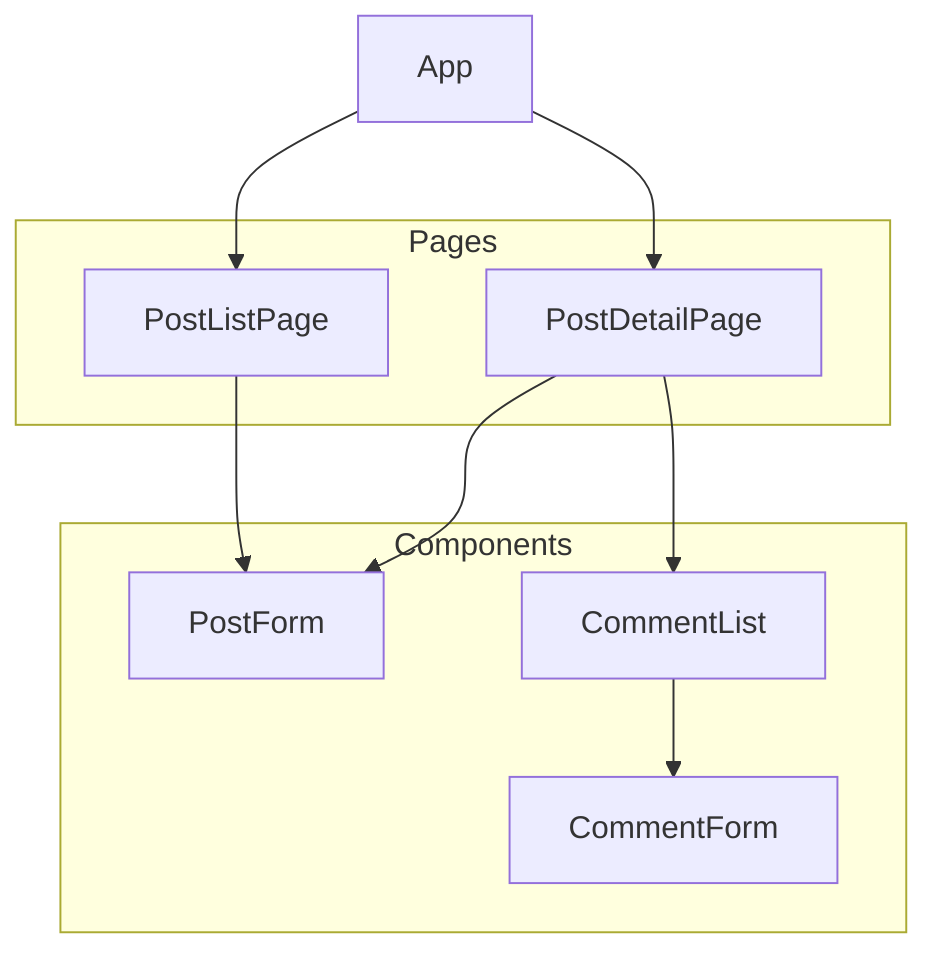

# 用户交流模块架构设计

本文档旨在为新的用户交流模块提供详细的架构设计方案，涵盖数据模型、API 接口和前端组件规划。

## 1. 数据模型设计 (Data Model Design)

### 1.1. Post (帖子) 模型

`Post` 模型用于存储用户发布的帖子信息。

| 字段名 | 数据类型 | 描述 | 备注 |
| :--- | :--- | :--- | :--- |
| `id` | `UUID` | 唯一标识符 | 主键 |
| `title` | `String` | 帖子标题 | |
| `content` | `Text` | 帖子内容 | 应支持富文本格式 (如 Markdown 或 HTML) |
| `author` | `ForeignKey(User)` | 发布人 | 关联到用户模型 |
| `created_at` | `DateTime` | 发布时间 | 自动记录创建时间 |
| `updated_at` | `DateTime` | 更新时间 | 自动记录更新时间 |
| `expires_at` | `DateTime` | 过期时间 | 可为空，用于设置帖子自动归档或删除 |
| `status` | `String` | 状态 | 枚举类型，例如: `published` (已发布), `draft` (草稿), `archived` (已归档) |

### 1.2. Comment (评论) 模型

`Comment` 模型用于存储用户对帖子的评论。

| 字段名 | 数据类型 | 描述 | 备注 |
| :--- | :--- | :--- | :--- |
| `id` | `UUID` | 唯一标识符 | 主键 |
| `post` | `ForeignKey(Post)` | 关联的帖子 | 关联到 `Post` 模型 |
| `author` | `ForeignKey(User)` | 评论人 | 关联到用户模型 |
| `content` | `Text` | 评论内容 | |
| `created_at` | `DateTime` | 评论时间 | 自动记录创建时间 |
| `updated_at` | `DateTime` | 更新时间 | 自动记录更新时间 |

## 2. API 接口定义 (API Definition)

采用 RESTful 风格设计 API 接口。

### 2.1. 帖子管理 API (Post Management API)

| 方法 | 路径 | 描述 | 主要功能 |
| :--- | :--- | :--- | :--- |
| `GET` | `/api/posts/` | 获取帖子列表 | 支持分页 (`page`, `page_size`), 过滤 (按 `status`, `author`), 排序 (按 `created_at`) |
| `POST` | `/api/posts/` | 创建新帖子 | 请求体包含 `title`, `content`, `expires_at` 等 |
| `GET` | `/api/posts/{id}/` | 获取单个帖子详情 | 返回帖子详细信息及其关联的评论 |
| `PUT` | `/api/posts/{id}/` | 更新帖子 | 更新帖子内容，只有作者或管理员可以操作 |
| `DELETE` | `/api/posts/{id}/` | 删除帖子 | 只有作者或管理员可以操作 |

### 2.2. 评论管理 API (Comment Management API)

| 方法 | 路径 | 描述 | 主要功能 |
| :--- | :--- | :--- | :--- |
| `GET` | `/api/posts/{post_id}/comments/` | 获取某个帖子的所有评论 | 支持分页 |
| `POST` | `/api/posts/{post_id}/comments/` | 在某个帖子下发表新评论 | 请求体包含 `content` |
| `PUT` | `/api/comments/{id}/` | 更新评论 | 只有评论作者可以操作 |
| `DELETE` | `/api/comments/{id}/` | 删除评论 | 只有评论作者或管理员可以操作 |

## 3. 前端组件规划 (Frontend Component Planning)

使用 React 框架进行前端开发。

### 3.1. 主要组件 (Main Components)

*   **`PostListPage.jsx`**:
    *   **功能**: 显示帖子列表，提供搜索、过滤和排序功能。
    *   **状态**: 帖子列表、加载状态、分页信息、过滤条件。
    *   **交互**: 点击帖子标题跳转到详情页，点击“创建帖子”按钮打开 `PostForm`。

*   **`PostDetailPage.jsx`**:
    *   **功能**: 显示单个帖子的详细内容，并加载和显示 `CommentList`。
    *   **状态**: 帖子数据、评论数据、加载状态。
    *   **交互**: 如果是作者，显示“编辑”和“删除”按钮。

*   **`PostForm.jsx`**:
    *   **功能**: 用于创建或编辑帖子的表单。
    *   **组件**: 包含一个富文本编辑器 (如 `react-quill` 或 `slate.js`)。
    *   **状态**: 表单字段 (`title`, `content`), 提交状态。
    *   **交互**: 提交表单后，调用 API 创建/更新帖子，并重定向到相应页面。

*   **`CommentList.jsx`**:
    *   **功能**: 循环渲染评论列表，每条评论包含作者、内容和时间。
    *   **状态**: 评论数组。
    *   **交互**: 显示 `CommentForm` 用于发表新评论。

*   **`CommentForm.jsx`**:
    *   **功能**: 用于发表新评论的简单表单。
    *   **状态**: 评论内容 (`content`)。
    *   **交互**: 提交后调用 API 创建评论，并刷新 `CommentList`。

### 3.2. 组件关系图

## 4. 技术选型建议

*   **后端**: Django Rest Framework 或 FastAPI，利用其强大的序列化和视图集功能快速构建 API。
*   **前端**: React, Redux/Zustand (状态管理), React Router (路由), Axios (HTTP 请求)。
*   **富文本编辑器**: `react-quill` 或 `slate.js`。
*   **数据库**: PostgreSQL，支持 JSON 字段和全文搜索。

---