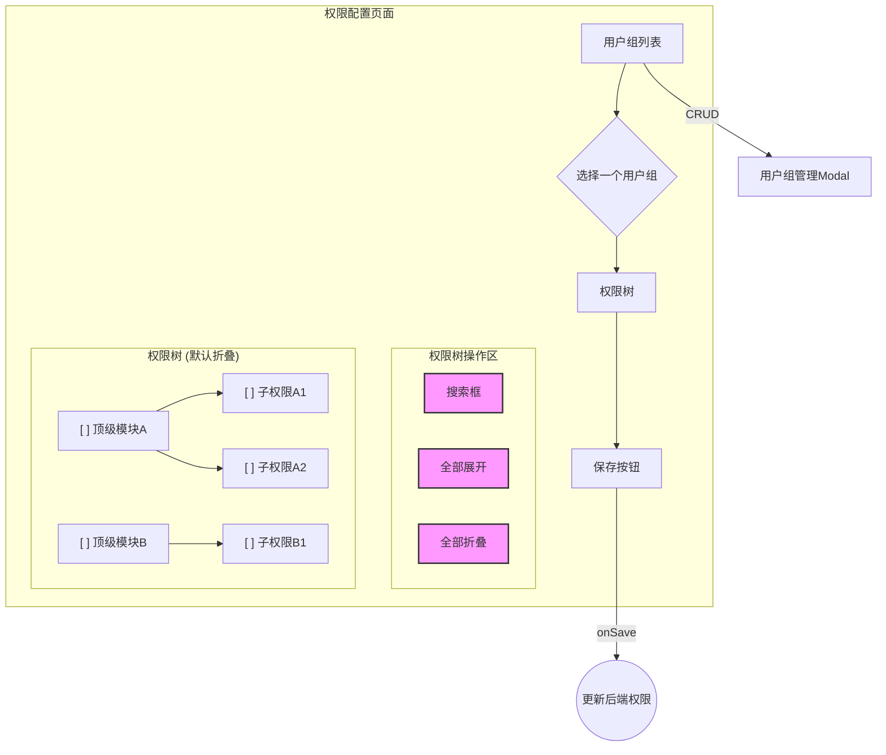

# 用户组权限页面布局优化方案

## 1. 问题背景

当前的用户组权限配置页面 (`http://localhost:3000/admin/user-management`) 将所有权限以一个完全展开的树状列表展示。当权限数量增多时，这个列表会变得非常长，导致用户难以查找、管理和分配权限，影响了整体的可用性。

## 2. 根本原因分析

通过分析前端组件 `omni_desk_frontend/src/components/Admin/GroupPermissionManager.jsx`，我们发现 Ant Design 的 `Tree` 组件被设置了 `defaultExpandAll` 属性。这使得权限树在加载时默认展开所有节点，失去了层级管理的优势，造成了信息过载。

后端的 `PageRoute` 模型已经定义了清晰的父子层级关系，API (`/api/permissions/pages/`) 也能够返回完整的树状结构数据。问题纯粹出在前端的展现逻辑上。

## 3. 优化设计方案

为了解决上述问题，我们提出以下 UI 布局优化方案，旨在提高权限管理的可操作性和清晰度。

### 3.1. 默认折叠权限树

**核心改动:** 移除 `Tree` 组件的 `defaultExpandAll` 属性。

- **效果:** 页面加载时，权限树将只显示顶级权限模块（例如：“用户管理”、“文档管理”等）。用户可以点击展开图标，逐级查看和分配子权限。这大大减少了初次加载时的信息密度，使用户可以专注于特定的权限模块。

### 3.2. 增加“全部展开/全部折叠”功能

**新增功能:** 在权限树的顶部工具栏中，增加两个按钮：“全部展开”和“全部折叠”。

- **实现:**
  - 维护一个 state `expandedKeys` 用于控制树的展开节点。
  - “全部展开”按钮被点击时，遍历整个 `pageTree` 数据，收集所有节点的 `key`，并更新 `expandedKeys` state。
  - “全部折叠”按钮被点击时，将 `expandedKeys` state 设置为空数组 `[]`。

### 3.3. 引入按模块“全选/全不选”

**新增功能:** 虽然 Antd 的 `Tree` 组件在 `checkable` 模式下，勾选父节点会自动选中所有子节点，但我们可以通过 UI 上的明确提示来强化这一功能，或者在未来实现更复杂的“半选”状态逻辑。目前，我们可以依赖 `checkStrictly` 属性的行为。

- **建议:** 暂时不使用 `checkStrictly`，保持父子节点联动的默认行为。在每个父节点旁边可以考虑增加一个 tooltip，提示“勾选此项将选中所有子权限”。

### 3.4. 权限搜索与过滤

**新增功能:** 在权限树的顶部工具栏中，增加一个搜索框。

- **实现:**
  - 当用户在搜索框中输入文本时，根据输入值动态过滤 `pageTree` 数据。
  - 过滤逻辑应保留匹配节点的所有父级路径，以维持树的结构。
  - 匹配的权限节点应高亮显示。
  - 当搜索框清空时，恢复显示完整的权限树。

### 3.5. UI 结构示意图 (Mermaid)

## 4. 实施步骤

1.  **修改 `GroupPermissionManager.jsx`:**
    - 移除 `Tree` 组件的 `defaultExpandAll` 属性。
    - 添加 `expandedKeys` 和 `onExpand` 属性到 `Tree` 组件，并创建相应的 state 和处理函数。
    - 添加“全部展开”和“全部折叠”按钮，并实现其功能逻辑。
    - 添加搜索框 `Input.Search` 组件。
    - 实现搜索逻辑，动态生成用于渲染的 `treeData`。
2.  **（可选）后端配合:** 当前设计无需后端改动。
3.  **测试:**
    - 测试默认加载时树是否折叠。
    - 测试展开/折叠单个节点。
    - 测试“全部展开”/“全部折叠”功能。
    - 测试搜索功能是否能正确过滤并高亮节点。
    - 测试权限保存功能是否依然正常。

## 5. 预期效果

- **提升可用性:** 用户可以更快速地定位到他们需要管理的权限模块。
- **减少混乱:** 默认折叠的视图使界面更加整洁。
- **增强控制:** “展开/折叠”和“搜索”功能给予用户完全的控制权。
- **提高效率:** 管理员可以更高效地完成权限分配任务。