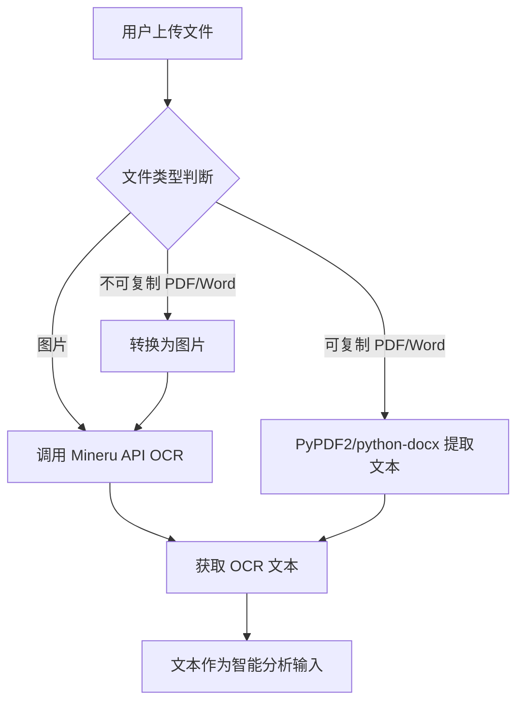
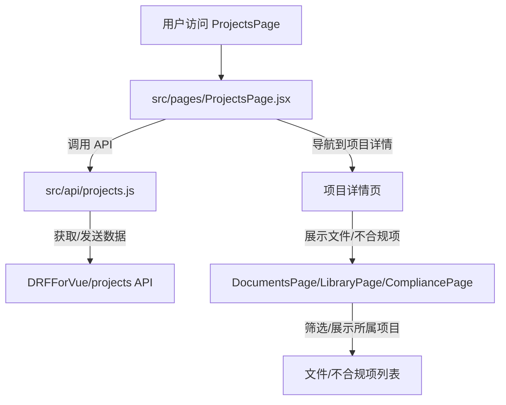

# 项目资料智能管理功能实现计划

## 1. 目标

在现有 `DRFForVue` 后端和 `calendar_with_react` 前端基础上，实现项目资料智能管理功能，包括：

*   **文件分类管理**：支持多类型文件（PDF、Word、图片等）的项目归档和分类。
*   **智能分析与查漏补缺**：利用大语言模型（LLM）能力，识别文档中的不规范、时间冲突、内容缺失、内容与规定不符等问题。
*   **页面提醒**：在前端页面直观展示不合规提醒。
*   **定时提醒**：对有时间要求的规范文件进行定时检查和页面提醒。
*   **项目管理**：将文件和不合规项与具体项目关联，实现项目档案专家职能。

## 2. 详细实现步骤

### 2.1 后端开发 (DRFForVue)

**目标**：在 `DRFForVue` 后端实现文件预处理、项目管理、智能分析和定时提醒功能。

#### 2.1.1 文件预处理（OCR 和文本提取）

*   **目标**：从 PDF、Word、图片等文件中提取可分析的文本内容，优先使用 Mineru 服务进行 OCR。
*   **操作**：
    *   **检查 `documents/views.py` 中的文件上传逻辑**：定位 [`documents.views.BookImportView`](DRFForVue/documents/views.py) 和 [`DocumentTemplateViewSet.upload_template`](DRFForVue/documents/views.py) 方法，了解当前文件处理流程。
    *   **集成 Mineru API**：
        *   如果尚未集成，需要添加调用 Mineru API 的逻辑。这可能涉及到在 [`DRFForVue/DRFForVue/settings.py`](DRFForVue/DRFForVue/settings.py) 中配置 Mineru 的 URL 和 API 密钥。
        *   创建或修改一个辅助函数/模块（例如在 [`DRFForVue/documents/utils.py`](DRFForVue/documents/utils.py) 或新的文件）用于发送 HTTP 请求到 Mineru 服务，并处理返回的 OCR 文本。
    *   **处理不同文件类型**：
        *   对于图片文件：直接调用 Mineru 进行 OCR。
        *   对于 PDF 和 Word 文档：
            *   **文本可复制的 PDF/Word**：继续使用 `PyPDF2` (或 `pdfminer.six`) 和 `python-docx` 直接提取文本。
            *   **不可复制的 PDF/Word**：考虑将页面转换为图片，然后将图片发送给 Mineru 进行 OCR。这可能需要额外的图像处理库（如 `Pillow`）。
    *   **将提取出的文本作为后续智能分析的输入**。



#### 2.1.2 项目管理功能

*   **目标**：实现项目档案的统一管理，将文件和不合规项归属到特定项目。`projects` 应用已包含初始结构。
*   **操作**：
    *   **检查 `projects` 应用的初始结构**：
        *   [`DRFForVue/projects/models.py`](DRFForVue/projects/models.py)：检查 `Project` 模型是否已定义，以及其字段是否符合计划（`name`, `description`, `start_date`, `end_date`, `manager`, `status`）。如果缺失或不符，需要修改。
        *   [`DRFForVue/projects/serializers.py`](DRFForVue/projects/serializers.py)：检查 `Project` 序列化器。
        *   [`DRFForVue/projects/views.py`](DRFForVue/projects/views.py)：检查 `Project` 的 `ViewSet`。
        *   [`DRFForVue/projects/urls.py`](DRFForVue/projects/urls.py)：检查路由配置。
        *   确认 [`DRFForVue/DRFForVue/urls.py`](DRFForVue/DRFForVue/urls.py) 中是否已包含 `path('projects/', include('projects.urls'))`。
        *   确认 [`DRFForVue/DRFForVue/settings.py`](DRFForVue/DRFForVue/settings.py) 的 `INSTALLED_APPS` 中是否已添加 `'projects'`。
    *   **关联现有模型**：
        *   [`DRFForVue/documents/models.py`](DRFForVue/documents/models.py)：在 `Book` 和 `DocumentTemplate` 模型中添加 `ForeignKey('projects.Project', on_delete=models.CASCADE, related_name='documents')` 字段。
        *   **检查 `compliance` 应用的初始结构**：
            *   [`DRFForVue/compliance/models.py`](DRFForVue/compliance/models.py)：检查 `ComplianceIssue` 模型是否已定义，及其字段是否符合计划（`project`, `document`, `issue_type`, `description`, `location`, `status`, `severity`, `due_date`）。如果缺失或不符，需要修改。
            *   [`DRFForVue/compliance/serializers.py`](DRFForVue/compliance/serializers.py)：检查 `ComplianceIssue` 序列化器。
            *   [`DRFForVue/compliance/views.py`](DRFForVue/compliance/views.py)：检查 `ComplianceIssue` 的 `ViewSet` 或 `APIView`，确保查询可以按项目过滤。
            *   [`DRFForVue/compliance/urls.py`](DRFForVue/compliance/urls.py)：检查路由配置。
            *   确认 [`DRFForVue/DRFForVue/settings.py`](DRFForVue/DRFForVue/settings.py) 的 `INSTALLED_APPS` 中是否已添加 `'compliance'`。
            *   确认 [`DRFForVue/DRFForVue/urls.py`](DRFForVue/DRFForVue/urls.py) 中是否已包含 `path('compliance/', include('compliance.urls'))`。
    *   **调整 API 逻辑**：在文件上传、不合规项生成等操作中，确保能够接收并关联到相应的 `project_id`。

```mermaid
graph TD
    A[用户创建/管理项目] --> B[DRFForVue/projects/views.py]
    B --> C[DRFForVue/projects/models.py (Project)]
    C -- 关联 --> D[DRFForVue/documents/models.py (Book/DocumentTemplate)]
    C -- 关联 --> E[DRFForVue/compliance/models.py (ComplianceIssue)]
    F[文件上传/LLM分析] --> G{接收 project_id}
    G -- 存储 --> D
    G -- 存储 --> E
```

#### 2.1.3 智能分析与查漏补缺（利用 Ollama LLM 服务）

*   **目标**：通过调用 Ollama 部署的模型进行智能分析，识别不规范、时间冲突、内容缺失、内容与规定不符等问题。
*   **操作**：
    *   **修改 `documents/views.py`**：
        *   定位 [`DocumentTemplateViewSet`](DRFForVue/documents/views.py) 的 `analyze_file` 方法。
        *   **集成 Ollama**：
            *   检查 [`DRFForVue/office_assistant/views.py`](DRFForVue/office_assistant/views.py) 或创建一个新的服务层（例如 [`DRFForVue/llm_service/ollama_client.py`](DRFForVue/llm_service/ollama_client.py)）来管理 Ollama 的调用。
            *   实现通过 HTTP 请求与 Ollama API 交互的逻辑。这可能涉及到使用 `requests` 库。
            *   如果 Ollama 需要特定的模型加载，确保在调用前已完成。
        *   **核心逻辑**：将预处理后的文档文本作为输入，构建合适的提示词（Prompt），发送给 Ollama LLM 进行分析。
        *   **提示词设计**：设计结构化提示词，明确指示 LLM 扮演“规范审查员”的角色，要求其识别：
            *   不规范之处（格式错误、用词不当）
            *   时间冲突（日期逻辑错误）
            *   内容缺失（缺少关键条款/数据）
            *   内容与规定不符（与已知规范相悖）
            *   LLM 的输出应结构化（例如，JSON 格式），包含问题类型、描述、建议修改、相关文本片段、置信度等信息，以便后端解析并存入 `ComplianceIssue` 模型。
    *   **规范知识库（RAG 辅助）**：
        *   如果需要，考虑实现 RAG (Retrieval Augmented Generation)。这可能涉及到：
            *   将规范文档切块并向量化存储（例如，使用 `pgvector` 这样的向量数据库扩展）。
            *   在分析时，根据待分析文档的内容，从规范知识库中检索最相关的规范片段。
            *   将检索到的规范片段与待分析文档一起作为 LLM 的输入，引导 LLM 更准确地判断合规性。

```mermaid
graph TD
    A[预处理文本] --> B[构建 Ollama Prompt]
    B --> C[调用 Ollama API]
    C --> D[Ollama 返回结构化分析结果]
    D --> E[解析结果]
    E --> F[存储为 DRFForVue/compliance/models.py (ComplianceIssue)]
    subgraph RAG (可选)
        G[规范文档] --> H[切块/向量化存储]
        I[待分析文档内容] --> J[检索相关规范片段]
        J --> B
    end
```

#### 2.1.4 定时提醒功能

*   **目标**：对于有时间要求的规范文件，实现定时检查和页面提醒。
*   **操作**：
    *   **安装并配置 `celery` 和 `django-celery-beat`**：
        *   检查 [`DRFForVue/requirements.txt`](DRFForVue/requirements.txt) 和 [`DRFForVue/DRFForVue/settings.py`](DRFForVue/DRFForVue/settings.py)，确保已安装并配置 Celery Broker (如 Redis) 和 Celery Beat。
    *   **检查 `compliance` 应用中的 `tasks.py`**：
        *   如果 [`DRFForVue/compliance/tasks.py`](DRFForVue/compliance/tasks.py) 尚未创建或为空，需要编写 Celery 任务。
        *   编写任务逻辑：定期扫描 `ComplianceIssue` 模型中 `due_date` 临近或已过期的项。
        *   任务触发时：更新 `ComplianceIssue` 状态或创建一个新的 `Notification` 记录（如果存在单独的通知系统），确保前端可以通过 API 拉取这些提醒信息。

```mermaid
graph TD
    A[Celery Beat 定时触发] --> B[DRFForVue/compliance/tasks.py]
    B --> C[扫描 ComplianceIssue 模型]
    C -- 识别临近/过期 due_date --> D[更新 ComplianceIssue 状态]
    D --> E[创建 Notification 记录 (可选)]
    E --> F[前端通过 API 拉取提醒]
```

### 2.2 前端开发 (calendar_with_react)

**目标**：在 `calendar_with_react` 前端实现项目管理界面和页面提醒展示。

#### 2.2.1 项目管理与文件展示

*   **目标**：提供项目管理界面，并在文件和不合规项展示中体现项目归属。
*   **操作**：
    *   **检查 `src/pages/ProjectsPage.jsx`**：
        *   如果已存在，检查其功能是否符合计划：展示项目列表、创建新项目、编辑项目信息。
        *   如果缺失，需要创建该文件并实现上述功能。
        *   确保每个项目可以点击进入其详情页，查看该项目下的文件和不合规项。
    *   **检查 `src/api/projects.js`**：
        *   如果已存在，检查其是否包含与后端 `projects` API 交互的函数。
        *   如果缺失或不完整，需要创建或补充。
    *   **修改文件列表页面** ([`src/components/DocumentsPage.jsx`](calendar_with_react/src/components/DocumentsPage.jsx), [`src/components/LibraryPage.jsx`](calendar_with_react/src/components/LibraryPage.jsx))：
        *   增加按项目筛选的功能（例如，一个项目选择器）。
        *   在文件列表中显示所属项目信息。
    *   **检查/修改不合规项列表页面** ([`src/components/CompliancePage.jsx`](calendar_with_react/src/api/compliance.js) 或新增页面)：
        *   检查 [`src/api/compliance.js`](calendar_with_react/src/api/compliance.js) 是否已包含与后端 `compliance` API 交互的函数。
        *   增加按项目筛选的功能。
        *   在提醒列表中显示所属项目信息。
    *   **文件详情页和提醒详情页**：确保在这些页面中能够清晰地展示文件或提醒所属的项目信息。



#### 2.2.2 页面提醒展示

*   **目标**：在页面上直观、及时地展示各类提醒。
*   **操作**：
    *   **通知中心**：在导航栏或侧边栏 ([`src/components/Sidebar.jsx`](calendar_with_react/src/components/Sidebar.jsx)) 添加一个通知图标，显示未读提醒数量。点击后跳转到提醒列表页面。
    *   **检查 `src/pages/NotificationsPage.jsx`**：
        *   如果已存在，检查其功能是否符合计划：展示所有不合规和定时提醒，包含列表项（类型、描述、相关文件链接、严重程度、状态等）、筛选、排序、标记已读、归档等功能。
        *   如果缺失，需要创建该页面并实现上述功能。
    *   **文件详情页集成**：在 [`src/components/BookReaderPage.jsx`](calendar_with_react/src/components/BookReaderPage.jsx) 或 [`src/components/ChapterView.jsx`](calendar_with_react/src/components/ChapterView.jsx) 中，如果当前文件或章节存在不合规项，应在页面上以醒目方式（如高亮、警告图标）提示，并提供链接或弹窗查看详细问题。
    *   **利用 `src/utils/notifications.js`**：扩展其功能，来处理和展示前端通知。

```mermaid
graph TD
    A[后端发送提醒] --> B[前端 Notification API 拉取]
    B --> C[src/utils/notifications.js]
    C --> D[src/components/Sidebar.jsx (通知图标)]
    D -- 点击 --> E[src/pages/NotificationsPage.jsx (提醒列表页)]
    F[用户查看文件详情] --> G[src/components/BookReaderPage.jsx/ChapterView.jsx]
    G -- 检查不合规项 --> H[页面内提醒/高亮]
```

### 2.3 前后端集成与测试

*   **目标**：确保前后端数据流和功能正常工作。
*   **操作**：
    *   编写单元测试和集成测试，确保各模块功能正确。
    *   进行端到端测试，验证用户体验。