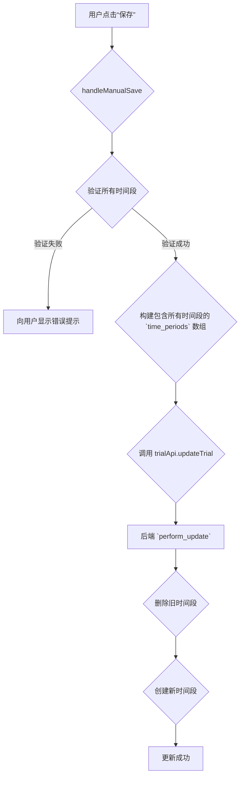

# 试验日程时间段更新失败 Bug 修复计划

## 1. 问题背景

在试验日程页面，当用户通过“编辑排班”为试验新增或编辑时间段时，点击保存后前端会报错 `Cannot read properties of undefined (reading '0')`，导致保存失败。

## 2. 根本原因分析

通过对前后端代码的联合分析，定位到以下几个核心问题：

1.  **前端空指针错误**：在 `EventModal.jsx` 的 `handleManualSave` 函数中，当处理一个新添加但未填写完整的时间段时，代码尝试访问一个 `undefined` 对象的 `[0]` 索引，导致程序崩溃。
2.  **前端逻辑过于复杂**：`handleManualSave` 函数试图手动区分时间段的新增、修改和删除，这使得逻辑复杂且容易出错。
3.  **前后端字段名不匹配**：前端在 `updateTrial` 请求中发送的时间段数组键名为 `time_slots`，而后端 `TrialViewSet` 的 `perform_update` 方法期望接收的键名是 `time_periods`。
4.  **后端采用“先删后增”策略**：后端在更新试验时，会删除所有旧的时间段，然后重新创建请求中提供的所有时间段。这一实现细节未在前端得到正确利用。

## 3. 修复方案

为了彻底解决此问题并优化代码，我将采取以下步骤：

### 3.1. 重构前端 `EventModal.jsx`

我将重构 `handleManualSave` 函数，使其逻辑更简单、更健壮：

-   **移除复杂逻辑**：删除当前用于区分新增、修改和删除时间段的手动处理逻辑。
-   **增强验证**：在提交前，增加严格的数据验证，确保所有时间段都包含有效的起止日期和时间。如果验证失败，将向用户显示明确的错误提示。
-   **统一数据处理**：构建一个包含所有最终时间段的完整列表（无论其是新建的还是已存在的）。

### 3.2. 修正前端 API 调用

我将修改 `trialApi.js` 中的 `updateTrial` 函数：

-   **修正字段名**：将请求体中的时间段数组键名从 `time_slots` 更改为 `time_periods`，以匹配后端 API 的要求。
-   **传递完整数据**：确保将 `EventModal.jsx` 中构建的完整时间段列表通过此 API 发送到后端。

### 3.3. 流程示意图

修复后的数据流将如下所示：

## 4. 预期成果

-   彻底解决新增和编辑时间段时的崩溃问题。
-   简化前端代码，提高其可维护性和健壮性。
-   确保前后端数据格式和逻辑的一致性。
-   提升用户体验，提供更可靠的错误处理和提示。