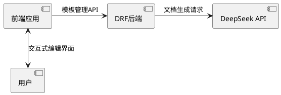

# 智能文档生成系统技术路线

## 系统架构


## 实施步骤

### 1. 后端服务搭建
```python
# DRFForVue/documents/models.py
class DocumentTemplate(models.Model):
    name = models.CharField(max_length=100)
    content = models.TextField()
    variables = models.JSONField(default=dict)
    created_at = models.DateTimeField(auto_now_add=True)
```

### 2. 前端交互模块
```javascript
// omni_desk_frontend/src/components/SmartDocumentEditor.jsx
const templateVariables = [
  { name: 'project_name', type: 'string', required: true },
  { name: 'version', pattern: '^v\\d+\\.\\d+\\.\\d+$' }
];
```

### 3. DeepSeek集成规范
```http
POST /api/ollama/generate HTTP/1.1
Content-Type: application/json

{
  "model": "deepseek-docgen",
  "prompt": "根据{{project_name}}生成立项报告，版本格式{{version}}",
  "format": "markdown",
  "variables": {
    "project_name": "智能日历系统",
    "version": "v1.0.0" 
  }
}
```

## 安全控制矩阵
| 风险点        | 防护措施                      | 审计方式               |
|---------------|-----------------------------|----------------------|
| 模板注入       | 沙箱环境渲染                 | 代码静态分析           |
| API滥用       | 令牌桶限流算法               | 日志监控               |

## 部署路线图
1. Phase 1: 基础模板管理（2周）
2. Phase 2: 智能生成对接（3周）
3. Phase 3: 交互式编辑功能（2周）
